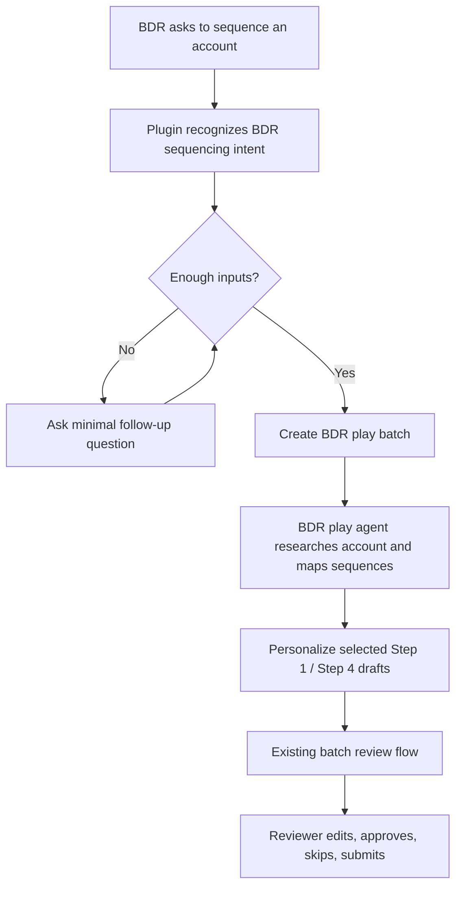

# BDR Play Plugin Intake

## Problem Frame

BDRs should be able to start from a natural request like "sequence this account" and have the plugin ask only enough follow-up questions to identify the BDR cold outbound play, collect the account/contact inputs, and route the work into the existing approval flow. The first version should prove the loop with the attached BDR play before generalizing into a fully dynamic play marketplace or multi-agent orchestration system.

The existing product already supports the core approval spine: a batch is created, company/contact work is processed, drafts are saved into review, reviewers edit/approve, and approved contacts can be pushed server-side. This feature should reuse that spine and add the smallest routing/intake behavior needed for the BDR play.

## Requirements

**Intake and Play Selection**
- R1. The plugin must recognize BDR sequencing intent from natural phrases such as "sequence this account," "build sequences for these contacts," or a company plus named contacts/titles.
- R2. In the common BDR path, the plugin must ask no more than two follow-up turns before creating a batch: one to confirm the BDR cold outbound play when intent is ambiguous, and one to collect any missing company, domain, contact name, contact title, or campaign/push target information.
- R3. The first version must route only to the BDR cold outbound play, not a generalized play catalog.
- R4. The plugin must make the selected play explicit in the created work item so downstream processing can run BDR-specific research, classification, writing, and review behavior.

**BDR Play Behavior**
- R5. The BDR play must use the supplied company and contact titles as the source of truth for persona mapping.
- R6. The BDR play must classify the company into the retail/ecommerce brand types supported by the play: high return rate, high consideration/high ticket, or subscription/replenishment.
- R7. The BDR play must stop or ask for confirmation when the company does not fit the supported retail/ecommerce/DTC categories.
- R8. The BDR play must map each contact to the relevant sequence from the attached BDR play and flag contacts whose titles do not map cleanly.
- R9. The BDR play must run account research and targeted personalization lookups only for the selected sequence steps, avoiding unrelated research.
- R10. The first version must produce the BDR play's manual email outputs for review, preserving merge tokens and template voice.

**Approval Flow**
- R11. Generated BDR outputs must appear in the existing review flow with enough context for approval: company, contact, title, selected sequence, primary angle, evidence/source URLs, warnings, subject, and body.
- R12. Reviewers must be able to edit, approve, skip, and submit BDR outputs using the same review workflow pattern already used for outbound batches.
- R13. Outputs with placeholder or unverified emails must remain visibly non-pushable until a real email is supplied.
- R14. The review experience must clearly label BDR play steps by their original play step numbers, even if the current storage or push layer uses a different internal representation.

**Scope Control**
- R15. The first version must avoid building a fully generic play registry, multi-play UI, or arbitrary agent graph editor.
- R16. The first version must leave room for later play-specific agents by keeping the play choice and play metadata durable.

## Success Criteria

- A BDR can describe a target account and contacts in Cowork/plugin chat, answer the minimal follow-up questions, and receive a review URL for BDR play outputs.
- The review page shows BDR-specific sequence selections and personalized Step 1 / Step 4 email drafts for each mapped contact.
- Unsupported companies, missing titles, unmapped personas, and missing real emails are surfaced as review warnings instead of silently producing bad drafts.
- The implementation proves the loop without requiring a generalized play framework before the first BDR play works end to end.

## Scope Boundaries

- Do not build a generalized play marketplace in the first version.
- Do not support non-BDR plays in the first version.
- Do not invent contacts or override user-provided titles with researched titles.
- Do not require every future agent orchestration decision to be solved before shipping the BDR path.
- Do not expose research provider, model, Instantly, or other vendor credentials to the browser.

## Key Decisions

- Start with a BDR-only route: This is the simplest useful version and matches the user's preference to prove the workflow before expanding.
- Keep intake in the plugin first: The plugin can ask a couple of questions and call the existing Vercel workflow with structured inputs, which minimizes state management in the app.
- Reuse the existing approval flow: The current approval UI and server-side push posture are the durable product surface; the new work should feed it instead of creating a parallel approval experience.
- Preserve future flexibility through metadata: Even in the simple version, the created batch should carry enough play identity and play-step context to avoid a dead-end implementation.

## High-Level Flow

## Dependencies / Assumptions

- The existing batch creation, processing, review, and submit flow remains the primary workflow.
- The attached BDR play remains the source of truth for supported brand types, persona mapping, sequence templates, and Step 1 / Step 4 output expectations.
- Planning should verify how the current fixed email-step assumptions should adapt to BDR Step 1 / Step 4 display and push behavior.

## Outstanding Questions

### Resolve Before Planning

- None.

### Deferred to Planning

- [Affects R10, R14][Technical] Decide whether BDR Step 1 / Step 4 outputs should be stored as dynamic play steps, adapted into the current email step model, or paired with generated placeholder steps for the current push layer.
- [Affects R4, R16][Technical] Decide the minimal durable representation for `play_id`, selected sequence, original play step number, and play warnings.
- [Affects R9][Needs research] Decide which research integrations are available for Instagram/TikTok, product catalog lookup, reviews, LinkedIn jobs, and press signals in the deployed environment.

## Next Steps

-> /ce:plan for structured implementation planning.
