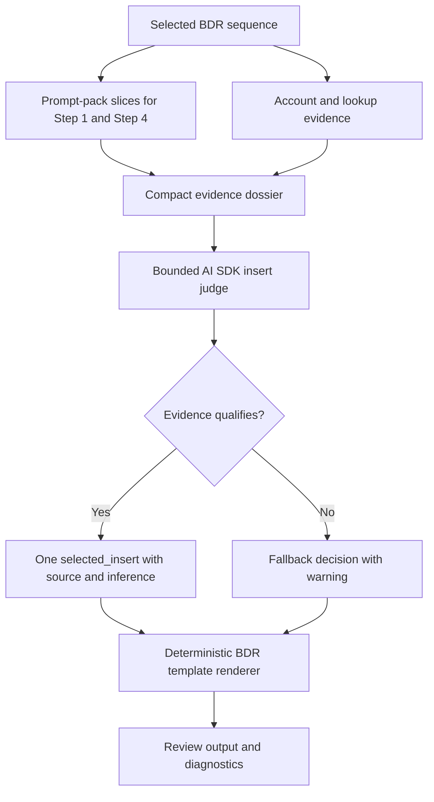

# BDR Dossier Snippet Quality

## Problem Frame

BDR email quality depends on the small personalized insert that goes into the existing sequence template. The current workflow has the right foundation: BDR routing is durable, sequence templates stay deterministic, prompt-pack rules are sliced by selected sequence, and weak evidence can fall back safely. The next improvement should make the research layer produce stronger account dossiers so the AI SDK agent can choose the best evidence-backed insert for each selected placeholder.

The goal is not to let the agent write whole emails. The goal is to create one excellent `selected_insert` per required placeholder, grounded in a compact evidence dossier, then let the existing BDR templates render the final email.

## Requirements

**Snippet Quality**
- R1. For each selected BDR sequence placeholder, the workflow must produce exactly one best `selected_insert` or an explicit fallback decision; it must not ask reviewers to choose from multiple candidates in this version.
- R2. The selected insert must be a natural outbound sentence fragment or sentence that fits the destination template voice without exposing research-process language, raw snippets, or prompt instructions.
- R3. The selected insert must be grounded in a verified public fact with a source URL, source snippet, evidence type, confidence, and a clear soft inference.
- R4. The selected insert must prefer specificity over generic category language when reliable evidence exists, such as a product, collection, support role, subscription flow, digital initiative, or repeated review pattern.
- R5. If evidence is weak, stale, ambiguous, unsupported, or below the prompt-pack threshold, the workflow must use the relevant template fallback and surface a review warning instead of forcing personalization.

**Evidence Dossiers**
- R6. The dossier must be built before final insert synthesis and must group evidence by selected lookup family, source priority, verified fact, inferred operating moment, confidence, and fallback reason.
- R7. The dossier must stay compact enough for bounded agent synthesis: only the strongest evidence items for the selected Step 1 and Step 4 lookups should reach the agent.
- R8. The dossier must preserve enough review context for trust: source URL, short snippet, evidence kind, confidence, and why the evidence did or did not qualify.
- R9. Repeated-pattern requirements, especially review-pattern evidence, must enforce threshold logic before personalization; one-off complaints or weak social posts must not become personalized copy.
- R10. Dossiers must be reusable across contacts at the same company when the selected lookup need is the same, so quality improves without repeating the same research work.

**AI SDK Agent Behavior**
- R11. The AI SDK agent should act as a bounded judge and compressor over the dossier, not as an unconstrained web researcher or full email writer.
- R12. Agent prompts must include only the selected sequence's prompt-pack slices, relevant dossier evidence, output contract, and language constraints.
- R13. Agent execution must follow current AI SDK agent best practices: explicit `ToolLoopAgent` use only when tool looping is needed, bounded `stopWhen`, scoped active tools or equivalent tool availability, structured `Output.object` results, timeouts, and telemetry/step visibility.
- R14. The agent must return structured output that distinguishes verified fact, inference, selected insert, fallback status, warning, and evidence URL; unstructured prose must not be accepted as the source of truth.
- R15. Provider or tool failures must degrade into warning-backed fallback decisions, not generic outbound copy or hidden success.

**Template and Review Safety**
- R16. BDR email bodies must continue to come from deterministic sequence templates plus the selected insert; no raw dossier text, full scraped content, tool trace, or prompt-pack instruction may render as email copy.
- R17. Reviewer-visible fields must explain evidence quality in plain language and avoid internal implementation labels such as "template fallback used" or "sequence mapping needed."
- R18. Status diagnostics and smoke checks must make it clear when the optimized dossier path ran, which prompt-pack revision was used, and whether fallback was caused by weak evidence, missing provider configuration, or agent/tool failure.

## Success Criteria

- A mapped BDR contact receives Step 1 and Step 4 emails whose personalization comes from a verified dossier-backed insert or from the correct BDR fallback template.
- The best happy-path inserts feel specific to the account and sequence, not like generic industry copy.
- Weak evidence produces safe fallback copy with clear review warnings rather than hallucinated personalization.
- Review payloads contain no generic fallback subjects, no internal guardrail text as email body, and no prompt or tool trace leakage.
- Full local tests and BDR smoke coverage can prove the dossier path preserves sequence selection, prompt-pack slicing, selected-insert structure, and review safety.

## Scope Boundaries

- Do not build multi-candidate reviewer selection in this version.
- Do not let the agent write full email bodies from scratch.
- Do not build a generalized play marketplace, prompt editor, or arbitrary agent graph.
- Do not require Browserbase or any optional provider for the core path to work.
- Do not expose raw provider payloads, full scraped pages, API keys, or private diagnostics in browser-visible review state.

## Key Decisions

- **Optimize for best snippets first:** Runtime and review clarity remain constraints, but the primary product win is better evidence-backed personalization.
- **Use one best insert per placeholder:** This keeps the review flow simple and forces the system to make a clear evidence decision.
- **Prefer dossier-first synthesis:** The dossier should filter, rank, and normalize evidence before the model writes an insert. This reduces tool drift and keeps the agent focused on judgment.
- **Keep deterministic rendering:** Templates remain the email source of truth; the agent supplies only structured insert decisions and fallback metadata.
- **Treat fallback as a quality outcome:** A safe fallback with a clear warning is better than weak personalization that sounds specific but is not defensible.

## Dependencies / Assumptions

- Existing BDR routing, sequence templates, prompt-pack slicing, and review approval flow remain the foundation.
- Current relevant files include `lib/plays/bdr/sequences.ts`, `lib/plays/bdr/prompt-pack.ts`, `lib/plays/bdr/research-dossier.ts`, `lib/plays/bdr/research-agent.ts`, `lib/plays/bdr/workflow-output.ts`, and `lib/jobs/processBatch.ts`.
- Current AI SDK guidance favors `ToolLoopAgent` for tool-loop agents, `instructions` instead of legacy system naming, bounded `stopWhen`, `activeTools` where useful, `Output.object` for structured output, and explicit timeout/telemetry controls.
- Slack tools were not requested for this brainstorm. Ask to search Slack if organizational context should be added later.

## High-Level Flow

## Outstanding Questions

### Resolve Before Planning
- None.

### Deferred to Planning
- [Affects R6-R10][Technical] Decide the exact dossier scoring/ranking fields and how to test them against noisy product, review, jobs, subscription, and digital-signal examples.
- [Affects R11-R15][Technical] Decide whether the first implementation should use a two-stage model flow, with deterministic dossier construction followed by non-tool structured synthesis, or retain a tightly bounded `ToolLoopAgent` for selected cases only.
- [Affects R18][Technical] Decide which diagnostics should be persisted for operators versus hidden from reviewer-facing state.

## Next Steps

-> /ce:plan for structured implementation planning.
