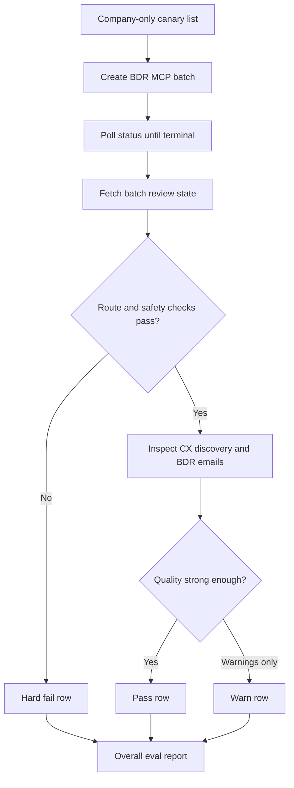

# BDR Live E2E Eval

## Problem Frame

The BDR workflow needs a live rollout eval that proves the deployed Vercel MCP path works end to end with real providers, not only local mocks. The eval should accept a company-only list, look for CX leaders, create review-first BDR batches, wait for completion, inspect the review output, and produce a clear pass/warn/fail report before the workflow is trusted for customer-facing use.

The first canary list is:
- Gruns
- The Black Tux
- Quince
- Manscapped
- Alo Yoga

## Requirements

**Live Execution**
- R1. The eval must run against a deployed MCP endpoint, not localhost, and must require the operator to provide the app URL, MCP secret, and traceable actor email.
- R2. The eval must submit company-only BDR requests with target persona set to CX leaders, without requiring known contacts, titles, or emails.
- R3. Each company should run as its own traceable review-first batch with a unique correlation id so failed or warning companies can be rerun without recreating every canary.
- R4. The eval must poll `get_outbound_sequence_status` until a terminal state or a bounded timeout; it must not assume synchronous processing.
- R5. The eval must not silently rewrite company names. If a name appears ambiguous or misspelled, such as "Manscapped", the eval should run the provided name and flag the ambiguity in the report unless the operator supplies an explicit domain or normalized company name.

**Routing And Runtime Safety**
- R6. Every company must route through `bdr_workflow`; `generic_company_agent` is a hard failure for this eval.
- R7. Every create/status response must expose sanitized diagnostics showing the deployed contract revision, prompt-pack revision, optimized dossier path, runtime, persistence mode, and fallback causes.
- R8. The eval must fail if any response or review payload exposes secrets, raw tool traces, prompt-pack instructions, unresolved BDR placeholders, or generic company-agent fallback copy.
- R9. If provider failures, weak evidence, or missing contact data occur, the workflow must surface warning-backed BDR fallback behavior rather than hidden success or generic outbound copy.

**CX Leader Discovery**
- R10. For company-only rows, the workflow should attempt to identify CX, customer support, customer care, support operations, eCommerce, or digital experience leaders.
- R11. The eval report must distinguish a discovered CX-relevant contact from a safe non-pushable placeholder contact when no credible leader is found.
- R12. Missing or unverified emails must remain non-pushable; the eval must not require push readiness for company-only canaries.
- R13. The eval should flag contacts whose title/persona is outside the BDR sequence map, but this should be a quality warning unless the output becomes pushable or generic.

**Email And Dossier Quality**
- R14. For each company, the eval must inspect rendered Step 1 and Step 4 review emails when a BDR sequence is mapped.
- R15. Rendered email bodies must come from deterministic BDR templates plus approved selected inserts or safe fallback copy; the eval must fail on raw dossier text, full scraped pages, internal guardrails, or research-process language.
- R16. Personalized inserts should be grounded in public evidence with source URLs and should feel specific to the company when evidence qualifies.
- R17. Weak evidence should produce safe template fallback copy and plain-language warnings, not forced personalization.

**Reporting**
- R18. The eval output must include one row per company with batch id, status, route, selected contact, contact pushability, sequence code, fallback causes, warning count, ambiguity notes, and pass/warn/fail result.
- R19. The eval must print a concise console summary for operators and save a machine-readable JSON artifact for comparison across runs.
- R20. The eval should optionally save a markdown report when requested, but JSON plus console output are the required first version.
- R21. The eval must produce an overall verdict that separates hard safety failures from quality warnings.
- R22. The eval should make it easy to rerun only failed or warning companies after a fix.

## Success Criteria

- All five canary companies complete to `ready_for_review` or a clearly explained safe terminal state.
- No company routes through the generic workflow.
- No review output contains known generic fallback subjects, prompt/tool text, unresolved bracket placeholders, or secret-looking strings.
- CX leader discovery either finds a plausible CX-relevant person or produces a safe non-pushable placeholder with warnings.
- At least one company demonstrates dossier-backed personalization with a specific selected insert and source evidence.
- The report gives enough detail to decide whether rollout is safe, without opening every review page manually.

## Scope Boundaries

- Do not push contacts to Instantly during this eval.
- Do not require real emails for company-only canaries.
- Do not grade deliverability, reply likelihood, or campaign performance.
- Do not require a human reviewer to approve each draft during the automated eval.
- Do not make the agent write full emails from scratch; template rendering remains the source of email bodies.
- Do not treat every safe fallback as failure; distinguish quality warnings from routing or safety failures.

## Key Decisions

- **Live E2E first:** This eval is for rollout confidence, so it prioritizes deployed behavior over local deterministic regression speed.
- **Company-only CX leader canary:** The initial list intentionally tests contact discovery and safe missing-email behavior because that matches the user's desired operating mode.
- **One batch per company:** Per-company batches make failures easier to isolate and rerun without polluting the signal from other canaries.
- **Hard safety, softer quality scoring:** Routing, leakage, generic fallback, and pushability violations fail the eval. Weak evidence and missing contact discovery produce warnings unless they create unsafe output.
- **Do not silently correct inputs:** The eval should surface ambiguous company names rather than hide typos behind untracked normalization.
- **Console plus JSON first:** Operators need a quick verdict in the terminal and a durable artifact for comparing eval runs.
- **Review-first only:** The eval validates generated review output and diagnostics, not downstream campaign push.

## Dependencies / Assumptions

- The deployed app has database persistence enabled and refuses in-memory production state.
- `ANTHROPIC_API_KEY`, `EXA_API_KEY`, and `FIRECRAWL_API_KEY` are expected for the best live result; missing providers should appear as sanitized fallback warnings.
- Existing scripts already cover one-company smoke behavior in `scripts/verify-bdr-processing-smoke.mjs`; the eval should extend that concept to a multi-company canary list.
- Existing readiness guidance in `README.md` remains the operator entry point for deployed MCP checks.

## High-Level Flow

## Outstanding Questions

### Resolve Before Planning
- None.

### Deferred to Planning
- [Affects R16-R17][Needs research] Decide which lightweight text-quality heuristics best distinguish useful company-specific inserts from bland but technically safe fallback copy.

## Next Steps

-> /ce:plan for structured implementation planning.
