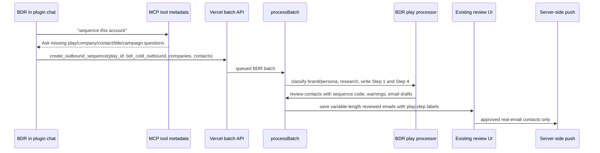

# feat: Add BDR Play Intake

## Overview

Add the smallest useful BDR play path to the existing Cowork/MCP -> Vercel -> batch review -> server-side push workflow. The first version should let a BDR start from a sequencing request, have the plugin gather the missing company/contact/title/campaign inputs, create a BDR play batch, generate the BDR play's Step 1 and Step 4 drafts, and review them in the existing approval UI.

This plan intentionally avoids a generalized play catalog or agent graph editor. The implementation should add one explicit play identifier, one BDR play processor, and enough metadata for future play-specific agents without committing to a full registry now.

The attached `account-sequencer` skill bundle is not part of this repo. This plan covers the Vercel app, MCP tool contract, and repo-local documentation needed to power that plugin behavior. Rebuilding or redistributing the external skill bundle is a separate packaging task unless its source is added to the repo.

## Problem Frame

The current app has the durable approval spine already: MCP/Cowork creates a batch, processing creates runs, agent output is saved to review state, reviewers edit/approve/submit, and approved contacts can be pushed server-side. The missing piece is a BDR-specific intake and generation path that uses the attached BDR cold outbound play instead of the current generic company agent. See origin: `docs/brainstorms/2026-04-29-bdr-play-plugin-intake-requirements.md`.

## Requirements Trace

- R1-R4. MCP/plugin intake recognizes BDR sequencing intent, asks only the minimal missing-input questions, and creates work with explicit BDR play identity.
- R5-R10. BDR processing trusts supplied titles, classifies brand type/persona, maps to the attached play's sequences, runs targeted research, and generates Step 1 / Step 4 drafts with template voice and merge tokens preserved.
- R11-R14. Existing review flow shows BDR-specific context, warning states, and original play-step labels while preserving edit/approve/skip/submit behavior.
- R15-R16. The first version remains BDR-only while storing durable play metadata that can support future play-specific agents.

## Scope Boundaries

- No generalized play marketplace, dynamic play UI, arbitrary workflow graph, or multi-play management.
- No non-BDR plays in this iteration.
- No title verification or replacement from LinkedIn; provided contact titles remain the source of truth.
- No browser exposure of model, research provider, Instantly, or database credentials.
- No runtime migration/backfill of historical review emails beyond making existing rows continue to render.
- No packaging of the external `.skill` bundle from this repo unless the plugin source is later added here.

### Deferred to Separate Tasks

- Broader play registry and multi-agent orchestration: future iteration after BDR path works end to end.
- Real provider-specific research quality tuning for Instagram/TikTok/review sites: future hardening after the first provider-backed implementation path is validated.
- External `account-sequencer` skill packaging: separate task that can consume `docs/bdr-play-intake.md` and updated MCP metadata.

## Context & Research

### Relevant Code and Patterns

- `app/api/mcp/route.ts` exposes MCP tool metadata and JSON-RPC/direct tool invocation compatibility.
- `lib/mcp/schemas.ts` and `lib/mcp/outbound-tools.ts` validate and create outbound batches.
- `lib/schemas.ts`, `lib/types.ts`, `docs/schema.sql`, `lib/memory-store.ts`, and `lib/postgres-store.ts` define the shared batch/run/contact/email shape.
- `lib/jobs/processBatch.ts` is the routing seam for batch processing and the right place to branch on BDR play metadata.
- `lib/agent/run-company-agent.ts` is the current generic agent seam and a pattern for converting research output into review contacts.
- `components/review/BatchReviewApp.tsx` and `components/review/ReviewApp.tsx` render email drafts using `contact.emails`, but currently assume generic labels and CSV columns for three fixed emails.
- `lib/instantly/client.ts` maps reviewed emails into custom variables and currently assumes indexes 0-2.
- Existing coverage lives in `tests/mcp-route.test.ts`, `tests/mcp-outbound-sequence.test.ts`, `tests/batch-review-flow.test.ts`, `tests/company-agent-schema.test.ts`, and review state/navigation tests.

### Institutional Learnings

- No `docs/solutions/` directory or matching institutional learning document was found in this repo during planning.

### External References

- Vercel's AI agents guide describes using the AI SDK for tool-calling agent loops, including `stopWhen`/step limits and Fluid compute duration considerations. This supports using AI SDK tools for the BDR research/writing seam without introducing a separate agent runtime.
- Vercel's agent overview describes routing, orchestration, MCP endpoints, Functions/Fluid Compute, persistence, and observability as the expected production shape for deployed agents.

## Key Technical Decisions

- Use explicit `play_id: "bdr_cold_outbound"` metadata on batches and runs: This satisfies the BDR-only first version while leaving a future extension point.
- Keep BDR as a specialized processor, not a generic registry: The first version should route through a simple conditional in batch processing and a BDR agent module.
- Make review emails variable-length and add original play-step metadata: The BDR play outputs Step 1 and Step 4 only, so the current fixed three-email assumption should be relaxed rather than padded with fake steps.
- Use internal email ordering separately from original play-step labels: Store internal review order as 1, 2, ... while also storing original play step numbers 1 and 4 for display/export/push mapping.
- Keep unsupported and incomplete cases review-safe: Missing real emails, unsupported brand categories, unmapped personas, and thin research should create warnings and non-pushable contacts rather than fabricated outreach.
- Prefer AI SDK tool-calling inside the existing Vercel function seams: The repo already uses `ai` and `zod`; adding a separate agent framework is unnecessary for this first slice.

## Open Questions

### Resolved During Planning

- BDR Step 1 / Step 4 storage: Store as variable review emails with nullable original play-step metadata, not placeholder third emails.
- Minimal durable play representation: Add BDR play metadata at batch/run level and sequence/play-step metadata at contact/email level.
- Research integrations for first version: Use existing server-side Exa/fetch seams as the initial implementation path, with Browserbase/fetch fallback hooks where pages are JS-heavy or blocked. Treat missing provider data as warnings/fallback template branches.

### Deferred to Implementation

- Exact BDR template data shape: The implementer may choose static typed constants, JSON-like objects, or another repo-local representation as long as templates remain testable and preserve copy.
- Final Instantly custom variable names for original BDR step labels: Keep current `sequence_subject_N`/`sequence_body_N` compatibility, but add play-step metadata only where the confirmed workspace mapping supports it.
- Exact research provider query wording: This depends on provider behavior and should be tuned with tests/mocks and manual smoke review.

## High-Level Technical Design

> *This illustrates the intended approach and is directional guidance for review, not implementation specification. The implementing agent should treat it as context, not code to reproduce.*

## Implementation Units

- [x] **Unit 1: Add Play Metadata and Variable Review Steps**

**Goal:** Make the data model capable of representing a BDR play batch and two BDR manual email steps without creating fake emails.

**Requirements:** R4, R10, R11, R14, R16

**Dependencies:** None

**Files:**
- Modify: `lib/types.ts`
- Modify: `lib/schemas.ts`
- Modify: `docs/schema.sql`
- Modify: `lib/memory-store.ts`
- Modify: `lib/postgres-store.ts`
- Test: `tests/batch-review-flow.test.ts`
- Test: `tests/review-editor-state.test.ts`

**Approach:**
- Add optional play metadata to batch/run types and persistence: `play_id`, play version/name if useful, and a small JSON metadata field for play-specific context.
- Add contact-level BDR sequence context in a durable place, either first-class columns or metadata JSON: selected sequence code, brand type, persona, and classification warning state.
- Relax review email assumptions from exactly three fixed steps to one or more ordered review emails.
- Add original play-step metadata to emails, such as original step number and display label, while preserving internal order for existing review/edit loops.
- Keep existing historical generic rows valid by defaulting display labels from `step_number` when play metadata is absent.

**Execution note:** Add characterization tests around the current three-email review flow before relaxing schemas so existing generic behavior stays intact.

**Patterns to follow:**
- Schema/persistence parity patterns in `docs/schema.sql`, `lib/memory-store.ts`, `lib/postgres-store.ts`, and `tests/readiness-config.test.ts`.
- Review state normalization in `lib/review-editor-state.ts`.

**Test scenarios:**
- Happy path: a generic non-BDR batch with three emails still saves, reloads, and submits exactly as before.
- Happy path: a BDR-style contact with two emails and original play step labels `Step 1` and `Step 4` saves and reloads with labels intact.
- Edge case: an email without original play-step metadata renders and exports using the existing internal email step label.
- Error path: saving an email step that does not belong to the contact still fails.
- Integration: Postgres and memory stores both return the same review state shape for BDR metadata and variable emails.

**Verification:**
- Existing review tests continue to pass after schema relaxation.
- New tests prove BDR two-email review state round-trips through both stores.

- [x] **Unit 2: Add BDR Play Reference and Classification Logic**

**Goal:** Bring the attached BDR play into repo-local, testable code and implement deterministic company/contact classification before generation.

**Requirements:** R5, R6, R7, R8, R10

**Dependencies:** Unit 1

**Files:**
- Create: `lib/plays/bdr/types.ts`
- Create: `lib/plays/bdr/sequences.ts`
- Create: `lib/plays/bdr/classify.ts`
- Test: `tests/bdr-play-classification.test.ts`

**Approach:**
- Convert the attached BDR sequence reference into typed repo-local data for all 12 sequence choices, including subject, Step 1 template, Step 4 template, persona rules, brand-type rules, and fallback rules.
- Implement deterministic title-to-persona mapping that trusts the provided title and flags unsupported titles rather than forcing a stretch match.
- Implement conservative brand classification with supported category signals and an unsupported/needs-confirmation result for companies outside retail/ecommerce/DTC.
- Return structured classification results that downstream processing can use without re-parsing template copy.

**Patterns to follow:**
- Zod-backed type boundary style in `lib/agent/schemas.ts`.
- Existing test style in `tests/company-agent-schema.test.ts`.

**Test scenarios:**
- Happy path: "VP of Customer Experience" maps to persona 1 and a high-return footwear brand maps to `A-1`.
- Happy path: "Director of E-commerce" maps to persona D and high-consideration electronics maps to `D-2`.
- Edge case: "VP of Digital" maps to persona 3 with an ambiguity warning.
- Error path: "CMO" or "Merchandising Director" returns an unmapped persona warning and does not silently choose a sequence.
- Error path: a non-retail company returns an unsupported brand warning requiring confirmation or skip behavior.
- Regression: sequence templates preserve `{{first_name}}`, `{{company}}`, and `{{sender.first_name}}` merge tokens exactly.

**Verification:**
- Classification tests cover brand type, persona, sequence code, unsupported category, and template-token preservation.

- [x] **Unit 3: Implement BDR Research and Drafting Processor**

**Goal:** Add a BDR-specific processor that performs targeted research lookups, applies template fallback rules, and returns review-ready contact outputs.

**Requirements:** R5, R8, R9, R10, R11, R13

**Dependencies:** Units 1 and 2

**Files:**
- Create: `lib/plays/bdr/research.ts`
- Create: `lib/plays/bdr/run-bdr-play-agent.ts`
- Modify: `lib/ai/tools.ts`
- Modify: `lib/agent/schemas.ts`
- Test: `tests/bdr-play-agent.test.ts`

**Approach:**
- Build the BDR processor as a specialized module that accepts a company, contacts, mode, and play metadata.
- Reuse `searchWithExa` and fetch/Browserbase seams for initial research. Add narrower helper functions for product/catalog lookup, review-pattern scan, jobs count, and digital/press signals.
- Only run lookup categories required by the chosen sequence's Step 1 and Step 4 prompts.
- Preserve template fallback behavior: delete first lines when no product/signal is found, choose Version B when review/jobs/digital signals are missing, and add warnings for thin research.
- Return review-ready contacts with primary angle, opening hook, proof, guardrail, evidence URLs, QA warnings, selected sequence code, and two email drafts.

**Execution note:** Implement classification and fallback behavior test-first; research providers should be mocked so tests do not depend on network behavior.

**Patterns to follow:**
- Current agent output contract in `lib/agent/run-company-agent.ts`.
- Existing research result types in `lib/ai/tools.ts`.

**Test scenarios:**
- Happy path: given a high-return footwear company and VP CX contact plus mocked product/review findings, the processor returns sequence `A-1` with Step 1 and Step 4 populated.
- Happy path: when review pattern lookup is empty, Step 4 uses the template's Version B copy and records a thin-research warning.
- Edge case: supplied contact without a real email receives a placeholder invalid email and non-pushable warning.
- Error path: unsupported contact title produces a skipped/needs-edit output with no invented persona.
- Error path: research provider failure does not fail the entire batch; it falls back to generic template branches with evidence warnings.
- Integration: output validates against the updated agent/review schema and can be saved into review state.

**Verification:**
- BDR agent tests prove sequence selection, fallback branches, warning behavior, and two-email output shape.

- [x] **Unit 4: Route BDR Batches Through the Existing Workflow**

**Goal:** Update batch creation and processing so `play_id: "bdr_cold_outbound"` invokes the BDR play processor while non-BDR batches keep the existing generic path.

**Requirements:** R3, R4, R11, R12, R13, R15, R16

**Dependencies:** Units 1-3

**Files:**
- Modify: `lib/mcp/schemas.ts`
- Modify: `lib/mcp/outbound-tools.ts`
- Modify: `app/api/mcp/route.ts`
- Modify: `app/api/webhooks/cowork/batch/route.ts`
- Modify: `lib/jobs/processBatch.ts`
- Test: `tests/mcp-outbound-sequence.test.ts`
- Test: `tests/mcp-route.test.ts`
- Test: `tests/batch-review-flow.test.ts`

**Approach:**
- Add optional `play_id` to MCP/direct/webhook batch inputs, with the first supported value `bdr_cold_outbound`.
- Update MCP tool descriptions and input schema descriptions so the plugin/host agent asks the user for missing BDR play inputs before creating a batch. The tool metadata should be the source of truth for host agents; the repo-local docs should be the source for rebuilding an external `.skill` package later.
- Allow BDR contacts to be supplied with name/title even when email is missing; processing should create placeholder invalid emails and warnings for non-pushable contacts.
- In `processBatch`, branch on `batch.play_id`. BDR batches use the BDR processor; batches without `play_id` keep the existing `runCompanyAgent` behavior.
- Return play metadata in status responses only where useful, without exposing secrets or generated drafts through MCP polling.

**Patterns to follow:**
- Existing polling metadata contract in `lib/cowork/continuation.ts`.
- MCP JSON-RPC/direct compatibility tests in `tests/mcp-route.test.ts`.

**Test scenarios:**
- Happy path: `create_outbound_sequence` with `play_id: "bdr_cold_outbound"` creates a durable batch whose status can be polled.
- Happy path: processing a BDR batch produces one review run with BDR sequence metadata and two labeled email drafts.
- Edge case: direct/webhook payloads without `play_id` still use the existing generic company-agent path.
- Error path: unknown `play_id` returns a validation/tool error and does not create a batch.
- Error path: BDR payload with contacts missing titles returns a clear validation or review warning according to the chosen validation boundary.
- Security: MCP/status responses do not include API keys, model provider secrets, or full generated email bodies.
- Contract: tool metadata includes BDR intake guidance and required/missing-field guidance for host agents.

**Verification:**
- MCP route and batch flow tests cover BDR and non-BDR routing.
- Retried batch processing remains idempotent for BDR batches.

- [x] **Unit 5: Update Review UI, Export, and Push Mapping for BDR Steps**

**Goal:** Make the current approval screens accurately show and submit BDR Step 1 / Step 4 drafts without confusing them with generic Email 1 / Email 2 / Email 3.

**Requirements:** R11, R12, R13, R14

**Dependencies:** Units 1 and 4

**Files:**
- Modify: `components/review/BatchReviewApp.tsx`
- Modify: `components/review/ReviewApp.tsx`
- Modify: `lib/review-editor-state.ts`
- Modify: `lib/instantly/client.ts`
- Test: `tests/batch-review-flow.test.ts`
- Test: `tests/review-editor-state.test.ts`

**Approach:**
- Render email cards using display labels derived from original play-step metadata when present, such as "Step 1: Email · peer story" and "Step 4: Email · benchmarks / data".
- Update CSV/JSON exports to include dynamic email columns or play-step-labeled columns instead of hardcoding `subject_1` through `subject_3` only.
- Preserve current edit/save/submit UX and ready-to-push count behavior.
- Keep server-side push compatibility by sending reviewed email order to Instantly custom variables as it does today, while including play-step metadata only if safely supported by the payload seam.
- Ensure invalid placeholder emails remain excluded from push.

**Patterns to follow:**
- Existing preview/edit pattern in `components/review/BatchReviewApp.tsx` and `components/review/ReviewApp.tsx`.
- Existing non-browser push posture in `lib/instantly/client.ts` and README security notes.

**Test scenarios:**
- Happy path: a BDR review contact displays Step 1 and Step 4 labels, allows edits, saves, reloads, and preserves labels.
- Happy path: CSV export includes both BDR reviewed drafts with labels or stable dynamic columns.
- Edge case: a generic three-email contact still displays the existing email labels when no play-step metadata exists.
- Error path: approved placeholder-email contacts are excluded from push and still cause submit to fail when no real approved contacts remain.
- Integration: push payload for a BDR approved contact contains the reviewed two email drafts in the expected order and does not crash when a third email is absent.

**Verification:**
- Review flow tests cover BDR labels, save/reload, export shape, and push payload compatibility.

- [x] **Unit 6: Document the BDR Intake Contract and Operational Limits**

**Goal:** Document how Cowork/plugin users should invoke the first BDR path, what questions the plugin should ask, and what warnings/review states mean.

**Requirements:** R1, R2, R3, R7, R13, R15

**Dependencies:** Units 1-5

**Files:**
- Modify: `README.md`
- Modify: `docs/cowork-async-polling-instructions.md`
- Create: `docs/bdr-play-intake.md`
- Test: `tests/readiness-config.test.ts`

**Approach:**
- Add a BDR play example request/response showing `play_id: "bdr_cold_outbound"`, company/domain, contacts with titles, optional emails, and campaign target.
- Document the plugin's maximum two follow-up-turn contract: confirm BDR play if ambiguous, then collect missing company/domain/contact/title/campaign information.
- Document unsupported categories, unmapped titles, missing emails, and thin research warnings.
- Keep deployment/env docs clear that research/model/vendor keys remain server-side.

**Patterns to follow:**
- Existing README examples for `create_outbound_sequence` and batch processing.
- Existing polling guidance in `docs/cowork-async-polling-instructions.md`.

**Test scenarios:**
- Happy path: docs examples stay aligned with MCP schema fields.
- Error path: readiness tests catch docs mentioning required env or schema fields that no longer exist.

**Verification:**
- Docs describe the first BDR path clearly enough for a plugin author or BDR to know what to provide and what to expect.

## System-Wide Impact

- **Interaction graph:** MCP tool metadata, Cowork webhook normalization, batch creation, batch processing, review rendering, export, submit, and push payload mapping all touch the new BDR play metadata.
- **Error propagation:** Validation-level failures should return MCP tool errors before creating batches; research/template fallback failures should become review warnings unless they make the contact impossible to classify.
- **State lifecycle risks:** Batch retry idempotency must continue to key on company and avoid duplicate BDR runs; placeholder emails must remain non-pushable through submit and push.
- **API surface parity:** Direct MCP invocation and JSON-RPC tool calls should accept the same BDR play fields. Cowork webhook normalization should preserve those fields when sent.
- **Integration coverage:** Unit tests alone will not prove the full path; batch flow tests must cover create -> process -> review -> save -> submit for BDR.
- **Unchanged invariants:** Browser UI still never receives vendor secrets, approved contacts still require server-side submit/push, and non-BDR generic batches remain supported.

## Risks & Dependencies

| Risk | Mitigation |
|------|------------|
| Relaxing fixed email counts breaks generic review flows | Add characterization tests for existing three-email behavior before changing schemas. |
| BDR Step 1 / Step 4 mapping conflicts with Instantly campaign expectations | Preserve reviewed email order for current custom variables and add original play-step labels as metadata, not as a replacement for existing payload compatibility. |
| Research providers cannot reliably fetch Instagram, TikTok, reviews, or LinkedIn jobs | Treat provider misses as fallback branches with warnings; do not fail the whole batch unless classification itself is impossible. |
| MCP host does not ask questions despite improved tool descriptions | Add server-side validation/errors for critical missing BDR fields so bad batches are not silently created. |
| BDR templates drift from the attached play | Add template-token and sequence-code tests, and document the repo-local BDR sequence reference as the source used by the app. |

## Documentation / Operational Notes

- Add a README BDR example but keep the current generic outbound example intact.
- Document that the first BDR play is an explicit `play_id`, not a general play framework.
- Note that live research quality depends on configured server-side provider keys and may produce review warnings when sources are unavailable.
- If database schema changes are deployed, run the existing database setup workflow against the target database before enabling BDR play batches.

## Sources & References

- **Origin document:** [docs/brainstorms/2026-04-29-bdr-play-plugin-intake-requirements.md](../brainstorms/2026-04-29-bdr-play-plugin-intake-requirements.md)
- Related code: `app/api/mcp/route.ts`
- Related code: `lib/jobs/processBatch.ts`
- Related code: `components/review/BatchReviewApp.tsx`
- Related code: `lib/instantly/client.ts`
- External docs: [How to build AI Agents with Vercel and the AI SDK](https://vercel.com/docs/agents/)
- External docs: [AI Agents on Vercel](https://vercel.com/agents)
