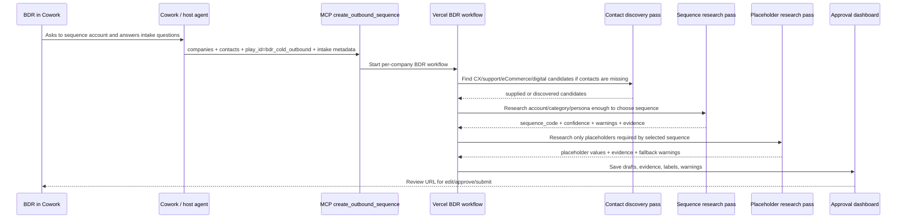
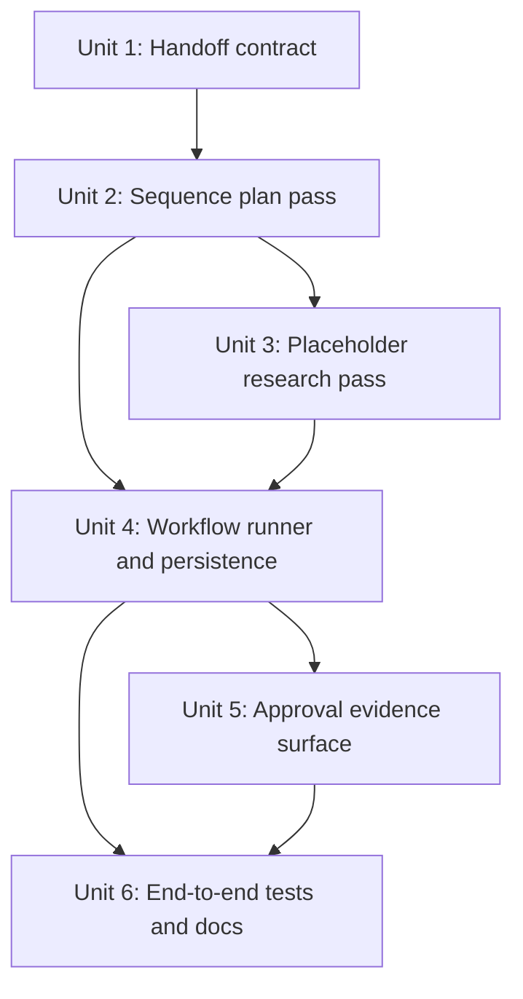
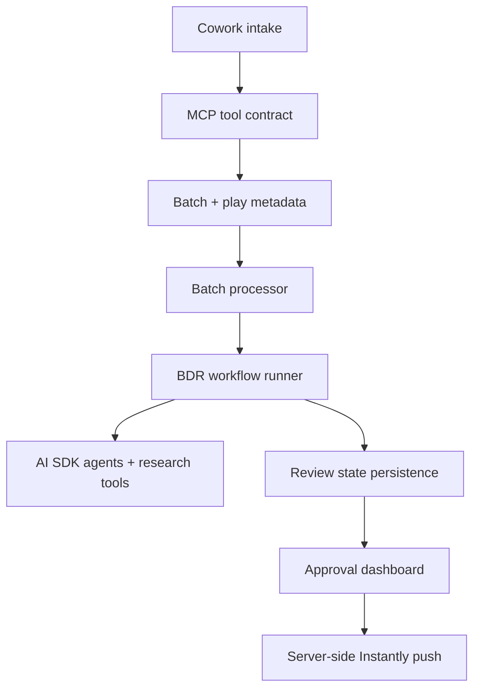

# feat: Add BDR two-pass agent research workflow

## Overview

Extend the current BDR play from a single in-process deterministic generator into a Vercel-side two-pass agent workflow. Cowork remains responsible for asking the BDR the minimal intake questions and making the play choice explicit. Once Cowork calls MCP with `play_id: "bdr_cold_outbound"`, the app should run a durable BDR workflow that first researches enough to select the correct sequence, then performs a deeper targeted pass to fill only the placeholders required by that selected sequence.

The goal is not a general play marketplace yet. This plan keeps the BDR path explicit while adding the orchestration shape needed for future play-specific agents.

| Layer | Current behavior | Planned behavior |
|---|---|---|
| Cowork / host agent | Determines BDR intent and calls MCP with `play_id` | Same, plus passes structured intake answers and any contact details it already has |
| App batch worker | Branches directly to `runBdrPlayAgent` | Starts/resumes a durable BDR agent workflow for each BDR company |
| BDR contact/sequence selection | Placeholder contact when none supplied | Discovery pass can find public CX/support/eCommerce/digital candidates; sequence pass selects the sequence from supplied or discovered context |
| Placeholder fill | Lookup functions run immediately after selection | Second agent pass: targeted research plan based on selected template placeholders |
| Approval flow | Existing review UI with Step 1 / Step 4 labels | Same approval flow, with richer evidence trace and pass-level warnings |

## Problem Frame

The existing implementation proves the first BDR vertical slice: `play_id` routes the batch to BDR-specific classification, research, draft generation, and the shared approval flow. The next question is where the richer agent intelligence should live. The answer should preserve the clean handoff:

- Cowork determines that the user wants the BDR play and collects inputs.
- The Vercel app discovers contacts/personas when they are missing, determines which BDR sequence to build, and performs research.
- The approval dashboard remains the human checkpoint before any push.

This follows the origin requirement to keep intake explicit, reuse the approval spine, and leave room for later play-specific agents (see origin: `docs/brainstorms/2026-04-29-bdr-play-plugin-intake-requirements.md`).

## Requirements Trace

- R1. Preserve Cowork-side BDR intent recognition and minimal follow-up intake (origin R1-R4).
- R2. Pass structured intake context into the app so the Vercel workflow can reason over user answers without re-asking the user.
- R3. Add a contact discovery path for company-only BDR intake, keeping discovered contacts non-pushable until emails are verified.
- R4. Add a first research/decision pass that selects brand type, persona, and sequence code with evidence, confidence, and warnings (origin R5-R8).
- R5. Add a second targeted research pass that fills only the placeholders required by the selected sequence steps (origin R9-R10).
- R6. Keep missing emails, unsupported categories, unmapped personas, and thin research as review warnings, not silent successes (origin R7, R13).
- R7. Preserve the current review and push workflow, including original BDR step labels (origin R11-R14).
- R8. Keep the architecture BDR-only for now while making the play workflow boundary reusable later (origin R15-R16).
- R9. Make workflow progress and retry behavior durable enough that partial first/second-pass work does not promote a batch to ready.

## Scope Boundaries

- Do not build a generalized play registry, graph editor, or multi-play marketplace.
- Do not move play intent inference into the backend for this iteration; Cowork still passes `play_id`.
- Do not let the model invent contacts, titles, emails, brand categories, or unsupported research findings.
- Do not expose research provider credentials or agent traces to the browser beyond safe evidence/warning summaries.
- Do not bypass the existing approval dashboard or server-side push posture.

### Deferred to Separate Tasks

- Dedicated Codex/Cowork skill file for the BDR intake playbook: separate follow-up after the workflow contract is stable.
- Generic play router that accepts raw user intent and chooses among multiple plays: future play framework work.
- Admin UI for play template authoring and dynamic placeholder definitions: future play management work.

## Context & Research

### Relevant Code and Patterns

- `lib/mcp/schemas.ts`, `lib/mcp/outbound-tools.ts`, and `app/api/mcp/route.ts` already accept and propagate `play_id`.
- `lib/jobs/processBatch.ts` is the current orchestration point for company-level batch processing and already routes BDR batches by `batch.play_id`.
- `lib/plays/bdr/classify.ts` contains the first-pass sequence selection logic today, but it is heuristic and only uses supplied company/domain/title strings.
- `lib/plays/bdr/research.ts` contains lookup-specific research functions for product, digital signal, subscription signal, review pattern, and support jobs.
- `lib/plays/bdr/run-bdr-play-agent.ts` currently combines sequence selection, research, template rendering, and output mapping in one function.
- `lib/ai/tools.ts` provides Exa-backed search helpers and should remain the low-level research boundary.
- `saveResearchArtifact` and review-state persistence already provide a place to store summarized agent outputs and evidence.
- `tests/bdr-play-agent.test.ts`, `tests/bdr-play-classification.test.ts`, and `tests/batch-review-flow.test.ts` are the nearest behavioral coverage to extend.

### Institutional Learnings

- No `docs/solutions/` files were present in this checkout, so there are no local solution writeups to carry forward.

### External References

- Vercel agent guide: AI agents are modeled as loops where an LLM chooses tools, tool calls are validated/executed, and results are appended back into context; deployed agents should use function duration settings and observability.
- AI SDK `ToolLoopAgent`: supports reusable multi-step tool loops, `stopWhen`, `activeTools`, and structured `output`.
- AI SDK loop control: `prepareStep` can change model, active tools, tool choice, and context by step, which fits a first-pass classifier followed by a deeper placeholder pass.
- Vercel Workflow: durable workflows and steps can pause/resume and survive crashes; step functions have built-in retries and are suited for external API calls.
- Vercel Fluid compute: useful for shorter agent endpoints and background work, but Workflow is the stronger fit for crash-safe multi-pass research.

## Key Technical Decisions

- Keep Cowork as the play-intent layer: The BDR user answers questions in Cowork, and Cowork calls MCP with `play_id`. The backend should not try to infer play intent from raw chat yet.
- Move sequence choice into the Vercel workflow: The backend should use company/contact/title plus first-pass research to decide `sequence_code`, rather than trusting Cowork to choose sequence variants.
- Split BDR generation into explicit passes: First pass produces a sequence plan; second pass fills selected placeholders. This avoids broad research and makes failures/warnings easier to review.
- Prefer durable Vercel Workflow for the two-pass orchestration: The flow has external API calls, partial state, and retry concerns; Workflow steps are a better fit than one long request.
- Keep AI outputs structured and schema-validated: Both passes should return typed objects that can be tested and safely persisted before rendering templates.
- Preserve deterministic template rendering: The model should gather/select facts; template rendering should remain controlled by app code so merge tokens and BDR voice are preserved.

## Open Questions

### Resolved During Planning

- Should the BDR play itself be determined in Cowork or in the backend? Keep it in Cowork for this iteration; backend handles sequence selection and research.
- Should the first and second research passes be one agent loop or two explicit workflow steps? Use explicit workflow steps. They may each use AI SDK agents internally, but the workflow boundary should persist the first-pass decision before deeper research begins.
- Should the agent dynamically research all possible sequence placeholders? No. First select a sequence, then research only the selected sequence's Step 1 / Step 4 lookup needs.

### Deferred to Implementation

- Exact model names and token limits: Decide during implementation based on current AI Gateway configuration and cost/latency needs.
- Whether Vercel Workflow Beta is enabled in the project: If unavailable, use the same workflow interface with the existing internal batch worker first, then swap execution to Workflow later.
- Exact persisted artifact shape: The plan names the required concepts, but final column/json shape should follow the existing store conventions during implementation.

## Output Structure

Implementation used the existing internal batch worker as the execution backend because Vercel Workflow is not configured in this project yet. The domain boundary is still named as a workflow runner so it can move behind Vercel Workflow later.

```text
lib/plays/bdr/
  sequence-plan.ts
  placeholder-research.ts
  workflow-output.ts
  workflow-runner.ts
tests/
  bdr-play-workflow.test.ts
  bdr-play-sequence-plan.test.ts
  bdr-play-placeholder-research.test.ts
```

## High-Level Technical Design

> *This illustrates the intended approach and is directional guidance for review, not implementation specification. The implementing agent should treat it as context, not code to reproduce.*



## Implementation Units



- [x] **Unit 1: Strengthen the Cowork-to-MCP handoff contract**

**Goal:** Make the explicit BDR play handoff carry enough structured context for the Vercel-side agent workflow to run without re-asking the user.

**Requirements:** R1, R2, R7

**Dependencies:** Current `play_id` support

**Files:**
- Modify: `lib/mcp/schemas.ts`
- Modify: `lib/mcp/outbound-tools.ts`
- Modify: `app/api/mcp/route.ts`
- Modify: `docs/bdr-play-intake.md`
- Test: `tests/mcp-outbound-sequence.test.ts`

**Approach:**
- Keep `play_id: "bdr_cold_outbound"` explicit.
- Extend `play_metadata` conventions to carry intake answers such as user request summary, confirmed play name, known missing fields, and campaign/push intent.
- Keep optional emails optional, but continue preserving supplied contact names and titles as the persona source of truth.
- Update the MCP tool description so Cowork knows it determines the play, while the Vercel workflow determines the sequence.

**Patterns to follow:**
- Current `createOutboundSequenceSchema` and `createOutboundSequence` propagation.
- Existing polling output contract in `lib/mcp/outbound-tools.ts`.

**Test scenarios:**
- Happy path: MCP call with `play_id`, company, contact title, and intake metadata creates a batch preserving `play_id` and metadata.
- Edge case: MCP call with BDR play and missing contact email still accepts the batch and preserves the title.
- Error path: MCP call with unknown play id remains rejected by schema.
- Integration: Status polling response includes `play_id` and does not expose raw sensitive research payloads.

**Verification:**
- BDR batches can be created with explicit play metadata, and generic outbound batches remain unchanged when `play_id` is omitted.

- [x] **Unit 2: Add the first-pass BDR sequence planning agent**

**Goal:** Build a first-pass workflow component that performs lightweight account/persona research and emits a structured sequence decision before any placeholder writing begins.

**Requirements:** R3, R5, R7

**Dependencies:** Unit 1

**Files:**
- Create: `lib/plays/bdr/sequence-plan.ts`
- Modify: `lib/plays/bdr/classify.ts`
- Modify: `lib/plays/bdr/types.ts`
- Modify: `lib/plays/bdr/sequences.ts`
- Test: `tests/bdr-play-sequence-plan.test.ts`
- Test: `tests/bdr-play-classification.test.ts`

**Approach:**
- Define a `BdrSequencePlan` shape containing brand classification, persona classification, `sequence_code`, confidence, evidence URLs, warnings, and the selected template's required lookup keys.
- Use the existing deterministic classifier as the guardrail and fallback, not as the only source of truth.
- Add a first-pass agent/tool layer that can research company category and validate whether the supplied contact title fits a supported persona.
- Require structured output and schema validation. If the output is invalid or unsupported, return a warning-only sequence mapping result rather than producing confident drafts.
- Do not let the first pass mutate templates or produce final email body copy.

**Technical design:** Directional only:

```text
Input: company + contacts + intake metadata
Pass 1 output:
  - selected brand category or unsupported warning
  - selected persona per contact or unmapped warning
  - sequence_code when both brand and persona are supported
  - placeholder lookup requirements for the selected sequence
  - evidence ledger for why this sequence was selected
```

**Patterns to follow:**
- Current `selectBdrSequence` return shape and warning handling.
- `companyAgentOutputSchema` structured validation pattern.
- AI SDK structured `output` pattern from the official docs.

**Test scenarios:**
- Happy path: Kizik plus VP Customer Experience with supporting category evidence maps to `A-1` and returns required Step 1 / Step 4 lookup keys.
- Happy path: LG plus Director of E-commerce maps to `D-2` with confidence and evidence.
- Edge case: Known company but unsupported title returns no sequence and a persona warning.
- Edge case: Ambiguous company category returns no confident sequence unless evidence supports a supported BDR category.
- Error path: Invalid model output or missing `sequence_code` is converted into review-safe warnings.
- Integration: Existing heuristic classification tests still pass or are updated to assert the deterministic fallback behavior.

**Verification:**
- The first pass can be exercised without rendering email copy and produces enough metadata for the second pass to know exactly what to research.

- [x] **Unit 3: Add the second-pass placeholder research agent**

**Goal:** Research and fill the selected sequence's placeholders using only the lookup requirements produced by the sequence plan.

**Requirements:** R4, R5, R6

**Dependencies:** Unit 2

**Files:**
- Create: `lib/plays/bdr/placeholder-research.ts`
- Modify: `lib/plays/bdr/research.ts`
- Modify: `lib/plays/bdr/run-bdr-play-agent.ts`
- Test: `tests/bdr-play-placeholder-research.test.ts`
- Test: `tests/bdr-play-agent.test.ts`

**Approach:**
- Define a placeholder research bundle keyed by selected template lookup needs, such as hero product, complex product, digital signal, subscription signal, review pattern, support role count, or digital investment.
- Use AI SDK tool-loop behavior only within the allowed research scope for the selected sequence. `prepareStep`/active tool control can restrict available tools by pass.
- Preserve the current fallback behavior: missing research should create warnings and use existing fallback bodies where available.
- Keep final template rendering deterministic. The agent fills facts; app code replaces placeholders and preserves merge tokens.
- Store source URLs and concise evidence claims for every accepted placeholder value.

**Patterns to follow:**
- Current `researchForBdrSequence` lookup dispatch.
- Current test provider pattern in `tests/bdr-play-agent.test.ts`.
- `lib/ai/tools.ts` as the boundary for Exa/search/browser helpers.

**Test scenarios:**
- Happy path: Sequence with hero product and review pattern lookups returns both placeholder values with source URLs and no warnings.
- Happy path: Sequence with support jobs lookup accepts a numeric role count only when source evidence supports it.
- Edge case: Missing Step 1 evidence uses the Step 1 fallback and records a warning.
- Edge case: Missing Step 4 Version A evidence uses Version B and records a warning.
- Error path: Research provider failure is converted to a warning and does not fail the whole batch when fallback copy exists.
- Integration: Rendered emails contain no unresolved bracket placeholders except approved merge tokens like `{{first_name}}`.

**Verification:**
- The second pass cannot research unrelated placeholders for non-selected sequences and cannot produce final copy without a validated sequence plan.

- [x] **Unit 4: Introduce durable BDR workflow orchestration**

**Goal:** Move BDR company processing behind a workflow runner that persists first-pass and second-pass progress before saving review drafts.

**Requirements:** R3, R4, R6, R8

**Dependencies:** Units 2 and 3

**Files:**
- Create: `lib/plays/bdr/workflow-runner.ts`
- Create: `lib/plays/bdr/workflow-output.ts`
- Modify: `lib/jobs/processBatch.ts`
- Modify: `lib/types.ts`
- Test: `tests/bdr-play-workflow.test.ts`
- Test: `tests/batch-review-flow.test.ts`

**Approach:**
- Add a workflow runner interface that can be called from `processBatch`; behind that interface, prefer Vercel Workflow when available.
- Add the Workflow dependency/configuration only if implementation confirms Vercel Workflow is enabled for this project; otherwise keep the runner interface and use the existing internal worker as the first execution backend.
- Model the durable stages as intake received, sequence planning, placeholder research, review draft save, and ready for review.
- Save first-pass and second-pass artifacts separately enough that a retry can resume or safely identify pending work.
- Persist the pass artifacts inside the existing research artifact raw summary rather than adding new tables in this slice.
- Continue using the existing `batch_runs` statuses unless implementation shows a clear need for more granular statuses. If more granularity is needed, add it intentionally and update polling.
- Keep the recent retry fix invariant: unfinished workflow work must keep the batch `processing`, not promote it to `ready_for_review`.

**Patterns to follow:**
- Current `processBatch` company loop and batch run idempotency guard.
- Existing `saveResearchArtifact` persistence.
- Vercel Workflow step model for crash-safe external API work.

**Test scenarios:**
- Happy path: BDR batch starts workflow, persists sequence plan, persists placeholder research, saves review drafts, and marks run ready.
- Edge case: Retry after sequence planning but before placeholder research resumes without creating a duplicate run.
- Edge case: Retry while workflow is still pending keeps the batch in `processing`.
- Error path: First-pass unsupported category saves warning-only review output instead of failing silently.
- Error path: Second-pass provider error with fallback copy produces review output with warnings.
- Integration: `get_outbound_sequence_status` reflects non-terminal `processing` until all workflow-backed runs are ready or failed.

**Verification:**
- Workflow-backed BDR runs behave like existing batch runs from the review user's perspective, but survive partial progress and retries.

- [x] **Unit 5: Surface pass-level evidence and warnings in approval**

**Goal:** Let reviewers understand why a sequence was selected and which placeholder facts were used without creating a separate review experience.

**Requirements:** R5, R6

**Dependencies:** Unit 4

**Files:**
- Modify: `lib/types.ts`
- Test: `tests/batch-review-flow.test.ts`

**Approach:**
- Keep the existing review screens, edit/approve/skip controls, Step 1 / Step 4 labels, and CSV export behavior.
- Current `primary_angle`, `opening_hook`, `proof_used`, `guardrail`, `evidence_urls`, `qa_warnings`, and `play_metadata` are sufficient for this slice, so no new UI fields were needed.
- Prefer compact warnings and evidence summaries over raw agent traces.
- Ensure unsupported or low-confidence sequence decisions are visibly non-ready for approval unless the reviewer consciously edits/approves them.

**Patterns to follow:**
- Existing warning callout and evidence fields in both review apps.
- Existing `emailDisplayLabel` behavior for original BDR step labels.

**Test scenarios:**
- Happy path: Review state for a BDR run displays selected sequence, evidence URLs, and Step 1 / Step 4 labels.
- Edge case: Warning-only sequence mapping output displays warnings and a non-pushable placeholder email when applicable.
- Integration: CSV export preserves sequence code and labeled email columns after the workflow change.

**Verification:**
- A reviewer can tell what the agent chose, why it chose it, what facts filled the placeholders, and what still needs human judgment.

- [x] **Unit 6: Update tests, docs, and operational guidance**

**Goal:** Document and verify the new division of responsibility: Cowork chooses the play, Vercel chooses the sequence and performs two-pass research.

**Requirements:** R1-R8

**Dependencies:** Units 1-5

**Files:**
- Modify: `docs/bdr-play-intake.md`
- Modify: `docs/cowork-async-polling-instructions.md`
- Modify: `README.md`
- Modify: `vercel.json`
- Test: `tests/bdr-play-workflow.test.ts`
- Test: `tests/mcp-outbound-sequence.test.ts`
- Test: `tests/batch-review-flow.test.ts`

**Approach:**
- Update docs to state clearly that Cowork determines `bdr_cold_outbound`; the Vercel agent workflow determines sequence code and placeholder research.
- Document fallback behavior when Vercel Workflow is not enabled.
- Document operational expectations for long-running research, polling, non-terminal status, and retry behavior.
- Ensure function duration/config guidance matches the chosen runtime path.

**Patterns to follow:**
- Current README BDR cold outbound section.
- Current Cowork polling instructions.
- Existing `vercel.json` function duration entries.

**Test scenarios:**
- Integration: Full BDR batch creates review output through the workflow path.
- Integration: Missing email remains non-pushable after two-pass workflow generation.
- Integration: Polling remains non-terminal during pending workflow work and terminal only after review output is saved.
- Error path: Unknown or omitted `play_id` continues to use the generic path or schema rejection exactly as today.

**Verification:**
- The docs explain the architecture accurately, and automated coverage proves the intended handoffs and terminal states.

## System-Wide Impact



- **Interaction graph:** Cowork/MCP, batch worker, Vercel Workflow, AI SDK research tools, persistence, approval UI, and push all remain part of the path.
- **Error propagation:** Agent/research errors should become structured warnings when fallback copy exists; only infrastructure or persistence failures should fail the run.
- **State lifecycle risks:** The main risk is partial first/second-pass work. Persist pass outputs and keep unfinished runs non-terminal.
- **API surface parity:** MCP, Cowork webhook batch input, internal process route, status polling, and review state must all agree on `play_id`, play metadata, and workflow status.
- **Integration coverage:** Unit tests for each pass are necessary but not enough; batch-level tests must prove the workflow feeds review state and status polling correctly.
- **Unchanged invariants:** Cowork still selects the play; reviewers still approve before push; missing emails remain non-pushable; generic outbound flow remains available when `play_id` is omitted.

## Risks & Dependencies

| Risk | Mitigation |
|---|---|
| Workflow Beta is unavailable or not configured | Build a workflow runner interface with an existing internal-worker fallback; keep domain logic independent of Vercel-specific directives. |
| Agent selects an unsupported or weak sequence | Require structured confidence/warnings and fall back to warning-only review output. |
| Research becomes too broad or expensive | Derive second-pass lookup tasks from the selected template only and enforce tool/step limits. |
| Partial workflow progress creates duplicate runs or false readiness | Reuse company keys, persist pass artifacts, and preserve the processing-state retry invariant. |
| Model output corrupts merge tokens or template voice | Keep final rendering deterministic in app code and test merge token preservation. |
| Review UI overwhelms users with traces | Surface compact evidence and warnings, not raw tool logs. |

## Documentation / Operational Notes

- The user-facing mental model should be: Cowork picks the play; Vercel picks the sequence; approval validates the output.
- Polling instructions should explicitly treat workflow-backed BDR runs as asynchronous and non-terminal until the review URL is ready.
- Vercel observability/logging should distinguish pass one sequence planning from pass two placeholder research.
- If using Vercel Workflow, deployment notes should mention Workflow availability, function duration expectations, and any required package/env setup.

## Sources & References

- **Origin document:** [docs/brainstorms/2026-04-29-bdr-play-plugin-intake-requirements.md](../brainstorms/2026-04-29-bdr-play-plugin-intake-requirements.md)
- Related code: `lib/jobs/processBatch.ts`
- Related code: `lib/plays/bdr/run-bdr-play-agent.ts`
- Related code: `lib/plays/bdr/research.ts`
- Related code: `lib/plays/bdr/classify.ts`
- Related code: `lib/mcp/schemas.ts`
- Vercel agent guide: [How to build AI Agents with Vercel and the AI SDK](https://vercel.com/docs/agents/)
- AI SDK reference: [ToolLoopAgent](https://ai-sdk.dev/docs/reference/ai-sdk-core/tool-loop-agent)
- AI SDK guide: [Agents loop control](https://ai-sdk.dev/docs/agents/loop-control)
- Vercel docs: [Workflow](https://vercel.com/docs/workflow)
- Vercel docs: [Fluid compute](https://vercel.com/docs/fluid-compute)
