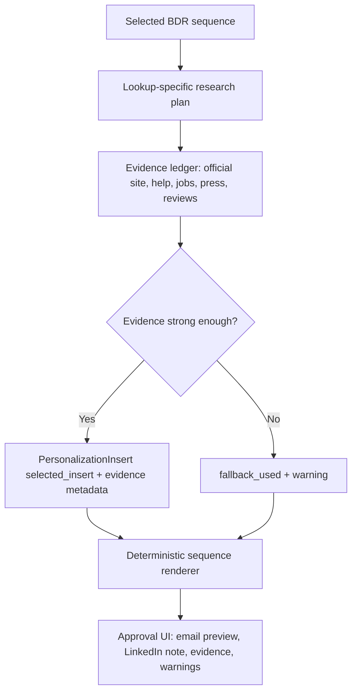

# feat: Update BDR prompt contracts for consistent personalization

## Overview

Update the BDR play implementation so it uses the new inline prompt document as a structured prompt and evidence contract rather than treating personalization as a simple string cleanup problem. The current BDR flow can select sequences, run targeted research, and render Step 1 / Step 4 drafts into the approval UI, but recent Quince and Grüns tests showed the weak spot: noisy page text can leak into email copy, and the renderer lacks a durable way to decide when to use a personalized insert versus a generic opener.

The new behavior should preserve deterministic template rendering while moving placeholder research toward evidence-backed, lookup-specific inserts with confidence, source snippets, and fallback decisions. The implementing agent should not build a generic play marketplace; this remains a BDR-only improvement to the existing two-pass workflow.

## Problem Frame

The origin requirements say the BDR play must preserve template voice, run targeted lookups only for selected sequence steps, surface evidence and warnings in review, and keep unsupported or weak research from silently producing bad drafts (see origin: `docs/brainstorms/2026-04-29-bdr-play-plugin-intake-requirements.md`). The updated prompt document adds more precise rules:

- Build a mini evidence ledger before filling placeholders.
- Prefer official product, help center, jobs, press, and policy evidence over noisy reviews or social snippets.
- Output a short `selected_insert`, not raw research text.
- Use review/social evidence only when there are repeated credible patterns.
- Delete or skip personalization when evidence is weak and use the generic opener.
- Include LinkedIn connection notes as part of the full manual sequence preview.

The plan should make those rules first-class in the BDR play domain model instead of scattering one-off string sanitizers through rendering code.

## Requirements Trace

- R1. Preserve BDR-only routing and sequence selection from the existing two-pass workflow (origin R3, R4, R8).
- R2. Replace raw placeholder values with structured personalization inserts that include `selected_insert`, confidence, evidence type, verified fact, inference, source URL, source snippet, and fallback status.
- R3. Update all 12 BDR sequences from the updated inline prompt document, including subjects, email body copy, generic fallbacks, and LinkedIn connection notes.
- R4. Research only the lookup needs for the selected sequence, but make each lookup follow the source priority and evidence rules in the prompt document (origin R9).
- R5. Render only `selected_insert` into email copy, never source snippets, raw page titles, scraped headings, or review quotes.
- R6. If evidence is weak, omit the personalized sentence and use the sequence's generic opener/version instead of forcing a low-confidence insert.
- R7. Display enough evidence context in the approval flow for review without making non-pushable or noisy outputs look approved-ready (origin R11, R13).
- R8. Add LinkedIn note preview support for the selected sequence while keeping final API push scoped to email variables/placeholders for now.
- R9. Keep merge tokens intact and remove prompt artifacts such as `---`, `[SELECTED_INSERT]`, version labels, and research instructions from rendered email output.

## Scope Boundaries

- Do not build a generic prompt editor, play marketplace, or arbitrary sequence authoring UI.
- Do not push LinkedIn messages through the sequencer API in this iteration; preview them for approval only.
- Do not expose raw agent traces, API credentials, or full scraped page content in the browser.
- Do not rely on one-off Reddit/review snippets as standalone pain claims.
- Do not let LLM output rewrite the whole email template; the app should render controlled templates with validated inserts.

### Deferred to Separate Tasks

- Full sequence push mapping for all manual BDR steps beyond the current email push shape: separate sequencer integration work.
- Browserbase interaction for JS-heavy catalogs and support widgets: add after the Exa-first contract is stable.
- Proof-style prompt management or admin editing UI: future play management work.

## Context & Research

### Relevant Code and Patterns

- `lib/plays/bdr/sequences.ts` currently stores sequence templates, subjects, labels, and Step 1 / Step 4 variant copy.
- `lib/plays/bdr/research.ts` owns lookup-specific research provider methods and currently returns `{ value, evidence_urls, warning }`.
- `lib/plays/bdr/personalization.ts` performs defensive cleanup of noisy values, but it does not model evidence, confidence, or fallback decisions.
- `lib/plays/bdr/placeholder-research.ts` maps selected sequence lookups to persisted placeholder research.
- `lib/plays/bdr/workflow-output.ts` renders BDR sequence output into `CompanyAgentOutput` for the review UI.
- `lib/plays/bdr/sequence-plan.ts` selects sequence codes and records first-pass evidence.
- `lib/ai/tools.ts` is the low-level Exa search boundary. It already returns `source_url`, `source_title`, `quote_or_fact`, evidence type, and confidence.
- `tests/bdr-play-sequence-plan.test.ts`, `tests/bdr-play-placeholder-research.test.ts`, and `tests/bdr-play-workflow.test.ts` are the main behavioral tests to extend.
- `tests/batch-review-flow.test.ts` and `tests/mcp-outbound-sequence.test.ts` cover cross-layer review and MCP behavior.

### Institutional Learnings

- No `docs/solutions/` files are present in this checkout. The most relevant institutional context is the completed predecessor plan in `docs/plans/2026-04-30-001-feat-bdr-two-pass-agent-workflow-plan.md`.

### External References

- User-provided source prompt: `BDR_Cold_Outbound_Sequences_UPDATED_INLINE_PROMPTS.md`
- No external framework research is needed for this plan. The codebase already has local patterns for the BDR workflow, research provider boundaries, typed rendering, and review tests.

## Key Technical Decisions

- **Represent prompts as structured sequence definitions:** Update `BdrSequenceTemplate` so each step can carry email copy, fallback copy, LinkedIn note copy, lookup type, and insertion policy. This avoids burying prompt rules in free-form strings.
- **Introduce a personalization insert contract:** Replace `BdrResearchFinding.value` as the primary render input with a richer object matching the prompt document's internal output contract. Rendering should use only `selected_insert`.
- **Separate evidence gathering from copy insertion:** Research providers can collect facts and snippets; a lookup-specific adapter should decide whether those facts produce a safe insert or a fallback.
- **Use fallback as a first-class outcome:** Low-confidence evidence should not produce a weak personalized sentence. It should mark `fallback_used: true`, carry a warning, and render the generic opener/version.
- **Keep deterministic rendering:** The updated prompts should improve the inputs to templates, not hand full body generation to an LLM.
- **Preview LinkedIn notes without pushing them:** The manual sequence includes LinkedIn connection notes, so the approval UI should show them, but push behavior remains email-only until the sequencer integration supports the right variable mapping.

## Open Questions

### Resolved During Planning

- Should the updated prompt document replace current hard-coded copy directly or become a data contract? Use it as a data contract. Direct string replacement would preserve too many prompt artifacts and would not solve consistency.
- Should weak evidence still fill a generic "noticed..." sentence? No. Weak evidence should delete the personalized sentence and use the sequence fallback.
- Should review/social evidence be enough for Version A? Only when the lookup finds repeated credible patterns, not a single review or scraped forum page.

### Deferred to Implementation

- Exact parser strategy for importing the prompt document: Implementation can either migrate manually into typed sequence definitions or add a small conversion script if that proves faster.
- Exact Browserbase boundary: The plan designs the interface so Browserbase can be added, but implementation can keep the first pass Exa-only if Browserbase credentials are not configured locally.
- Exact review UI layout for LinkedIn notes: Keep it consistent with current card/email rendering patterns during implementation.

## High-Level Technical Design

> *This illustrates the intended approach and is directional guidance for review, not implementation specification. The implementing agent should treat it as context, not code to reproduce.*

Decision matrix for inserting copy:

| Lookup family | Preferred sources | Insert when | Fallback when |
|---|---|---|---|
| Product / campaign | Official homepage, product pages, new arrivals, social only if current | Campaign naturally ties to fit, sizing, gift timing, returns, or pre-purchase questions | Product is stale, generic, or only a scraped title |
| Complex product | Catalog, PDPs, guides, configurators, warranty/delivery pages | Product has clear decision complexity or regret risk | No product/category stands out |
| Subscription signal | Subscription pages, cancel/pause/skip FAQs, retention jobs, funding plus subscription model | Signal ties to cancel/save/retention or subscriber lifecycle | Only generic subscription language is found |
| Jobs signal | Official careers, Greenhouse/Lever/Ashby, LinkedIn snippets | 2+ relevant roles or one senior role with relevant responsibilities | Role count is noisy or unrelated |
| Review pattern | Trustpilot, Google, app reviews, Reddit only with repeated credible patterns | 3+ materially similar examples support the same non-accusatory pattern | Fewer than 3 examples, weak source, inflammatory one-off |
| Digital signal | Press, investor, executive, careers, credible retail press | Concrete initiative ties to roadmap sequencing | Vague transformation language only |

## Implementation Units

- [x] **Unit 1: Model the updated BDR sequence and insert contract**

**Goal:** Extend the BDR domain types so sequence templates and personalization results can represent the updated prompt rules without relying on ad hoc string cleanup.

**Requirements:** R2, R3, R5, R6, R8, R9

**Dependencies:** None

**Files:**
- Modify: `lib/plays/bdr/types.ts`
- Modify: `lib/plays/bdr/sequences.ts`
- Test: `tests/bdr-play-placeholder-research.test.ts`
- Test: `tests/bdr-play-workflow.test.ts`

**Approach:**
- Add a typed personalization result shape with fields equivalent to `selected_insert`, confidence, evidence type, verified fact, inference, source URL, source snippet, and fallback status.
- Add step metadata needed by the updated prompt document: source priority, insertion rule, fallback behavior, and LinkedIn note text.
- Update the sequence definitions to remove prompt artifacts from body templates and store insertion instructions as metadata, not visible copy.
- Preserve existing `sequence_code`, original step labels, merge tokens, and Step 1 / Step 4 email behavior.

**Patterns to follow:**
- Current `BdrSequenceTemplate` and `BdrPlaceholderResearch` shapes in `lib/plays/bdr/types.ts`.
- Existing deterministic template constants in `lib/plays/bdr/sequences.ts`.

**Test scenarios:**
- Happy path: A sequence definition exposes Step 1 email body, Step 4 variant bodies, and LinkedIn note text without prompt instructions appearing in rendered output.
- Edge case: A sequence with no insert available still has a generic fallback path.
- Error path: Missing or malformed insert metadata does not render `[SELECTED_INSERT]` or `undefined`.
- Integration: Existing workflow tests still map selected sequences to original play step labels.

**Verification:**
- The BDR template layer can represent every updated prompt requirement while rendered emails remain clean and merge-token-safe.

- [x] **Unit 2: Replace value-only research findings with evidence-backed inserts**

**Goal:** Make placeholder research return validated insert decisions rather than raw text values.

**Requirements:** R2, R4, R5, R6, R7

**Dependencies:** Unit 1

**Files:**
- Modify: `lib/plays/bdr/research.ts`
- Modify: `lib/plays/bdr/placeholder-research.ts`
- Modify: `lib/plays/bdr/personalization.ts`
- Modify: `lib/ai/tools.ts`
- Test: `tests/bdr-play-placeholder-research.test.ts`

**Approach:**
- Keep `lib/ai/tools.ts` as the low-level research boundary and avoid leaking provider-specific details upward.
- Update each lookup method to collect candidate evidence records, then produce a lookup-specific `PersonalizationInsert`.
- Enforce source priority from the prompt document: official pages first, reviews/social only under stricter repeated-pattern rules.
- Make fallback decisions explicit with warnings and evidence URLs when available.
- Retain compatibility for tests and callers by adapting old `value` expectations through the new `selected_insert` until all rendering is migrated.

**Patterns to follow:**
- Current `defaultBdrResearchProvider` lookup methods.
- Existing warning propagation in `researchBdrPlaceholders`.

**Test scenarios:**
- Happy path: Product lookup with official featured collection evidence returns a concise insert tied to fit/sizing/pre-purchase moment.
- Happy path: Subscription lookup with cancel/pause/skip policy evidence returns an insert tied to save/cancel lifecycle.
- Edge case: Review lookup with fewer than three matching examples returns `fallback_used: true` and does not produce a Version A insert.
- Error path: Exa returns noisy page chrome or generic title text; insert is rejected or normalized without raw scraping artifacts.
- Integration: Placeholder research for a selected sequence invokes only the two lookup families required by that sequence.

**Verification:**
- No renderer needs to infer confidence from raw strings; every placeholder has either a safe insert or an explicit fallback.

- [x] **Unit 3: Migrate all updated BDR sequence copy and LinkedIn notes**

**Goal:** Bring the 12 sequence definitions in line with the updated inline prompt document while preserving controlled rendering.

**Requirements:** R3, R8, R9

**Dependencies:** Unit 1

**Files:**
- Modify: `lib/plays/bdr/sequences.ts`
- Test: `tests/bdr-play-workflow.test.ts`

**Approach:**
- Update subjects and body copy for all `A-*`, `B-*`, `C-*`, and `D-*` sequences from the updated prompt document.
- Remove visible prompt scaffolding from templates: no `---`, no `[SELECTED_INSERT]`, no "Version A" labels, no research instructions.
- Add LinkedIn connection note templates as preview-only steps associated with the selected sequence.
- Normalize openers so they read as natural cold email copy after token replacement, including when the personalization sentence is omitted.

**Patterns to follow:**
- Current `BDR_SEQUENCES` structure and `sequenceFor` accessor.
- Recent no-dash template changes in `lib/plays/bdr/sequences.ts`.

**Test scenarios:**
- Happy path: `D-3` renders the updated "how MaryRuth's monetized the cancel flow" subject and body for a subscription eCommerce leader.
- Happy path: `B-2` renders the updated Ralph Lauren support-ops copy and associated LinkedIn note.
- Edge case: Missing Step 1 insert removes or bypasses the personalized sentence without leaving awkward punctuation.
- Error path: Rendered output contains no `---`, `[SELECTED_INSERT]`, research instructions, or markdown table artifacts.
- Integration: LinkedIn notes appear in workflow output metadata or preview structure without being included in email push payloads.

**Verification:**
- Review output matches the updated prompt document's voice and sequence selection while staying deterministic.

- [x] **Unit 4: Update rendering and approval output for inserts, fallbacks, and LinkedIn preview**

**Goal:** Render the full selected sequence consistently in the approval UI with email drafts, LinkedIn note preview, evidence metadata, and fallback warnings.

**Requirements:** R5, R6, R7, R8, R9

**Dependencies:** Units 1, 2, and 3

**Files:**
- Modify: `lib/plays/bdr/workflow-output.ts`
- Modify: `lib/agent/schemas.ts`
- Modify: `lib/types.ts`
- Modify: `app/review/batch/[token]/page.tsx`
- Modify: `app/review/[token]/page.tsx`
- Modify: `app/api/review/batch/[token]/state/route.ts`
- Modify: `app/api/review/[token]/state/route.ts`
- Test: `tests/batch-review-flow.test.ts`
- Test: `tests/bdr-play-workflow.test.ts`

**Approach:**
- Render email bodies from the template plus `selected_insert` only.
- Carry insert metadata into `opening_hook`, `proof_used`, evidence URLs, and QA warnings without showing raw source snippets as email copy.
- Add a preview representation for LinkedIn notes if the existing review schema can support it safely; otherwise store it in play metadata and surface it in the BDR contact evidence panel.
- Keep the push path email-only for this iteration.
- Ensure missing real emails and discovered contacts remain non-pushable until edited.

**Patterns to follow:**
- Existing `CompanyAgentOutput` contact and email mapping.
- Current review page behavior for `step_label`, `original_step_number`, editable body fields, evidence, and QA warnings.

**Test scenarios:**
- Happy path: A contact with high-confidence insert shows personalized Step 1 and Version A Step 4 emails plus LinkedIn note preview.
- Happy path: A contact with fallback Step 1 shows generic opener and a warning explaining fallback use.
- Edge case: Missing LinkedIn preview support in the UI does not block email review or push.
- Error path: Raw source snippets remain in evidence metadata only and never appear inside `body_text`.
- Integration: Approved email payloads still include only supported email fields and merge tokens.

**Verification:**
- The approval page lets reviewers understand why a line was inserted, edit the final copy, and avoid pushing unverified contacts.

- [x] **Unit 5: Strengthen sequence planning with prompt-source brand and persona rules**

**Goal:** Align sequence selection with the updated prompt document's brand categories and persona constraints so the right variation is selected before placeholder research begins.

**Requirements:** R1, R3, R4, R7

**Dependencies:** Unit 1

**Files:**
- Modify: `lib/plays/bdr/classify.ts`
- Modify: `lib/plays/bdr/sequence-plan.ts`
- Test: `tests/bdr-play-sequence-plan.test.ts`

**Approach:**
- Keep deterministic classification as a guardrail but align category terms with the prompt document's brand types.
- Continue preferring supplied titles, while preserving discovered-contact warnings for unverified titles.
- Ensure subscription/replenishment brands such as supplements, pet food, beauty subscriptions, personal care, and meal kits are not overpowered by generic return/support review language.
- Keep unsupported or ambiguous companies as warning-only plans unless account evidence supports a BDR category.

**Patterns to follow:**
- Existing `selectBdrSequence` and evidence scoring behavior.
- Recent Grüns regression coverage in `tests/bdr-play-sequence-plan.test.ts`.

**Test scenarios:**
- Happy path: Grüns-style daily nutrition subscription evidence maps retail/eCommerce leadership to `D-3`.
- Happy path: High-consideration electronics/furniture evidence maps eCommerce leadership to `D-2`.
- Edge case: Company evidence contains both reviews and subscription terms; subscription category wins when the business model evidence is stronger.
- Error path: Unsupported brand category returns no sequence and produces a review warning.
- Integration: Sequence planning still produces required lookup keys for the placeholder pass.

**Verification:**
- Sequence selection is stable enough that prompt improvements are not undermined by the wrong variant choice.

- [x] **Unit 6: Add end-to-end prompt consistency fixtures**

**Goal:** Lock in representative examples so future prompt edits do not regress into raw scraped text, weak evidence claims, or wrong sequence variants.

**Requirements:** R1-R9

**Dependencies:** Units 1 through 5

**Files:**
- Modify: `tests/bdr-play-workflow.test.ts`
- Modify: `tests/bdr-play-placeholder-research.test.ts`
- Modify: `tests/bdr-play-sequence-plan.test.ts`
- Modify: `tests/mcp-outbound-sequence.test.ts`

**Approach:**
- Add fixture-style tests for Quince, Grüns, and one high-consideration brand scenario.
- Assert not only selected sequence code, but also rendered subject, email body shape, fallback behavior, LinkedIn note presence, evidence URLs, warnings, and absence of prompt artifacts.
- Include negative tests for noisy raw page title, single review complaint, and missing evidence.

**Patterns to follow:**
- Existing mocked provider tests in `tests/bdr-play-workflow.test.ts`.
- Existing MCP and batch review integration tests.

**Test scenarios:**
- Happy path: Quince maps to high-return retail and produces copy-safe product/campaign insert without raw homepage text.
- Happy path: Grüns maps to `D-3` and uses subscription lifecycle copy without `Upgrade Your Subscription` page chrome.
- Happy path: A high-consideration catalog brand produces a pre-purchase guidance insert and correct benchmarks subject.
- Edge case: Weak evidence deletes personalized insert and uses generic opener.
- Error path: Review pattern from one Reddit thread is rejected and Version B renders.
- Integration: MCP-created BDR batch reaches review with sequence code, inserts, LinkedIn preview, evidence, and non-pushable missing-email warnings.

**Verification:**
- Test fixtures prove consistent output across brand type, persona, evidence strength, and fallback modes.

## System-Wide Impact

- **Interaction graph:** Cowork still calls MCP with `play_id`; `processBatch` still routes BDR work into the BDR workflow runner; sequence planning and placeholder research become more structured; approval remains the human checkpoint.
- **Error propagation:** Research failures should become insert fallback warnings, not thrown batch failures unless the selected sequence itself cannot be rendered.
- **State lifecycle risks:** Existing batch retry behavior should not mark low-confidence or fallback-heavy outputs as push-ready; missing emails stay non-pushable.
- **API surface parity:** MCP and push APIs should not require new caller fields for this iteration. Review output schema may expand for LinkedIn preview/evidence metadata.
- **Integration coverage:** End-to-end tests should prove MCP-created BDR batches can render prompt-safe outputs through the review state.
- **Unchanged invariants:** `play_id: "bdr_cold_outbound"` remains the durable play selector; Cowork chooses the play, the backend chooses the sequence; approved push remains server-side.

## Risks & Dependencies

| Risk | Mitigation |
|------|------------|
| The updated prompt document is prose-heavy and includes examples with `---` that should not be rendered | Store prompt rules as metadata and clean templates, not direct pasted instruction blocks |
| Evidence contract expands data shape and could break existing render tests | Migrate through typed adapters and update tests around rendered behavior, not internal implementation details |
| LLM or search results may still return noisy page titles | Require lookup-specific insert validation and fallback decisions before rendering |
| Review UI may not have a clean place for LinkedIn notes | Add preview metadata first; defer push/API mapping |
| Prompt copy can drift from the attached source over time | Add fixture tests for representative sequences and document the source prompt filename in plan/docs |

## Documentation / Operational Notes

- Update `docs/bdr-play-intake.md` to explain that BDR personalization uses evidence-backed inserts and may intentionally fall back to generic openers.
- Update any Cowork-facing instructions that imply the backend always personalizes every placeholder.
- Note that LinkedIn notes are preview-only until sequencer push support is explicitly added.

## Sources & References

- **Origin document:** [docs/brainstorms/2026-04-29-bdr-play-plugin-intake-requirements.md](../brainstorms/2026-04-29-bdr-play-plugin-intake-requirements.md)
- **Predecessor plan:** [docs/plans/2026-04-30-001-feat-bdr-two-pass-agent-workflow-plan.md](2026-04-30-001-feat-bdr-two-pass-agent-workflow-plan.md)
- **User-provided prompt source:** `BDR_Cold_Outbound_Sequences_UPDATED_INLINE_PROMPTS.md`
- Related code: `lib/plays/bdr/sequences.ts`
- Related code: `lib/plays/bdr/research.ts`
- Related code: `lib/plays/bdr/workflow-output.ts`
- Related tests: `tests/bdr-play-workflow.test.ts`
