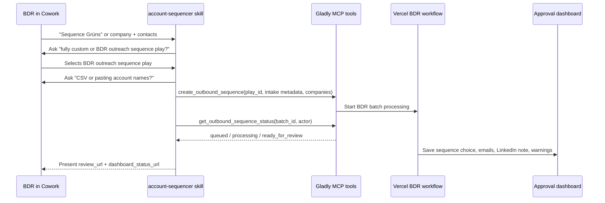

# feat: Update Cowork BDR skill for Vercel orchestration

## Overview

Update the Cowork-facing `account-sequencer` skill so it matches the new BDR architecture. The old skill behaves like a standalone outbound writer: it parses the BDR request, selects the BDR sequence, runs research, fills Step 1 and Step 4 inline, and tells the BDR to paste the emails into Outreach. The new product flow is different: Cowork should first ask whether the user wants a fully custom sequence or the BDR outreach sequence play. Only when the user selects the BDR play should Cowork ask whether the user has a CSV or is pasting account names, collect the minimum intake fields, call `create_outbound_sequence` with `play_id: "bdr_cold_outbound"`, poll with `get_outbound_sequence_status`, and present the approval dashboard URL.

The Vercel workflow now owns sequence selection, missing contact discovery, targeted placeholder research, email rendering, LinkedIn note preview, warnings, and the approval flow. The skill should make that handoff reliable and stop duplicating backend logic.

## Problem Frame

The current downloaded skill package still instructs Cowork to:

- Trust supplied titles and select one of the 12 sequences itself.
- Run account research and live personalization lookups.
- Fill email templates inline.
- Preserve old `{{first_name}} ---` copy style.
- Output copy-paste-ready emails rather than a review URL.

That conflicts with the implemented backend behavior. Recent Grüns testing also showed why Cowork should not try to invent or broaden contact discovery: backend discovery can enforce account-matching filters and route weak/missing data into warnings. The skill should therefore become an intake and orchestration wrapper around the MCP tools, not a parallel sequence generator.

This carries forward the origin requirement that Cowork determines the BDR play while the app determines contacts, sequence, placeholders, generated copy, and approval state (see origin: `docs/brainstorms/2026-04-29-bdr-play-plugin-intake-requirements.md`).

## Requirements Trace

- R1. The skill must recognize BDR sequencing intent from natural language and select the BDR play only when that intent is present or confirmed.
- R2. The skill must ask no more than two follow-up turns in the common path: first, "Do you want to run a fully custom sequence or the BDR outreach sequence play?"; second, only after BDR is selected, "Do you have a CSV, or are you pasting in account names?"
- R3. When the user selects the BDR outreach sequence play, the skill must call `create_outbound_sequence` with `play_id: "bdr_cold_outbound"` and structured `play_metadata.intake`.
- R4. Cowork must not choose `sequence_code`, brand type, or placeholder values; those are backend-owned.
- R5. Cowork must pass through any user-supplied company, domain, contact names, titles, emails, campaign target, and push/review intent without inventing missing values.
- R6. When contacts, titles, or emails are missing, the skill must let the backend produce review warnings instead of blocking unnecessarily or fabricating data.
- R7. The skill must poll using `get_outbound_sequence_status` until terminal/actionable status, then present the review URL and dashboard URL.
- R8. The skill must not paste generated email bodies, raw research, or LinkedIn copy into Cowork chat as the source of truth.
- R9. The skill must explain review semantics clearly: generated emails and LinkedIn notes are previewed/edited in the dashboard; API push only happens after approval and requires real emails.
- R10. The packaged skill references must remove obsolete template-writing instructions, including the old triple-hyphen style requirement.
- R11. When the user selects the fully custom sequence path, the skill must not send `play_id: "bdr_cold_outbound"`; the current generic/custom research-to-sequence path is represented by omitting `play_id`.

## Scope Boundaries

- Do not add a generic play marketplace or multi-play router to the skill.
- Do not teach Cowork to run the BDR sequence matrix itself.
- Do not ask Cowork to perform web research for products, reviews, jobs, or LinkedIn candidates.
- Do not output final email bodies in Cowork chat unless the user explicitly asks to summarize what the dashboard contains, and even then use the dashboard as the source of truth.
- Do not modify backend BDR rendering, contact discovery, or MCP schemas in this plan unless the skill update exposes a contract gap.

### Deferred to Separate Tasks

- Packaging and installing the updated `.skill` artifact into the user's live Cowork/Codex skill directory: implementation follow-up after the source files are updated.
- Generic future play selection across multiple play IDs: future play framework work.
- Full sequencer API variable mapping for LinkedIn messages: separate sequencer integration work.

## Context & Research

### Relevant Code and Patterns

- `app/api/mcp/route.ts` describes `create_outbound_sequence` and `get_outbound_sequence_status`, including BDR-specific intake guidance and polling behavior.
- `lib/mcp/outbound-tools.ts` returns durable `batch_id`, `review_url`, `dashboard_status_url`, polling metadata, `play_id`, and sanitized status details.
- `docs/bdr-play-intake.md` defines the BDR handoff contract: Cowork determines the play; backend discovers contacts if needed, selects sequence, researches placeholders, and writes drafts into review.
- `docs/cowork-async-polling-instructions.md` is the current repo-local text Cowork instructions should mirror.
- `docs/plans/2026-04-30-001-feat-bdr-two-pass-agent-workflow-plan.md` established the two-pass backend workflow boundary.
- `docs/plans/2026-04-30-002-feat-bdr-prompt-contract-plan.md` established that backend rendering uses structured inserts and LinkedIn preview metadata, not raw prompt text.
- The downloaded `account-sequencer` skill package currently contains `account-sequencer/SKILL.md` and `account-sequencer/references/sequences.md`; both are stale relative to the backend-owned workflow.

### Institutional Learnings

- No `docs/solutions/` files are present in this checkout. The most relevant institutional context is the completed BDR two-pass workflow plan and the active prompt-contract plan.

### External References

- No external framework research is needed. The required behavior is defined by local MCP tool metadata, BDR intake docs, and the existing skill package.

## Key Technical Decisions

- **Make Cowork an orchestrator, not a writer:** The skill should create and monitor backend work. It should not fill templates inline.
- **Keep play selection in Cowork, sequence selection in Vercel:** Cowork sets `play_id`; Vercel chooses brand type, persona, sequence, placeholders, and copy.
- **Ask the custom-vs-BDR question before BDR intake:** The first question should be "Do you want to run a fully custom sequence or the BDR outreach sequence play?" The CSV/account-name question only applies after the user chooses BDR.
- **Represent custom/generic by omitting `play_id`:** There is no custom `play_id` today. Cowork should route fully custom sequence requests through the existing generic path by leaving `play_id` unset.
- **Allow company-only BDR intake:** If the BDR only gives company and domain, the skill can create the batch. The backend handles contact discovery and warning states.
- **Treat real emails as push readiness, not draft readiness:** Missing emails should not block review drafts, but the skill must warn that push requires real emails.
- **Use dashboard URLs as source of truth:** Cowork should not summarize generated copy from memory or stale intermediate state.
- **Remove old prompt-copy references:** The skill should not include full sequence templates as operational instructions because that invites duplicate writing and style drift.

## Open Questions

### Resolved During Planning

- Should the skill still include the 12 sequence templates? No. It can include a short matrix or explanation for BDR-facing context, but the backend is the template source of truth.
- What exact questions should Cowork ask? First ask, "Do you want to run a fully custom sequence or the BDR outreach sequence play?" If and only if the user selects BDR, ask, "Do you have a CSV, or are you pasting in account names?"
- Does the fully custom path have a `play_id`? No. The generic/custom research-to-sequence flow currently uses omitted `play_id`; only BDR sets `play_id: "bdr_cold_outbound"`.
- Should Cowork block when contact names/titles are missing? No. Company-only review drafts are allowed; the backend can discover account-matched candidates or create warnings.
- Should Cowork choose campaign/push behavior? It should collect campaign target when the user wants push, but default to review-first and let approval control push readiness.

### Deferred to Implementation

- Exact packaging command for producing the final `.skill` archive: depends on the local skill packaging convention available during implementation.
- Whether to keep a small `references/sequences.md` compatibility file: decide while editing the package, but it must be clearly marked backend-owned and not used for inline generation.
- Whether the skill source should live under `skills/account-sequencer/` or another repo-local packaging path: use the nearest existing project convention if one exists during implementation.

## High-Level Technical Design

> *This illustrates the intended approach and is directional guidance for review, not implementation specification. The implementing agent should treat it as context, not code to reproduce.*

## Implementation Units

- [x] **Unit 1: Create repo-local skill source package**

**Goal:** Establish a maintainable source location for the Cowork `account-sequencer` skill before rewriting behavior.

**Requirements:** R10

**Dependencies:** None

**Files:**
- Create: `skills/account-sequencer/SKILL.md`
- Create: `skills/account-sequencer/references/mcp-bdr-handoff.md`
- Create: `skills/account-sequencer/references/polling.md`
- Create or modify: `docs/cowork-async-polling-instructions.md`
- Test: `tests/account-sequencer-skill-content.test.ts`

**Approach:**
- Treat the downloaded skill package as source material, but do not edit it in place as the only copy.
- Move the operational skill text into repo-local files that can be reviewed, tested, and packaged.
- Split durable reference material into short handoff and polling references instead of one large sequence-template reference.
- Include a packaging note that the generated `.skill` archive is an artifact, not the source of truth.

**Patterns to follow:**
- Existing `docs/bdr-play-intake.md` and `docs/cowork-async-polling-instructions.md` wording.
- The current skill package structure: `SKILL.md` plus `references/`.

**Test scenarios:**
- Happy path: Repo-local skill source exists with a top-level `SKILL.md` and references needed by the workflow.
- Edge case: Test confirms the source skill does not include obsolete inline-generation markers such as `ready to paste into Outreach` or `{{first_name}} ---`.
- Integration: Packaging source paths are stable enough for a later packaging command to archive the skill folder.

**Verification:**
- Reviewers can inspect the skill source in the repo without opening an opaque downloaded `.skill` archive.

- [x] **Unit 2: Rewrite trigger and intake behavior**

**Goal:** Make the skill recognize BDR sequencing intent and gather only the fields required for the backend handoff.

**Requirements:** R1, R2, R5, R6

**Dependencies:** Unit 1

**Files:**
- Modify: `skills/account-sequencer/SKILL.md`
- Modify: `skills/account-sequencer/references/mcp-bdr-handoff.md`
- Test: `tests/account-sequencer-skill-content.test.ts`

**Approach:**
- Update the skill description to trigger on BDR sequencing/account sequencing requests, but describe the output as a review dashboard rather than inline emails.
- Replace the old parsing workflow with the two-question branching flow:
  - Question 1: "Do you want to run a fully custom sequence or the BDR outreach sequence play?"
  - If the user selects fully custom, route to the generic/custom flow and omit `play_id`.
  - If the user selects BDR, ask Question 2: "Do you have a CSV, or are you pasting in account names?"
- For BDR selections, collect an intake checklist from the CSV or pasted account names:
  - `actor.email`
  - company name
  - domain when known
  - supplied contacts, titles, and emails when known
  - campaign target only when the user expects push
  - review-first vs push-intent metadata
- Preserve the "maximum two follow-up turns" rule.
- Explicitly allow company-only intake and explain that backend warnings handle missing contacts/titles/emails.
- Add guardrails: do not invent titles, emails, current employer, brand category, sequence code, or review findings.

**Patterns to follow:**
- `docs/bdr-play-intake.md` required-input and warning sections.
- MCP tool description in `app/api/mcp/route.ts`.

**Test scenarios:**
- Happy path: Skill text asks the custom-vs-BDR question before BDR-specific intake.
- Happy path: Skill text asks the CSV-vs-pasted-account-names question only after the user selects the BDR outreach sequence play.
- Happy path: Skill text includes `play_id: "bdr_cold_outbound"`.
- Happy path: Skill text says the fully custom path omits `play_id`.
- Edge case: Skill text states that missing contacts and emails are allowed for review-first drafting.
- Error path: Skill text prohibits inventing titles, emails, brand categories, or sequence choices.

**Verification:**
- The skill no longer makes Cowork responsible for research or sequence selection.

- [x] **Unit 3: Add the MCP create-call contract**

**Goal:** Define the exact payload Cowork should send to `create_outbound_sequence` for the BDR play.

**Requirements:** R3, R4, R5

**Dependencies:** Unit 2

**Files:**
- Modify: `skills/account-sequencer/SKILL.md`
- Modify: `skills/account-sequencer/references/mcp-bdr-handoff.md`
- Modify: `docs/bdr-play-intake.md`
- Test: `tests/account-sequencer-skill-content.test.ts`
- Test: `tests/mcp-outbound-sequence.test.ts`

**Approach:**
- Include a concise JSON-shaped example matching the current MCP schema:
  - `actor.email`
  - `actor.cowork_thread_id`
  - `play_id`
  - `play_metadata.intake.user_request_summary`
  - `play_metadata.intake.confirmed_play`
  - `play_metadata.intake.known_missing_fields`
  - `play_metadata.intake.push_intent`
  - `campaign_id` when applicable
  - `companies`
- State that Cowork should not add `sequence_code`, brand type, placeholders, email subjects, or generated bodies to the request.
- State that this create-call contract applies only after the user chooses the BDR outreach sequence play. Fully custom sequence requests should use the generic create-call shape with no `play_id`.
- Keep the existing MCP schema as the authority for accepted fields and update docs only if the skill reveals mismatches.

**Patterns to follow:**
- `tests/mcp-outbound-sequence.test.ts` BDR metadata scenario.
- `docs/bdr-play-intake.md` example MCP call.

**Test scenarios:**
- Happy path: Example payload in the skill includes required BDR handoff fields and matches supported schema names.
- Edge case: Example payload supports a company with no contacts.
- Edge case: Fully custom example omits `play_id` and may pass `target_persona` or custom context instead.
- Error path: Tests fail if the skill references unsupported fields such as `sequence_code` in the create call.
- Integration: Existing MCP tests continue proving BDR metadata is preserved and status responses are sanitized.

**Verification:**
- A Cowork agent following the skill can create a backend-owned BDR batch without choosing the sequence itself.

- [x] **Unit 4: Add polling and response handling instructions**

**Goal:** Teach the skill to monitor asynchronous backend work and present the correct user-facing next step.

**Requirements:** R7, R8, R9

**Dependencies:** Unit 3

**Files:**
- Modify: `skills/account-sequencer/SKILL.md`
- Modify: `skills/account-sequencer/references/polling.md`
- Modify: `docs/cowork-async-polling-instructions.md`
- Test: `tests/account-sequencer-skill-content.test.ts`

**Approach:**
- Instruct Cowork to treat `batch_id` as the durable handle.
- Poll with `get_outbound_sequence_status` using `batch_id` and `actor.email`.
- Continue polling only while status is `queued`, `processing`, or `pushing`, respecting `recommended_poll_after_seconds` and `max_poll_attempts`.
- On `ready_for_review`, present `review_url`, `dashboard_status_url`, and high-level run counts only.
- On `partially_failed` or `failed`, surface errors and dashboard URL.
- Never paste generated emails or raw research into Cowork chat as the primary output.

**Patterns to follow:**
- `docs/cowork-async-polling-instructions.md`.
- `lib/cowork/continuation.ts` polling metadata wording.

**Test scenarios:**
- Happy path: Skill text tells Cowork to stop polling on `ready_for_review` and present the review URL.
- Edge case: Skill text says to resume later with the same `batch_id` after max polling attempts.
- Error path: Skill text handles `failed` and `partially_failed` without claiming generation succeeded.
- Integration: Skill references `get_outbound_sequence_status` and does not instruct duplicate batch creation during polling.

**Verification:**
- The Cowork user sees durable status updates and a dashboard link instead of stale generated copy.

- [x] **Unit 5: Replace old sequence-template reference with backend-owned semantics**

**Goal:** Remove or demote stale operational sequence templates so the skill cannot drift from backend rendering.

**Requirements:** R4, R8, R10

**Dependencies:** Unit 1

**Files:**
- Modify or remove: `skills/account-sequencer/references/sequences.md`
- Modify: `skills/account-sequencer/SKILL.md`
- Test: `tests/account-sequencer-skill-content.test.ts`

**Approach:**
- Remove instructions that tell Cowork to run Instagram, Trustpilot, LinkedIn Jobs, product catalog, or press research.
- Remove instructions that tell Cowork to fill Step 1 and Step 4 inline.
- Remove obsolete style rules such as preserving `{{first_name}} ---`.
- If a sequence reference remains, reduce it to a short human-readable explanation that the backend has 12 BDR variants and chooses among them.
- Point readers to the approval dashboard for actual selected sequence, evidence, warnings, email preview, and LinkedIn note.

**Patterns to follow:**
- `docs/plans/2026-04-30-002-feat-bdr-prompt-contract-plan.md` key decision that deterministic backend rendering is source of truth.
- `lib/plays/bdr/sequences.ts` as backend-owned operational template source.

**Test scenarios:**
- Happy path: Skill references backend-owned sequence selection rather than local sequence generation.
- Edge case: Compatibility sequence reference, if retained, is clearly marked informational.
- Error path: Tests fail if stale phrases remain: `Step 5: Run the account research`, `Fill in the templates`, `ready to paste into Outreach`, or `Keep the triple-hyphen`.

**Verification:**
- There is only one operational source of truth for BDR copy: the backend sequence definitions.

- [x] **Unit 6: Document packaging and run skill-level smoke scenarios**

**Goal:** Make the updated skill testable and ready to package for Cowork/Codex use.

**Requirements:** R1-R11

**Dependencies:** Units 1-5

**Files:**
- Create or modify: `skills/account-sequencer/README.md`
- Create or modify: `scripts/package-account-sequencer-skill.mjs`
- Test: `tests/account-sequencer-skill-content.test.ts`
- Test: `tests/mcp-route.test.ts`

**Approach:**
- Add packaging instructions that archive `skills/account-sequencer/` into an installable `.skill` artifact.
- Add content-level tests for the skill because it is instruction-heavy and easy to regress.
- Add three smoke scenarios as examples in the README:
  - Company-only: "Run the BDR sequence for Grüns."
  - Company plus contacts: "Sequence Quince with Jordan Lee, VP of Customer Experience."
  - Ambiguous intent: "Research this account" should ask whether the BDR play should run before creating a batch.
- Add one custom-path scenario showing that fully custom sequence requests do not set `play_id`.
- Verify the skill examples align with MCP route behavior.

**Patterns to follow:**
- Existing package structure from the downloaded `account-sequencer` skill.
- Existing MCP route tests that exercise JSON-RPC tool calls.

**Test scenarios:**
- Happy path: Package source contains no absolute local paths and can be archived with the expected folder structure.
- Happy path: Example company-only BDR payload includes `play_id` and omits contacts.
- Happy path: Example fully custom payload omits `play_id`.
- Edge case: Ambiguous request scenario asks for confirmation before calling MCP.
- Error path: Content test fails if generated email bodies are presented as the skill's final answer.
- Integration: MCP route accepts the BDR example payload from the skill documentation.

**Verification:**
- The skill can be packaged, inspected, and installed with behavior aligned to the current backend workflow.

## System-Wide Impact

- **Interaction graph:** Cowork skill instructions, MCP tool metadata, backend BDR workflow, review UI, and future package installation all need consistent boundaries.
- **Error propagation:** Missing contacts, unsupported titles, missing emails, or thin research should flow into backend review warnings; Cowork should not hide or "fix" them.
- **State lifecycle risks:** Cowork must use `batch_id` for polling and avoid creating duplicate batches during status checks.
- **API surface parity:** Skill examples should match `create_outbound_sequence` and `get_outbound_sequence_status` schemas exactly.
- **Integration coverage:** Content tests catch stale instruction drift; MCP tests prove examples still execute against the app contract.
- **Unchanged invariants:** Existing review dashboard remains the approval surface. Existing backend sequence templates remain the operational copy source. Browser-side push remains disabled.

## Risks & Dependencies

| Risk | Mitigation |
|------|------------|
| Cowork follows old inline-writing instructions from an installed stale skill | Package the updated skill from repo-local source and remove/demote sequence-writing references. |
| Skill examples drift from MCP schema | Add content tests and reuse MCP route fixtures where possible. |
| BDR expects email copy in chat instead of a dashboard | Skill should explain that the dashboard contains full sequence preview and editable personalization. |
| Missing contacts lead to bad discovered candidates | Cowork should not discover people; backend enforces account-matched discovery and review warnings. |
| Review-first vs push intent is unclear | Include `push_intent` in intake metadata and instruct Cowork to collect campaign target only when push is requested. |

## Documentation / Operational Notes

- Update `docs/bdr-play-intake.md` and `docs/cowork-async-polling-instructions.md` only where the skill source becomes the clearer operational wording.
- Keep the final installed `.skill` artifact out of the critical source path unless the repo establishes a convention for storing generated plugin bundles.
- After packaging, run one local company-only smoke test against the dev server and one MCP schema test with supplied contacts.

## Sources & References

- **Origin document:** [docs/brainstorms/2026-04-29-bdr-play-plugin-intake-requirements.md](../brainstorms/2026-04-29-bdr-play-plugin-intake-requirements.md)
- Related docs: [docs/bdr-play-intake.md](../bdr-play-intake.md)
- Related docs: [docs/cowork-async-polling-instructions.md](../cowork-async-polling-instructions.md)
- Related plan: [docs/plans/2026-04-30-001-feat-bdr-two-pass-agent-workflow-plan.md](2026-04-30-001-feat-bdr-two-pass-agent-workflow-plan.md)
- Related plan: [docs/plans/2026-04-30-002-feat-bdr-prompt-contract-plan.md](2026-04-30-002-feat-bdr-prompt-contract-plan.md)
- Related code: `app/api/mcp/route.ts`
- Related code: `lib/mcp/outbound-tools.ts`
- Related tests: `tests/mcp-outbound-sequence.test.ts`
