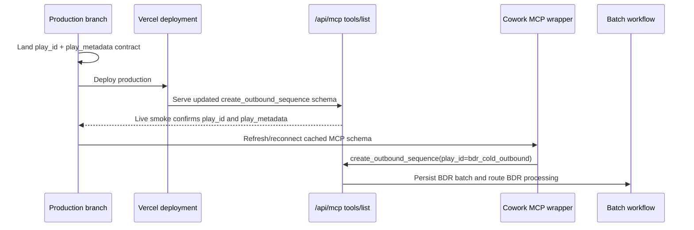

# fix: Restore BDR MCP production contract

## Overview

Restore the production MCP contract so Cowork can create BDR batches with `play_id: "bdr_cold_outbound"` and `play_metadata`, then refresh the installed Cowork-facing skill/schema path so agents stop routing BDR requests through the generic sequence flow.

The immediate failure is not that the current local branch lacks `play_id`. The current branch exposes and validates it. The failure is that the live production `/api/mcp` endpoint still serves the older `main` contract, where `create_outbound_sequence` only exposes `actor`, `companies`, `mode`, `target_persona`, and `campaign_id`. Cowork is correctly refusing to send unsupported fields.

## Problem Frame

The BDR play requirements say the plugin must make the selected play explicit in the created work item so downstream processing can run BDR-specific behavior (see origin: `docs/brainstorms/2026-04-29-bdr-play-plugin-intake-requirements.md`). Current repo docs and local branch code already describe that handoff, but production does not.

This creates three user-visible problems:

- Cowork sees no `play_id` slot in the live MCP schema and cannot route through the BDR play.
- Attempts to force BDR behavior create generic batches, because the deployed validator strips unsupported fields or never receives them.
- The skill package and docs can say the right thing while the MCP wrapper still prevents the call shape from reaching the backend.

## Requirements Trace

- R1. Production `tools/list` for `create_outbound_sequence` must expose `play_id` with supported value `bdr_cold_outbound`.
- R2. Production `tools/list` must expose `play_metadata` as an accepted object for BDR intake metadata.
- R3. Production `tools/call` and direct invocation must preserve `play_id` through batch creation, processing, and status polling.
- R4. Generic/custom sequence behavior must remain unchanged when `play_id` is omitted.
- R5. Unknown play IDs must fail validation rather than silently creating generic batches.
- R6. The repo-local skill source, packaged `.skill` artifact, and production MCP schema must agree before the skill is treated as live.
- R7. The rollout must include a live schema verification step and a Cowork schema refresh step to avoid cached stale tool metadata.
- R8. Verification must avoid creating uncontrolled duplicate customer batches.

## Scope Boundaries

- Do not build a generalized play catalog or multi-play router.
- Do not move play intent inference into Vercel; Cowork still selects BDR vs custom.
- Do not change BDR sequence selection, placeholder research, or generated copy behavior except where needed to prove routing.
- Do not rely on the review dashboard to convert already-created generic batches into BDR batches.

### Deferred to Separate Tasks

- Cleaning up or marking the accidentally created Thesis generic batches: separate operational cleanup if the user wants it.
- The optional `visualize` MCP form intake dependency in the newer desktop skill package: separate skill UX hardening unless Cowork confirms that MCP is installed.
- Broader production hardening such as Sentry, auth around `/admin/runs`, or queue-backed batch processing: already tracked as remaining production work.

## Context & Research

### Relevant Code and Patterns

- `app/api/mcp/route.ts` is the public MCP schema and JSON-RPC/direct invocation adapter.
- `lib/mcp/schemas.ts` is the server-side validator for `create_outbound_sequence`.
- `lib/mcp/outbound-tools.ts` passes parsed `play_id` and `play_metadata` into batch creation and returns `play_id` in create/status responses.
- `lib/jobs/processBatch.ts` routes BDR batches by comparing `batch.play_id` to the BDR play ID.
- `app/api/webhooks/cowork/batch/route.ts` already normalizes `play_id`/`playId` and `play_metadata`/`playMetadata` for webhook-style batch creation.
- `tests/mcp-route.test.ts` already asserts local `tools/list` exposes `play_id` and `play_metadata`, and that BDR/custom route shapes work.
- `tests/mcp-outbound-sequence.test.ts` already asserts BDR intake metadata is preserved while status responses remain sanitized.
- `README.md` documents production readiness steps, including deployed `/api/mcp` verification and redeploy after Vercel env changes.
- `docs/plans/2026-04-29-002-feat-bdr-play-intake-plan.md` is the completed plan that originally added the BDR MCP contract.
- `docs/plans/2026-04-30-003-feat-cowork-bdr-skill-orchestration-plan.md` is the skill plan that assumes the MCP contract is live.

### Institutional Learnings

- No `docs/solutions/` directory exists in this checkout, so there are no institutional solution notes to apply.
- `docs/outbound-readiness-audit.md` notes two relevant readiness patterns: MCP tool errors should be returned as tool results, and tool metadata needs output schemas for client validation/discoverability.

### External References

- No external framework research is needed for this plan. The failure is a local branch/deploy/schema-refresh mismatch, and the repo already contains the MCP and Vercel deployment patterns needed to fix it.

## Key Technical Decisions

- **Treat production `/api/mcp` as the source Cowork actually follows:** Local tests are necessary but insufficient; the rollout must verify the live endpoint Cowork is connected to.
- **Restore the existing BDR contract instead of inventing a second selector:** `play_id: "bdr_cold_outbound"` is already the durable play selector across docs, types, storage, and tests.
- **Patch both the public schema and server validator:** Exposing `play_id` in `app/api/mcp/route.ts` without accepting it in `lib/mcp/schemas.ts` would still route incorrectly or fail at execution.
- **Keep BDR optional:** Omitting `play_id` remains the custom/generic flow, so the deploy must not force all sequence requests through BDR.
- **Add a live schema smoke check:** This class of bug is specifically a deployed-contract drift, so an implementer should add or document a repeatable check against the deployed MCP URL.
- **Refresh Cowork after deploy:** MCP clients may cache tool schemas; the plan must include a reconnection or refresh step after production shows the right fields.

## Open Questions

### Resolved During Planning

- Is the current local code missing `play_id` support? No. Local `app/api/mcp/route.ts`, `lib/mcp/schemas.ts`, and `lib/mcp/outbound-tools.ts` include it.
- Why is Cowork still blocked? The deployed production MCP endpoint is stale relative to the branch/docs Cowork instructions reference.
- Should the dashboard be used to pick the BDR play for already-created generic batches? No. The backend routing decision is made at batch creation through `play_id`.
- Should unknown `play_id` values be accepted as metadata for future plays? No. The first version supports only `bdr_cold_outbound`; unknown values should fail closed.

### Deferred to Implementation

- Whether to merge the full existing BDR branch or cherry-pick only the minimal MCP contract depends on the readiness of the extra workflow changes on the branch selected for production.
- The exact Cowork schema refresh mechanism depends on how the MCP wrapper is installed in Cowork.
- The exact live smoke target should use the production MCP URL configured for Cowork, not a guessed preview URL.

## High-Level Technical Design

> *This illustrates the intended approach and is directional guidance for review, not implementation specification. The implementing agent should treat it as context, not code to reproduce.*

## Implementation Units

- [x] **Unit 1: Select the production patch source**

**Goal:** Decide the smallest safe code source to deploy so production gains the BDR MCP contract without unintentionally shipping unrelated unfinished work.

**Requirements:** R1, R2, R3, R4

**Dependencies:** None

**Files:**
- Inspect: `app/api/mcp/route.ts`
- Inspect: `lib/mcp/schemas.ts`
- Inspect: `lib/mcp/outbound-tools.ts`
- Inspect: `lib/jobs/processBatch.ts`
- Inspect: `docs/plans/2026-04-29-002-feat-bdr-play-intake-plan.md`
- Inspect: `docs/plans/2026-04-30-001-feat-bdr-two-pass-agent-workflow-plan.md`

**Approach:**
- Compare `main`, `origin/codex-feat-bdr-play-intake`, and the current working branch for the MCP contract files.
- Prefer landing the already-reviewed BDR play intake branch if its full behavior is production-ready.
- If broader BDR workflow changes are not ready, cherry-pick only the minimal contract/persistence/routing changes needed for `play_id` and `play_metadata` to work end to end.
- Record the chosen source in the PR or implementation notes so future debugging can distinguish "schema restored" from "full BDR workflow deployed."

**Patterns to follow:**
- Completed scope in `docs/plans/2026-04-29-002-feat-bdr-play-intake-plan.md`.
- Existing branch history showing `origin/codex-feat-bdr-play-intake` contains the first `play_id` MCP schema update.

**Test scenarios:**
- Test expectation: none -- this unit is planning/branch selection and does not change runtime behavior.

**Verification:**
- The implementer can name the branch or commit set that will become production, and that set includes all contract-bearing files needed for BDR routing.

- [x] **Unit 2: Restore MCP schema and validator parity on the production branch**

**Goal:** Ensure the production branch exposes and accepts the same BDR create-call shape that the skill and docs instruct Cowork to send.

**Requirements:** R1, R2, R3, R4, R5

**Dependencies:** Unit 1

**Files:**
- Modify: `app/api/mcp/route.ts`
- Modify: `lib/mcp/schemas.ts`
- Modify: `lib/mcp/outbound-tools.ts`
- Modify if missing from chosen patch source: `lib/types.ts`
- Modify if missing from chosen patch source: `lib/schemas.ts`
- Modify if missing from chosen patch source: `lib/memory-store.ts`
- Modify if missing from chosen patch source: `lib/postgres-store.ts`
- Test: `tests/mcp-route.test.ts`
- Test: `tests/mcp-outbound-sequence.test.ts`
- Test if persistence files change: `tests/batch-review-flow.test.ts`

**Approach:**
- Add `play_id` to the public `create_outbound_sequence` input schema with enum value `bdr_cold_outbound`.
- Add `play_metadata` to the public schema as an object with additional properties allowed.
- Keep `target_persona` and `campaign_id` unchanged so generic/custom flows remain compatible.
- Add or preserve matching Zod validation in `lib/mcp/schemas.ts`.
- Ensure `createOutboundSequence` passes parsed `play_id` and `play_metadata` into `createBatch`.
- Ensure create/status responses include `play_id` but do not expose raw sensitive intake or research payloads.

**Patterns to follow:**
- Local current branch implementation in `app/api/mcp/route.ts`, `lib/mcp/schemas.ts`, and `lib/mcp/outbound-tools.ts`.
- Existing JSON-RPC/direct invocation compatibility coverage in `tests/mcp-route.test.ts`.

**Test scenarios:**
- Happy path: `tools/list` exposes `play_id` and `play_metadata` in `create_outbound_sequence.inputSchema.properties`.
- Happy path: JSON-RPC `tools/call` with `play_id: "bdr_cold_outbound"` creates a batch whose structured content includes `play_id`.
- Happy path: direct non-JSON-RPC invocation with `play_id: "bdr_cold_outbound"` creates the same BDR batch shape.
- Edge case: a custom call that omits `play_id` succeeds and returns no `play_id`.
- Error path: a call with an unknown `play_id` fails validation and does not create a generic fallback batch.
- Integration: status polling for a BDR batch returns `play_id: "bdr_cold_outbound"` and remains sanitized.

**Verification:**
- Local MCP tests prove schema metadata, validation, direct invocation, JSON-RPC invocation, and polling are all contract-compatible.

- [x] **Unit 3: Add deployed MCP schema drift detection**

**Goal:** Make this exact production/local mismatch easy to catch before Cowork users create real batches.

**Requirements:** R1, R2, R7, R8

**Dependencies:** Unit 2

**Files:**
- Create or modify: `scripts/verify-mcp-schema.mjs`
- Modify: `package.json`
- Modify: `README.md`
- Test: `tests/readiness-config.test.ts`

**Approach:**
- Add a small readiness script that fetches a configured MCP URL, reads the direct GET schema and JSON-RPC `tools/list` when auth allows it, and asserts `create_outbound_sequence` exposes `play_id` and `play_metadata`.
- Keep the check read-only so it never creates batches.
- Support authenticated production endpoints by using `MCP_API_SECRET` when configured.
- Document that this check must run after production deploy and before asking Cowork to create BDR batches.
- Keep the check focused on contract shape, not generated copy quality.

**Patterns to follow:**
- Existing readiness documentation in `README.md`.
- Existing env script style in `scripts/push-vercel-env.mjs`.
- Existing readiness assertions in `tests/readiness-config.test.ts`.

**Test scenarios:**
- Happy path: readiness/config test confirms the schema verification script or checklist exists and mentions `play_id`, `play_metadata`, and `/api/mcp`.
- Edge case: the verification script treats a missing tool or missing fields as a hard failure.
- Error path: the verification script handles unauthorized responses with a clear message that `MCP_API_SECRET` or auth headers are missing.

**Verification:**
- The repo has a repeatable read-only way to prove live MCP schema parity without creating a batch.

- [x] **Unit 4: Align skill source and packaged artifact with the live contract**

**Goal:** Prevent the skill from instructing Cowork to send fields that the live MCP schema cannot yet accept, and prevent the repo packaging script from overwriting a newer reviewed skill with stale source.

**Requirements:** R6, R7

**Dependencies:** Unit 2

**Files:**
- Modify: `skills/account-sequencer/SKILL.md`
- Modify: `skills/account-sequencer/references/mcp-bdr-handoff.md`
- Modify: `skills/account-sequencer/references/polling.md`
- Modify if keeping form intake: `skills/account-sequencer/references/gladly-form-spec.md`
- Modify: `skills/account-sequencer/README.md`
- Modify: `scripts/package-account-sequencer-skill.mjs`
- Test: `tests/account-sequencer-skill-content.test.ts`

**Approach:**
- Choose one repo-local skill source as canonical.
- If the newer desktop `.skill` form-based intake is intended to be canonical, bring its files into `skills/account-sequencer/` and update tests to assert that behavior.
- If the simpler two-question chat intake is intended to remain canonical, remove or demote the desktop-only form dependency before packaging.
- Keep the BDR handoff examples aligned to the production MCP fields: `actor`, `companies`, `play_id`, `play_metadata`, `campaign_id`, and optional `target_persona` only for custom.
- Update polling instructions to use the MCP-returned `max_poll_attempts`, not a hard-coded divergent ceiling.
- Regenerate `dist/account-sequencer.skill` only after the repo source and tests agree.

**Patterns to follow:**
- Existing skill package structure under `skills/account-sequencer/`.
- Handoff examples in `docs/bdr-play-intake.md`.
- Polling metadata in `lib/cowork/continuation.ts`.

**Test scenarios:**
- Happy path: content tests assert the skill tells BDR calls to set `play_id: "bdr_cold_outbound"`.
- Happy path: content tests assert fully custom calls omit `play_id`.
- Edge case: content tests fail if skill references unsupported MCP fields such as `sequence_code`.
- Edge case: content tests fail if repo source and packaged artifact omit required references.
- Error path: content tests catch stale polling text that conflicts with `max_poll_attempts`.

**Verification:**
- Repackaging the skill from repo source produces an artifact whose operational instructions match the live MCP contract.

- [ ] **Unit 5: Deploy, refresh Cowork, and run a controlled smoke**

**Goal:** Move the fixed contract into the actual MCP endpoint Cowork uses, refresh any cached Cowork tool schema, and prove BDR routing without generating duplicate uncontrolled customer batches.

**Requirements:** R3, R4, R7, R8

**Dependencies:** Units 2 and 3 for deploy/live schema verification. Unit 4 must be complete before installing or re-enabling the Cowork-facing skill for BDR use.

**Files:**
- Modify: `README.md`
- Modify if useful: `docs/cowork-async-polling-instructions.md`

**Approach:**
- Deploy the selected production branch to the Vercel project backing Cowork's MCP URL.
- Run the live schema drift check before creating any new batch.
- Confirm the installed skill instructions match the now-live MCP contract before asking Cowork to act on BDR requests.
- Refresh or reconnect the Cowork MCP wrapper so its cached tool schema includes `play_id` and `play_metadata`.
- Run one controlled BDR smoke request using an internal/test actor and a deliberately chosen test account.
- Poll the returned `batch_id` and confirm the create/status response includes `play_id: "bdr_cold_outbound"`.
- Run one custom smoke request that omits `play_id` and confirm it stays generic.
- Document the outcome and any generated test batch IDs so accidental production artifacts can be distinguished from user work.

**Patterns to follow:**
- Production readiness checklist in `README.md`.
- Existing `get_outbound_sequence_status` polling guidance in `docs/cowork-async-polling-instructions.md`.

**Test scenarios:**
- Happy path: live `tools/list` exposes `play_id` and `play_metadata`.
- Happy path: controlled BDR smoke creates a BDR batch and status polling preserves `play_id`.
- Happy path: controlled custom smoke creates a generic batch with no `play_id`.
- Error path: if Cowork still shows the old schema after live MCP is fixed, the next step is schema refresh/reconnect, not more batch creation.

**Verification:**
- Cowork can call `create_outbound_sequence` with `play_id: "bdr_cold_outbound"` against production and receive a BDR batch handle.

## System-Wide Impact

- **Interaction graph:** Cowork skill instructions, MCP public schema, server-side Zod validation, batch persistence, BDR processor routing, review dashboard, and production deployment all need to agree on `play_id`.
- **Error propagation:** Unknown play IDs should remain validation/tool errors; missing production auth should be surfaced as MCP auth/config errors; stale Cowork schema should be treated as a wrapper refresh issue.
- **State lifecycle risks:** Repeated attempts before schema parity create extra generic batches. Smoke testing should be controlled and batch IDs should be recorded.
- **API surface parity:** `app/api/mcp/route.ts`, `lib/mcp/schemas.ts`, `app/api/webhooks/cowork/batch/route.ts`, docs, and skill examples must use the same field names.
- **Integration coverage:** Unit tests prove local contract behavior, but the live schema check proves the deployed endpoint Cowork actually reads.
- **Unchanged invariants:** Browser clients still never receive vendor secrets; generic/custom sequences still omit `play_id`; BDR selection remains explicit and Cowork-owned.

## Risks & Dependencies

| Risk | Mitigation |
|------|------------|
| Production deploy ships broader unfinished BDR workflow changes | Select patch source explicitly in Unit 1 and cherry-pick contract-only changes if needed. |
| Cowork keeps using a cached stale schema | Add a required refresh/reconnect step after live `/api/mcp` verification. |
| Direct MCP calls and JSON-RPC calls drift | Test both invocation styles in `tests/mcp-route.test.ts`. |
| Unknown play IDs silently become generic batches | Keep `play_id` enum validation and add an explicit error-path test. |
| Skill artifact and repo source diverge again | Make repo source canonical and update content tests before packaging. |
| Smoke tests create production noise | Use a controlled internal actor/test account and record generated batch IDs. |

## Documentation / Operational Notes

- Update `README.md` to say BDR rollout is not complete until the live MCP schema check shows `play_id` and Cowork has refreshed its tool schema.
- Update skill packaging notes so `dist/account-sequencer.skill` is regenerated from repo source, not edited independently on the desktop.
- Add a short operational note that existing generic batches created before the fix should not be assumed to have BDR routing.

## Sources & References

- **Origin document:** [docs/brainstorms/2026-04-29-bdr-play-plugin-intake-requirements.md](../brainstorms/2026-04-29-bdr-play-plugin-intake-requirements.md)
- Related plan: [docs/plans/2026-04-29-002-feat-bdr-play-intake-plan.md](2026-04-29-002-feat-bdr-play-intake-plan.md)
- Related plan: [docs/plans/2026-04-30-003-feat-cowork-bdr-skill-orchestration-plan.md](2026-04-30-003-feat-cowork-bdr-skill-orchestration-plan.md)
- Related audit: [docs/outbound-readiness-audit.md](../outbound-readiness-audit.md)
- Related code: `app/api/mcp/route.ts`
- Related code: `lib/mcp/schemas.ts`
- Related code: `lib/mcp/outbound-tools.ts`
- Related code: `lib/jobs/processBatch.ts`
- Related tests: `tests/mcp-route.test.ts`
- Related tests: `tests/mcp-outbound-sequence.test.ts`
