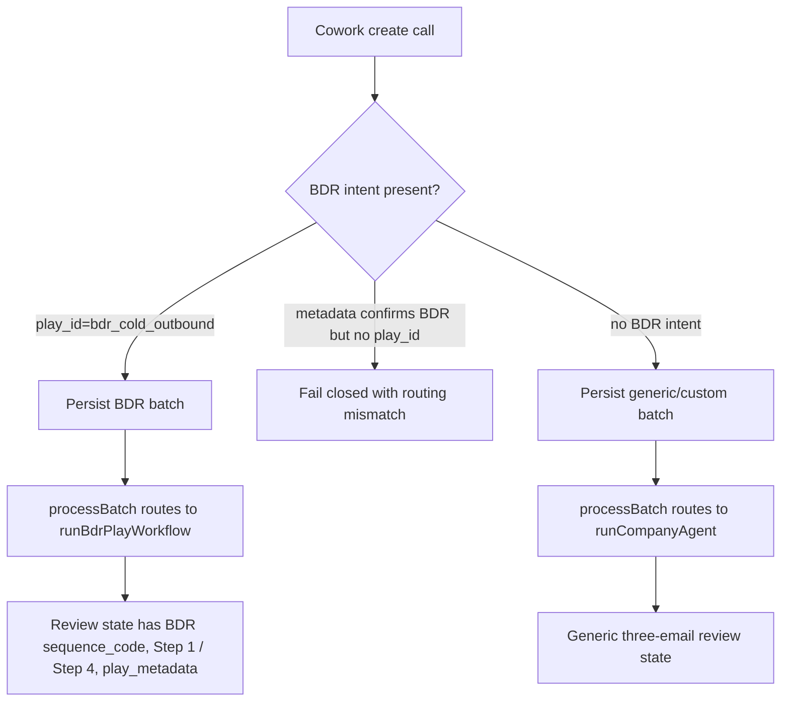

# fix: Prevent BDR requests from falling back to generic copy

## Overview

Fix the BDR routing failure where a BDR-intended request can produce the same generic three-email sequence from `runCompanyAgent` instead of the BDR play's Step 1 / Step 4 sequence output.

The user-visible symptom is specific: review output for Steven Holm at KiwiCo used subjects such as "handoffs without the reset", "full conversation history", and "before it becomes urgent". Those subjects come from the generic company agent in `lib/agent/run-company-agent.ts`, not from the BDR play renderer. BDR runs should instead pass through `runBdrPlayWorkflow`, preserve `play_id: "bdr_cold_outbound"`, and show BDR sequence metadata, original play step labels, evidence, warnings, and two BDR email outputs.

## Problem Frame

The BDR play requirements require the selected play to be explicit and durable so downstream processing can run BDR-specific research, classification, writing, and review behavior (see origin: `docs/brainstorms/2026-04-29-bdr-play-plugin-intake-requirements.md`). The existing production-contract plan covers stale MCP schema drift, but this plan focuses on the processing guardrail: if a user selected the BDR play, the system must not silently create generic review drafts.

In the current local code, `processBatch` chooses the BDR workflow only when `batch.play_id === BDR_PLAY_ID`; otherwise it falls back to `runCompanyAgent`. The exact repeated copy reported by the user is hardcoded in `lib/agent/run-company-agent.ts`. That means the failing path either created a batch without `play_id`, lost `play_id` before processing, or processed a stale generic batch as if it were acceptable BDR output.

## Requirements Trace

- R1. A BDR-intended create call must persist `play_id: "bdr_cold_outbound"` from MCP/webhook intake through batch creation, batch processing, run creation, research artifacts, review state, and status polling.
- R2. Processing must fail closed or surface a blocking warning when a BDR-intended request lacks the BDR play marker; it must not silently produce generic `runCompanyAgent` copy.
- R3. BDR review output must use BDR sequence rendering: two emails with original play step numbers 1 and 4, BDR sequence code or mapping warning, BDR play metadata, and BDR-specific warnings.
- R4. Generic/custom outbound behavior must remain unchanged when no BDR intent is supplied.
- R5. Tests must catch the exact regression by asserting BDR paths never produce the generic subjects "handoffs without the reset", "full conversation history", or "before it becomes urgent".
- R6. Live smoke and debugging surfaces must make it obvious whether a batch/run was BDR-routed or generic-routed before a reviewer approves or edits copy.
- R7. Production verification must distinguish routing fallback from runtime/config fallback by checking the deployed Vercel endpoint, durable database-backed state, and required research/provider configuration.

## Scope Boundaries

- Do not build a generalized play registry or infer arbitrary future plays.
- Do not change the BDR template library or supported persona/category mapping except where needed to prove routing.
- Do not retrofit already-created generic batches into BDR batches without an explicit operational cleanup path.
- Do not remove the generic company agent; it remains the fully custom fallback when BDR intent is absent.

### Deferred to Separate Tasks

- Deploying the broader stale MCP contract fix remains covered by `docs/plans/2026-05-01-001-fix-bdr-mcp-production-contract-plan.md`.
- Cleaning or recreating the specific KiwiCo/Steven Holm batch is an operational follow-up after the routing fix is verified.

## Context & Research

### Relevant Code and Patterns

- `lib/jobs/processBatch.ts` is the key routing point. It calls `runBdrPlayWorkflow({ company })` only when `batch.play_id === BDR_PLAY_ID`; otherwise it calls `runCompanyAgent`.
- `lib/agent/run-company-agent.ts` contains the exact reported generic sequence subjects and proof copy, including "handoffs without the reset", "full conversation history", "before it becomes urgent", and "KUHL: 44% reduction in WISMO emails; 79% email resolution rate".
- `lib/mcp/outbound-tools.ts` parses MCP input, creates batches, starts processing, and returns `play_id` in create/status responses.
- `lib/mcp/schemas.ts`, `lib/schemas.ts`, `lib/memory-store.ts`, and `lib/postgres-store.ts` already model `play_id` and `play_metadata`.
- `app/api/webhooks/cowork/batch/route.ts` accepts webhook-style `play_id`/`playId` and `play_metadata`/`playMetadata`.
- `lib/plays/bdr/workflow-runner.ts` resolves BDR contacts, creates sequence plans, runs placeholder research, and renders BDR output.
- `lib/plays/bdr/workflow-output.ts` renders BDR-specific review contacts, Step 1 / Step 4 labels, warnings, sequence code, and play metadata.
- `tests/batch-review-flow.test.ts` already covers a direct BDR batch with supplied email and validates Step 1 / Step 4 labels.
- `tests/mcp-outbound-sequence.test.ts` already verifies MCP-created BDR batches preserve sanitized `play_id` through polling.
- `tests/bdr-play-workflow.test.ts` covers BDR contact discovery and template rendering, including placeholder-email non-pushable warnings.
- `scripts/verify-mcp-schema.mjs` verifies live schema support for `play_id` and `play_metadata`, but it does not prove that a live BDR smoke reached BDR processing rather than generic processing.

### Institutional Learnings

- No `docs/solutions/` directory exists in this checkout, so there are no institutional solution notes to apply.
- `docs/outbound-readiness-audit.md` documents a relevant prior batch-processing issue: idempotent batch processing must be proved by tests because retries can otherwise create misleading duplicate state.

### External References

- No external research was used. The issue is a local routing, persistence, and deployment-contract failure with direct code and tests in this repository.

## Key Technical Decisions

- **Treat generic copy in a BDR-intended run as a regression, not acceptable fallback:** Missing research inside the BDR play should create BDR warnings or fallback BDR template bodies, not generic three-email sequences.
- **Keep `play_id` as the single routing source of truth:** The fix should harden preservation and diagnostics around `play_id: "bdr_cold_outbound"` rather than adding a second hidden selector.
- **Add a BDR routing sentinel to tests and observability:** Tests should assert the absence of known generic subjects in BDR output, and live smoke should inspect review state or artifacts for BDR markers.
- **Verify deployed runtime separately from local behavior:** The repeated generic copy is locally traceable to `runCompanyAgent`, but rollout must still prove the request hit the deployed Vercel app with production persistence and provider configuration rather than a local/dev fallback.
- **Fail closed on contradictory intent:** If intake metadata says the BDR play was confirmed but the durable batch lacks `play_id`, the system should flag the mismatch instead of creating generic drafts.
- **Preserve custom flow parity:** Calls with no BDR intent should continue through `runCompanyAgent` and keep existing generic tests valid.

## Open Questions

### Resolved During Planning

- Where does the reported repeated copy come from? `lib/agent/run-company-agent.ts`, the generic company-agent fallback path.
- What should BDR output look like instead? `runBdrPlayWorkflow` rendered by `lib/plays/bdr/workflow-output.ts`, with two email outputs labeled as original BDR play steps 1 and 4.
- Is this primarily an external best-practice problem? No. Local code, tests, and deployment contract are sufficient to plan the fix.

### Deferred to Implementation

- Whether the observed production batch lost `play_id` at MCP intake, webhook intake, persistence, or Cowork schema caching must be confirmed from live batch records/logs during implementation.
- The exact operator-facing diagnostic surface can be a research artifact field, batch status detail, or README smoke checklist depending on what is cheapest in the existing UI/API.

## High-Level Technical Design

> *This illustrates the intended approach and is directional guidance for review, not implementation specification. The implementing agent should treat it as context, not code to reproduce.*

## Implementation Units

- [x] **Unit 1: Add characterization coverage for the reported fallback**

**Goal:** Capture the exact regression before changing routing behavior.

**Requirements:** R1, R3, R5

**Dependencies:** None

**Files:**
- Modify: `tests/batch-review-flow.test.ts`
- Modify: `tests/mcp-outbound-sequence.test.ts`

**Approach:**
- Add a BDR batch-processing test using the reported shape: company `KiwiCo`, a contact named Steven Holm with title `Director of Customer Care`, no verified email, and `play_id: "bdr_cold_outbound"`.
- Assert the processed review contact has BDR markers: `run.play_id`, contact `play_metadata.play_id`, either a `sequence_code` or an explicit BDR sequence-mapping warning, and email labels derived from BDR Step 1 / Step 4 behavior.
- Assert the rendered subjects and body text do not include the generic fallback subjects or the KUHL proof point from `runCompanyAgent`.
- Add an MCP-level variant so the contract path proves `createOutboundSequence` plus `processBatch` preserves the same BDR routing guarantees.

**Execution note:** Add these tests before changing production code so the failing behavior is documented as a regression.

**Patterns to follow:**
- Existing BDR assertions in `tests/batch-review-flow.test.ts`.
- Existing MCP create/status shape in `tests/mcp-outbound-sequence.test.ts`.

**Test scenarios:**
- Happy path: BDR create/process for a supplied contact without email yields a BDR review contact with non-pushable warnings and no generic sequence subjects.
- Edge case: BDR contact with title but no email uses a placeholder email while still using BDR routing.
- Error path: if BDR sequence mapping is unsupported, the output is the BDR "Sequence mapping needed" warning path, not generic company-agent copy.
- Integration: MCP-created BDR batch processes into review state with BDR markers preserved from create through polling.

**Verification:**
- The failing symptom is represented by tests that would fail if `runCompanyAgent` output is used for BDR-intended work.

- [x] **Unit 2: Harden BDR intent preservation at intake boundaries**

**Goal:** Ensure BDR intent cannot be lost between Cowork/MCP/webhook input and durable batch state.

**Requirements:** R1, R2, R4

**Dependencies:** Unit 1

**Files:**
- Modify: `lib/mcp/outbound-tools.ts`
- Modify if needed: `app/api/webhooks/cowork/batch/route.ts`
- Modify if needed: `lib/mcp/schemas.ts`
- Modify if needed: `lib/schemas.ts`
- Test: `tests/mcp-route.test.ts`
- Test: `tests/mcp-outbound-sequence.test.ts`
- Test if webhook path changes: `tests/run-validation.test.ts` or a new focused webhook test near the existing route tests

**Approach:**
- Keep `play_id` explicit and validated as `bdr_cold_outbound`.
- Detect contradictory intake where `play_metadata.intake.confirmed_play` is `bdr_cold_outbound` but `play_id` is missing.
- Return a clear validation/tool error for that mismatch instead of allowing a generic batch to be created.
- Preserve the current behavior where fully custom calls omit both BDR `play_id` and BDR-confirming metadata.
- If webhook input can carry equivalent BDR metadata, apply the same mismatch guard there.

**Patterns to follow:**
- MCP tool-error pattern in `app/api/mcp/route.ts`.
- Existing unknown `play_id` validation test in `tests/mcp-route.test.ts`.
- BDR/custom boundary language in `docs/bdr-play-intake.md`.

**Test scenarios:**
- Happy path: MCP call with `play_id: "bdr_cold_outbound"` and matching metadata creates a BDR batch.
- Happy path: custom call with no `play_id` and no BDR-confirming metadata creates a generic batch.
- Error path: MCP call with metadata confirming BDR but no `play_id` returns a tool error and creates no batch.
- Error path: webhook call with BDR-confirming metadata but no durable `play_id` is rejected or marked as invalid rather than silently generic.

**Verification:**
- BDR intent is either durable in the batch or rejected before processing starts.

- [x] **Unit 3: Fail closed in batch processing when BDR intent and routing disagree**

**Goal:** Prevent `processBatch` from silently producing generic output for records that carry BDR intent outside `play_id`.

**Requirements:** R2, R3, R4, R5

**Dependencies:** Units 1 and 2

**Files:**
- Modify: `lib/jobs/processBatch.ts`
- Test: `tests/batch-review-flow.test.ts`

**Approach:**
- Add a small routing-intent helper near `processBatch` that distinguishes three states: explicit BDR, explicit generic/custom, and contradictory BDR metadata without BDR `play_id`.
- Continue routing explicit BDR batches to `runBdrPlayWorkflow`.
- Continue routing explicit generic/custom batches to `runCompanyAgent`.
- For contradictory BDR metadata, fail the batch/run with a clear routing-mismatch error or create a non-approvable review warning only if that matches the existing failure model better.
- Keep retry/idempotency behavior intact by respecting existing batch run status handling.

**Patterns to follow:**
- Existing failure accounting in `processBatch`.
- Existing idempotency checks in `tests/batch-review-flow.test.ts`.
- Existing BDR warning-only output path in `lib/plays/bdr/workflow-output.ts`.

**Test scenarios:**
- Happy path: explicit BDR batch routes to `runBdrPlayWorkflow` and never emits generic subjects.
- Happy path: explicit generic batch still routes to `runCompanyAgent` and existing generic tests pass.
- Error path: batch with `play_metadata.intake.confirmed_play = "bdr_cold_outbound"` but no `play_id` does not create ready generic review copy.
- Integration: retrying a failed or blocked routing-mismatch batch does not create duplicate runs or silently recover as generic.

**Verification:**
- `processBatch` has no path where BDR-confirmed intent can become generic review copy without an explicit error or warning.

- [x] **Unit 4: Add review/status diagnostics for BDR routing**

**Goal:** Make the route taken by a batch visible enough that reviewers and operators can identify stale generic batches before approving them.

**Requirements:** R1, R3, R6, R7

**Dependencies:** Unit 3

**Files:**
- Modify: `lib/jobs/processBatch.ts`
- Modify if needed: `lib/mcp/outbound-tools.ts`
- Modify if needed: `components/review/BatchReviewApp.tsx`
- Test: `tests/mcp-outbound-sequence.test.ts`
- Test: `tests/batch-review-flow.test.ts`

**Approach:**
- Persist or expose a concise processing marker such as BDR workflow route, generic route, or routing mismatch in an existing artifact or status response.
- Prefer existing structured fields: research artifact `raw_summary`, contact `play_metadata`, run `play_id`, and status response `play_id`.
- Include enough non-secret runtime context in logs or diagnostics to distinguish local/dev/in-memory processing from deployed Vercel/Postgres processing.
- If UI changes are needed, keep them minimal: BDR-routed contacts already have `sequence_code`, `play_metadata`, step labels, and warnings to display.
- Ensure the diagnostics do not expose raw sensitive intake metadata or provider secrets.

**Patterns to follow:**
- Sanitized status response expectations in `tests/mcp-outbound-sequence.test.ts`.
- Existing review display of `sequence_code`, warnings, evidence, and play metadata in the review components.

**Test scenarios:**
- Happy path: BDR processed status/review state contains enough markers to distinguish BDR workflow output from generic output.
- Happy path: diagnostics can distinguish deployed Vercel/Postgres processing from local in-memory processing without exposing secrets.
- Edge case: placeholder-email BDR contact remains visibly non-pushable but still BDR-routed.
- Error path: routing mismatch status/review diagnostics do not leak raw intake metadata.

**Verification:**
- An operator can inspect batch status or review state and tell whether the BDR workflow actually ran.

- [x] **Unit 5: Extend live smoke verification beyond schema shape**

**Goal:** Prove production is not only accepting BDR fields, but also processing BDR batches through the BDR workflow inside the deployed Vercel/runtime configuration.

**Requirements:** R1, R3, R5, R6, R7

**Dependencies:** Units 1-4

**Files:**
- Modify: `scripts/verify-mcp-schema.mjs` or create a separate smoke script if keeping schema verification read-only is preferred
- Modify: `README.md`
- Modify: `docs/cowork-async-polling-instructions.md`
- Test: `tests/readiness-config.test.ts`

**Approach:**
- Keep the current schema check read-only, or explicitly separate it from a controlled write smoke so operators do not accidentally create batches.
- Add rollout instructions for one controlled BDR smoke using an internal actor/test account.
- Before the write smoke, verify the target URL is the deployed Vercel MCP endpoint Cowork uses and that production persistence/configuration is active. `lib/store.ts` already refuses in-memory fallback when `VERCEL` is set, so a successful production smoke should prove database-backed processing.
- Confirm provider configuration expectations for BDR research, especially `EXA_API_KEY`, so missing external research is reported as a provider/config warning rather than mistaken for the hardcoded generic sequence bug.
- The smoke must poll status and inspect the review output or a sanitized status marker for BDR routing, not merely `tools/list`.
- Add an explicit failure rule: if review output contains generic fallback subjects or lacks BDR markers, stop and debug routing before asking Cowork to create customer work.
- Document generated smoke batch IDs so production artifacts are traceable.

**Patterns to follow:**
- Existing production checklist in `README.md`.
- Existing `scripts/verify-mcp-schema.mjs` contract verification style.
- Existing readiness assertions in `tests/readiness-config.test.ts`.

**Test scenarios:**
- Happy path: readiness documentation names both schema verification and BDR processing smoke verification.
- Happy path: readiness documentation confirms the smoke runs against the deployed Vercel endpoint with production persistence and expected research-provider configuration.
- Error path: documentation says generic fallback subjects in a BDR smoke are a failed rollout, not a copy-quality issue.
- Error path: documentation distinguishes missing research-provider configuration from generic-company-agent routing fallback.
- Integration: readiness test asserts the smoke checklist references `play_id`, BDR routing markers, and generic fallback subject detection.

**Verification:**
- The deployment checklist catches a production that exposes the schema but still produces generic BDR-intended review copy.

## System-Wide Impact

- **Interaction graph:** Cowork skill instructions, MCP schema, MCP validator, webhook intake, batch persistence, batch processing, BDR workflow, generic company agent, review state, status polling, Vercel runtime configuration, and deployment smoke all participate in the BDR route.
- **Error propagation:** Missing or invalid `play_id` remains a validation/tool error. Contradictory BDR metadata without durable BDR routing should become a clear routing-mismatch failure or blocking review warning, not ready generic drafts.
- **State lifecycle risks:** Existing stale generic batches cannot be trusted as BDR output. Retrying after the fix must preserve idempotency and must not duplicate runs.
- **API surface parity:** MCP and webhook inputs must agree on the same BDR/custom boundary. Status and review surfaces must continue sanitizing raw metadata.
- **Integration coverage:** Unit tests must cover direct batch creation, MCP creation, processing, review state, polling, and retry behavior because the bug appears at the handoff between those layers.
- **Unchanged invariants:** Generic/custom sequences still use `runCompanyAgent`; BDR play selection remains explicit; placeholder emails remain non-pushable until real emails are supplied.

## Risks & Dependencies

| Risk | Mitigation |
|------|------------|
| Fix only updates schema and misses processing fallback | Add tests that inspect final review subjects and BDR markers after `processBatch`. |
| BDR metadata heuristics accidentally classify custom work as BDR | Treat only explicit `play_id` as the valid BDR route; use metadata only to detect contradictory state, not to silently infer BDR. |
| Existing production batches remain generic | Document that they need explicit recreation or cleanup after the fix; do not mutate them silently. |
| Diagnostics leak raw intake or research data | Reuse sanitized status/review markers and existing public review warnings. |
| Runtime/config fallback is mistaken for routing fallback | Make live smoke verify deployed Vercel URL, persistence mode, and provider configuration separately from BDR routing markers. |
| Retry logic regresses | Extend batch retry/idempotency tests around routing mismatch and BDR success paths. |

## Documentation / Operational Notes

- Update rollout docs so "BDR is working" requires processed review output with BDR markers, not just an MCP schema that accepts `play_id`.
- Include a runtime/config check in the rollout docs so "BDR is working" also means the request hit the deployed Vercel app with production persistence and expected research-provider configuration.
- Add a note that the generic subjects "handoffs without the reset", "full conversation history", and "before it becomes urgent" indicate the generic company-agent path.
- Treat the KiwiCo/Steven Holm batch described by the user as suspect generic output unless its persisted batch/run records show `play_id: "bdr_cold_outbound"` and BDR review markers.

## Sources & References

- **Origin document:** [docs/brainstorms/2026-04-29-bdr-play-plugin-intake-requirements.md](../brainstorms/2026-04-29-bdr-play-plugin-intake-requirements.md)
- Related plan: [docs/plans/2026-05-01-001-fix-bdr-mcp-production-contract-plan.md](2026-05-01-001-fix-bdr-mcp-production-contract-plan.md)
- Related code: `lib/jobs/processBatch.ts`
- Related code: `lib/agent/run-company-agent.ts`
- Related code: `lib/mcp/outbound-tools.ts`
- Related code: `lib/plays/bdr/workflow-runner.ts`
- Related code: `lib/plays/bdr/workflow-output.ts`
- Related tests: `tests/batch-review-flow.test.ts`
- Related tests: `tests/mcp-outbound-sequence.test.ts`
- Related tests: `tests/bdr-play-workflow.test.ts`
- Related audit: [docs/outbound-readiness-audit.md](../outbound-readiness-audit.md)
