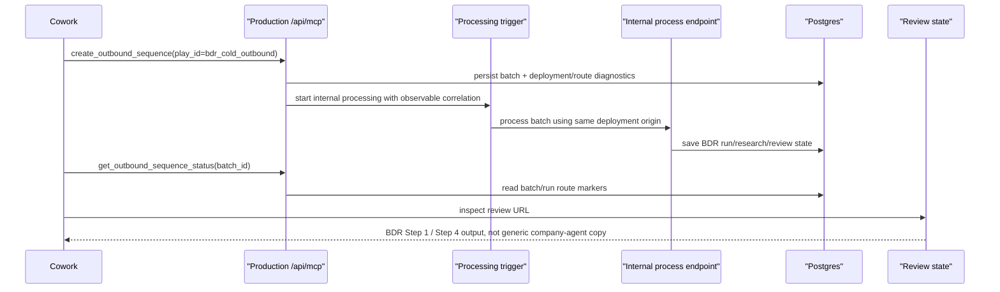

# fix: Verify deployed Vercel BDR pipeline

## Overview

The BDR route is still producing the generic company-agent subjects "handoffs without the reset", "full conversation history", and "before it becomes urgent" in the user-visible review output. Local code already contains the core BDR routing guardrails, so this plan focuses on the deployed Vercel/Cowork pipeline: proving the production endpoint, deployed build, cached Cowork tool schema, packaged account-sequencer skill, environment, async processor, and review state all agree that BDR work is routed through `bdr_cold_outbound`.

## Problem Frame

The BDR requirements require the selected play to be explicit and durable so downstream processing can run BDR-specific research, classification, writing, and review behavior (see origin: `docs/brainstorms/2026-04-29-bdr-play-plugin-intake-requirements.md`). The prior completed routing plan hardened local code paths, but the current symptom means the live pipeline can still create or surface generic drafts. The new problem is therefore not "does the repo know how to route BDR?" but "can an operator prove that the exact Vercel endpoint Cowork is calling is the deployed build, schema, skill, environment, and processor that local tests cover?"

## Requirements Trace

- R1. Production `/api/mcp` must expose and execute the same `play_id: "bdr_cold_outbound"` contract that local tests assert.
- R2. Cowork must call the BDR create shape only after the BDR play is selected, and its cached tool schema/skill instructions must not silently omit `play_id`.
- R3. Create/status responses must include enough sanitized deployment and route identity to distinguish stale deployment, wrong alias, missing environment, generic route, and BDR route.
- R4. The production processor must either complete the BDR workflow or surface a blocking failure; it must not leave operators guessing whether a fire-and-forget internal trigger ran.
- R5. Live smoke verification must inspect the final review state, not just `tools/list`, and must fail on the exact generic subjects reported by the user.
- R6. Existing generic/custom outbound behavior must remain unchanged when `play_id` is intentionally omitted.
- R7. Operators need a triage path for already-created generic batches so suspect review URLs are not reused as BDR output.

## Scope Boundaries

- Do not infer BDR intent from generic email body text in production requests; the durable selector remains `play_id`.
- Do not remove the generic company-agent path; it remains the custom sequence path when BDR is not selected.
- Do not mutate existing production batches automatically. Suspect batches should be diagnosed and recreated or cleaned up through an explicit operational path.
- Do not expose secrets, raw provider credentials, or sensitive intake metadata in diagnostics.
- Do not build a full job queue migration in this fix unless the Vercel trigger investigation proves the current trigger cannot be made reliable enough for this batch size.

### Deferred to Separate Tasks

- Broader workflow-queue replacement for large batches remains future production work unless the focused trigger evidence in this plan proves it is required.
- Improving BDR copy quality or sequence templates is outside this plan; the current bug is the wrong route producing generic copy.

## Context & Research

### Relevant Code and Patterns

- `app/api/mcp/route.ts` publishes `play_id`, `play_metadata`, and `diagnostics` in the public MCP tool contract.
- `lib/mcp/outbound-tools.ts` persists `play_id`, triggers processing, and reports `diagnostics.processing_route` as `bdr_workflow` or `generic_company_agent`.
- `lib/plays/bdr/intent.ts` rejects BDR-confirming metadata when durable `play_id` is missing.
- `lib/jobs/processBatch.ts` routes BDR batches through `runBdrPlayWorkflow` only when `batch.play_id === BDR_PLAY_ID`; otherwise it calls `runCompanyAgent`.
- `lib/jobs/triggerBatchProcessing.ts` currently starts processing by firing an internal endpoint request after create. That means production readiness depends on `INTERNAL_API_SECRET`, `APP_BASE_URL`/`VERCEL_URL`, and whether the platform keeps the background fetch alive long enough to observe failures.
- `scripts/verify-mcp-schema.mjs` proves live schema shape but not final review output.
- `scripts/verify-bdr-processing-smoke.mjs` creates a traceable BDR batch, polls status, fetches review state, and fails on the generic fallback subjects.
- `skills/account-sequencer/SKILL.md` and `skills/account-sequencer/references/mcp-bdr-handoff.md` contain the Cowork-facing branch that must set `play_id`.
- `tests/account-sequencer-skill-content.test.ts`, `tests/readiness-config.test.ts`, `tests/mcp-route.test.ts`, and `tests/batch-review-flow.test.ts` already cover the local contract, docs, packaged skill, and reported generic fallback regression.

### Institutional Learnings

- No `docs/solutions/` directory exists in this checkout, so there are no institutional solution notes to apply.
- `docs/outbound-readiness-audit.md` records a prior batch-processing concern: retries and idempotency need direct evidence because misleading duplicate or stale state can otherwise look like successful processing.

### External References

- Vercel environment variable changes apply only to new deployments, so any environment repair must be followed by redeploy before it can affect production: `https://vercel.com/docs/environment-variables/managing-environment-variables`.
- Vercel Functions create separate request invocations and support background work through `after()` in Next.js 15.1+ or `waitUntil()` from `@vercel/functions`; promises used this way share the function timeout and can be cancelled on timeout: `https://vercel.com/docs/functions/functions-api-reference/vercel-functions-package`.
- `vercel inspect` can retrieve deployment details for a specific deployment URL or ID, and deployment aliases/promotions determine which deployment a production domain serves: `https://vercel.com/docs/cli/inspect`, `https://vercel.com/docs/cli/alias`, `https://vercel.com/docs/cli/deploying-from-cli`.

## Key Technical Decisions

- **Treat local green tests as necessary but not sufficient:** The failure now lives at the deployment/Cowork boundary, so verification must assert the live endpoint, live schema, live skill, and live review state.
- **Expose route identity, not secrets:** Diagnostics should include build/deployment identity and route state, but never raw secrets or private research payloads.
- **Make the smoke test the production gate:** A schema check alone can pass while Cowork still uses a stale schema or a stale skill, so the gate must create a controlled BDR batch and inspect the review output.
- **Keep `play_id` authoritative:** Diagnostics may detect contradictions, but BDR routing should still be driven by durable `play_id: "bdr_cold_outbound"`.
- **Close the async trigger evidence gap before replacing architecture:** The current internal fetch trigger may be adequate if it is made observable and tied to platform-supported post-response work; move to a queue only if evidence shows the trigger remains unreliable.

## Open Questions

### Resolved During Planning

- Does the reported copy come from the BDR renderer? No. The reported subjects match the generic company-agent route in `lib/agent/run-company-agent.ts` and the generic draft fallback in the store generators.
- Is a new backend play selector needed? No. The existing selector is `play_id: "bdr_cold_outbound"`.
- Does this require external framework research? Yes, but only for Vercel deployment/runtime behavior. Official Vercel docs are enough for planning.

### Deferred to Implementation

- Which exact live failure is active: stale production deployment, wrong alias, stale Cowork cached schema, stale packaged skill, omitted `play_id`, missing production env, failed internal processor trigger, or an old generic batch being reviewed.
- Whether the production fix should use Next.js `after()`, `@vercel/functions` `waitUntil()`, a synchronous short-batch processing path, or a queue. The decision should follow trigger evidence from the first implementation unit.
- Which production batch IDs or review URLs need recreation after the fix is verified.

## High-Level Technical Design

> *This illustrates the intended approach and is directional guidance for review, not implementation specification. The implementing agent should treat it as context, not code to reproduce.*

## Implementation Units

- [x] **Unit 1: Add production route identity to MCP diagnostics**

**Goal:** Make it possible to prove which deployed build, Vercel environment, alias, and route contract served a create/status call without exposing operational details on public surfaces.

**Requirements:** R1, R3, R5

**Dependencies:** None

**Files:**
- Modify: `app/api/health/route.ts`
- Modify: `app/api/mcp/route.ts`
- Modify: `lib/mcp/outbound-tools.ts`
- Modify: `scripts/verify-mcp-schema.mjs`
- Test: `tests/mcp-route.test.ts`
- Test: `tests/readiness-config.test.ts`

**Approach:**
- Add a sanitized deployment identity payload to authenticated MCP create/status diagnostics using Vercel system environment variables where available: environment, deployment URL, git commit SHA, git branch, and app version/schema revision.
- Keep public health output minimal. If `app/api/health/route.ts` is public, expose only coarse readiness and a non-sensitive contract marker; reserve commit, branch, deployment URL, provider presence, and route identity for authenticated MCP/status or operator-only surfaces.
- Include a stable BDR contract marker or schema revision that changes when `create_outbound_sequence` contract fields change.
- Keep diagnostics response-compatible by using additive fields under the existing `diagnostics` object.
- Update the schema verifier so it prints or asserts the production deployment identity alongside `play_id` and `play_metadata`.

**Patterns to follow:**
- Existing additive `diagnostics` shape in `lib/mcp/outbound-tools.ts`.
- Existing readiness assertions in `tests/readiness-config.test.ts`.
- Existing MCP compatibility style in `tests/mcp-route.test.ts`.

**Test scenarios:**
- Happy path: local MCP `tools/call` returns diagnostics with route, runtime, persistence, and sanitized deployment identity fields.
- Happy path: schema verification script reads both direct `GET /api/mcp` and JSON-RPC `tools/list` and reports the same contract marker.
- Edge case: non-Vercel local execution reports local identity without throwing when Vercel system variables are absent.
- Error path: diagnostics omit secret values even when auth and provider env vars are configured.
- Error path: public health output does not expose commit SHA, branch name, deployment URL, provider presence, actor data, or batch-specific state.

**Verification:**
- An operator can compare a failing Cowork response with the expected deployed build/contract without opening Vercel logs first.

- [x] **Unit 2: Make Vercel processing trigger outcomes observable**

**Goal:** Eliminate the blind spot where create returns a batch and "started" state while the internal processing request may fail after the response path.

**Requirements:** R3, R4, R5, R7

**Dependencies:** Unit 1

**Files:**
- Modify: `lib/jobs/triggerBatchProcessing.ts`
- Modify: `app/api/internal/process-batch/[batchId]/route.ts`
- Modify: `lib/jobs/processBatch.ts`
- Modify if needed: `lib/types.ts`
- Modify if needed: `docs/schema.sql`
- Test: `tests/mcp-outbound-sequence.test.ts`
- Test: `tests/batch-review-flow.test.ts`
- Test: `tests/readiness-config.test.ts`

**Approach:**
- Persist or expose trigger state such as requested, accepted, failed, last error, and correlation ID using the existing batch status/error surfaces before adding new tables.
- Tie post-response trigger work to Vercel-supported lifecycle primitives when appropriate for the runtime, using Next.js `after()` or `@vercel/functions` `waitUntil()` instead of an unobserved detached fetch.
- Ensure the internal process endpoint records a route marker when it starts and finishes processing a batch.
- Keep create/status responses honest: if processing was not started because `INTERNAL_API_SECRET` or app origin is missing, the response should stay queued with a warning instead of implying BDR output will appear.
- Preserve idempotency: polling or retrying the trigger should not create duplicate runs for the same batch/company key.

**Patterns to follow:**
- Existing `triggerBatchProcessing` warnings.
- Existing batch idempotency behavior in `processBatch`.
- Existing failure aggregation in `processBatch`.

**Test scenarios:**
- Happy path: create response reports trigger accepted, status polling eventually sees BDR route markers, and no duplicate run appears after retry.
- Edge case: `INTERNAL_API_SECRET` missing creates a batch with a clear warning and no false processing-complete signal.
- Error path: internal endpoint authorization failure is visible in batch/status diagnostics rather than hidden after create returns.
- Integration: a BDR batch with a trigger retry still produces one BDR review run and no generic subjects.

**Verification:**
- A production batch can be traced from create call through trigger acceptance to processing completion using only sanitized status/review/admin surfaces.

- [x] **Unit 3: Verify Cowork schema and packaged skill are the live ones**

**Goal:** Prove Cowork is not using stale instructions or a cached tool schema that omits `play_id`, which would make a BDR request look like a fully custom request.

**Requirements:** R1, R2, R3, R5, R6

**Dependencies:** Unit 1

**Files:**
- Modify: `skills/account-sequencer/SKILL.md`
- Modify: `skills/account-sequencer/references/mcp-bdr-handoff.md`
- Modify if needed: `skills/account-sequencer/references/polling.md`
- Modify: `scripts/package-account-sequencer-skill.mjs`
- Modify: `scripts/verify-mcp-schema.mjs`
- Test: `tests/account-sequencer-skill-content.test.ts`
- Test: `tests/readiness-config.test.ts`

**Approach:**
- Add a visible skill/package revision marker that can be compared with the deployed MCP contract marker.
- Extend packaging verification so `dist/account-sequencer.skill` cannot drift from source instructions and references.
- Add an explicit Cowork refresh verification checklist: after deploy, reconnect or refresh the MCP wrapper, then confirm the cached `create_outbound_sequence` schema includes `play_id`.
- Keep the two allowed branches unambiguous: BDR sets `play_id`; fully custom omits it.

**Patterns to follow:**
- Existing packaged-skill equality assertions in `tests/account-sequencer-skill-content.test.ts`.
- Existing handoff examples in `skills/account-sequencer/references/mcp-bdr-handoff.md`.
- Existing Cowork polling instructions in `docs/cowork-async-polling-instructions.md`.

**Test scenarios:**
- Happy path: packaged skill includes the same BDR revision marker and `play_id` examples as source.
- Happy path: readiness docs require Cowork schema refresh after deployment and before customer batches.
- Edge case: fully custom examples still omit `play_id`.
- Error path: skill text tells Cowork to stop if diagnostics show `generic_company_agent` for a BDR-selected request.

**Verification:**
- The deployed contract, repo skill source, and packaged skill artifact can be compared before Cowork is allowed to create customer BDR work.

- [x] **Unit 4: Extend live smoke to reproduce the current Gruns/Jillian failure mode**

**Goal:** Add a production smoke path that uses the user's current failing shape and fails if review output contains the generic company-agent copy.

**Requirements:** R1, R2, R3, R4, R5

**Dependencies:** Units 1-3

**Files:**
- Modify: `scripts/verify-bdr-processing-smoke.mjs`
- Modify: `README.md`
- Modify: `docs/cowork-async-polling-instructions.md`
- Test: `tests/readiness-config.test.ts`

**Approach:**
- Keep the existing KiwiCo/Steven smoke but make the company/contact/title parameters explicit enough to run the reported Gruns/Jillian case.
- Add a correlation value in `play_metadata.intake.user_request_summary` so production artifacts are traceable.
- Assert the create response, status response, and review state all agree on `processing_route: "bdr_workflow"`, deployment identity, and `play_id`.
- Fetch the batch review state and fail on the exact generic subject/body patterns: "handoffs without the reset", "full conversation history", "before it becomes urgent", and the hardcoded generic proof point.
- Treat missing research providers as BDR warnings, not as generic fallback success.

**Patterns to follow:**
- Existing generic fallback detection in `scripts/verify-bdr-processing-smoke.mjs`.
- Existing production readiness checklist in `README.md`.
- Existing Cowork stop condition in `docs/cowork-async-polling-instructions.md`.

**Test scenarios:**
- Happy path: smoke can be configured for `Gruns`, `gruns.co`, `Jillian`, and the relevant title while still requiring BDR route markers.
- Happy path: smoke output includes batch ID, route, runtime, persistence, deployment identity, and contract marker.
- Error path: smoke fails when review state contains any reported generic fallback subject.
- Error path: smoke fails when create/status diagnostics report `generic_company_agent` or a stale/missing contract marker.
- Integration: readiness tests require the smoke checklist to inspect review state, not only `tools/list`.

**Verification:**
- Before Cowork users create customer batches, one live Vercel smoke proves the exact failing shape now produces BDR-marked review output.

- [x] **Unit 5: Add stale-batch triage and recreation guidance**

**Goal:** Give operators a clear way to decide whether an existing review URL is a stale generic batch, a BDR processing failure, or a valid BDR output.

**Requirements:** R3, R5, R7

**Dependencies:** Units 1-4

**Files:**
- Modify: `app/admin/runs/page.tsx`
- Modify if needed: `app/api/runs/[runId]/route.ts`
- Modify if needed: `lib/review-navigation.ts`
- Modify: `README.md`
- Test: `tests/batch-review-flow.test.ts`
- Test if admin surface changes: add or modify a focused admin/rendering test near existing review tests

**Approach:**
- Surface enough batch/run markers in authenticated status or operator-only admin output to classify existing artifacts: batch `play_id`, run `play_id`, processing route, deployment/contract marker if available, status, errors, and presence of generic fallback subjects.
- If the existing admin page remains unauthenticated in this iteration, prefer authenticated MCP/status diagnostics and README triage steps over adding more sensitive batch details to the admin UI.
- Document the operational rule: a BDR-intended batch that is missing `play_id` or contains generic subjects should be recreated after the fixed deploy; do not edit/approve it as BDR copy.
- Keep cleanup manual and explicit unless a future task adds a safe migration/cleanup command.
- Include reviewer-facing language that distinguishes BDR template fallback warnings from generic company-agent fallback.

**Patterns to follow:**
- Existing admin run listing in `app/admin/runs/page.tsx`.
- Existing review state markers for BDR sequence code, play metadata, warnings, and original step labels.
- Existing README production readiness language.

**Test scenarios:**
- Happy path: a BDR-routed batch exposes BDR markers and no generic fallback subjects.
- Happy path: a generic/custom batch is classified as generic only when `play_id` is omitted.
- Error path: a BDR-intended or suspected batch with generic subjects is flagged as stale/suspect, not ready to approve.
- Integration: an operator can use the documented fields to decide whether to recreate a specific review URL.

**Verification:**
- Existing problematic review URLs can be classified without relying on memory of how the request was made.

## System-Wide Impact

- **Interaction graph:** Cowork skill, Cowork cached MCP schema, Vercel production alias, `/api/mcp`, Postgres batch persistence, internal processing endpoint, BDR workflow, generic company agent, review state, admin/status surfaces, and smoke scripts all participate in the failure path.
- **Error propagation:** Missing `play_id`, stale schema, missing environment, failed processor trigger, and wrong route must become visible as validation errors, warnings, status diagnostics, or smoke failures rather than ready generic BDR copy.
- **State lifecycle risks:** Existing generic batches remain in Postgres and may still have valid review URLs. The plan distinguishes diagnosis/recreation from automatic mutation.
- **API surface parity:** Direct MCP GET, JSON-RPC `tools/list`, JSON-RPC `tools/call`, Cowork skill instructions, webhook input, status polling, and review/admin surfaces must agree on `play_id`.
- **Integration coverage:** Local tests should prove route identity, trigger status, skill packaging, smoke-script assertions, and batch-review classification. Production verification must still run against the deployed Vercel endpoint.
- **Unchanged invariants:** Fully custom outbound omits `play_id` and can still use generic company-agent copy; BDR routing remains explicit; missing BDR research becomes BDR warnings, not generic fallback copy.

## Risks & Dependencies

| Risk | Mitigation |
|------|------------|
| The production endpoint is an old deployment even though local code is fixed | Add deployment/contract identity to diagnostics and require `vercel inspect`/schema verification against the Cowork-used URL. |
| Cowork keeps using a stale cached schema or skill package | Add revision markers and a required refresh verification step before customer BDR batches. |
| Detached internal processing fails after create returns | Persist or expose trigger state and use Vercel-supported post-response lifecycle primitives where appropriate. |
| Smoke test passes schema but misses bad review output | Keep final review-state inspection and explicit generic subject detection as the production gate. |
| Diagnostics leak secrets | Keep diagnostics additive, sanitized, and limited to route/build/provider-presence fields. |
| Public health or unauthenticated admin surfaces reveal deployment or batch intelligence | Keep public health coarse and put detailed route/build/batch diagnostics behind authenticated MCP/status or an operator-only surface. |
| Operators keep editing old generic batches | Add stale-batch classification and recreate guidance. |

## Documentation / Operational Notes

- The production readiness checklist should say that BDR is enabled only after both live schema verification and live BDR processing smoke pass against the exact URL Cowork uses.
- Vercel environment changes require a new deployment before production sees them.
- If smoke output shows `diagnostics.processing_route: "generic_company_agent"` or review state contains the reported generic subjects, stop rollout and recreate the batch only after deployment/schema/skill alignment is confirmed.
- If `EXA_API_KEY` is missing, expect BDR-specific research warnings; do not accept generic company-agent copy as a research fallback.

## Sources & References

- **Origin document:** [docs/brainstorms/2026-04-29-bdr-play-plugin-intake-requirements.md](../brainstorms/2026-04-29-bdr-play-plugin-intake-requirements.md)
- Related completed plan: [docs/plans/2026-05-01-002-fix-bdr-routing-fallback-plan.md](2026-05-01-002-fix-bdr-routing-fallback-plan.md)
- Related code: `app/api/mcp/route.ts`
- Related code: `lib/mcp/outbound-tools.ts`
- Related code: `lib/jobs/triggerBatchProcessing.ts`
- Related code: `lib/jobs/processBatch.ts`
- Related code: `lib/plays/bdr/intent.ts`
- Related skill: `skills/account-sequencer/SKILL.md`
- Related script: `scripts/verify-bdr-processing-smoke.mjs`
- Related script: `scripts/verify-mcp-schema.mjs`
- Related tests: `tests/mcp-route.test.ts`
- Related tests: `tests/batch-review-flow.test.ts`
- Related tests: `tests/account-sequencer-skill-content.test.ts`
- Related tests: `tests/readiness-config.test.ts`
- External docs: [Vercel environment variables](https://vercel.com/docs/environment-variables/managing-environment-variables)
- External docs: [Vercel Functions package and post-response work](https://vercel.com/docs/functions/functions-api-reference/vercel-functions-package)
- External docs: [Vercel inspect](https://vercel.com/docs/cli/inspect)
- External docs: [Vercel alias](https://vercel.com/docs/cli/alias)
- External docs: [Vercel CLI deployment flow](https://vercel.com/docs/cli/deploying-from-cli)
