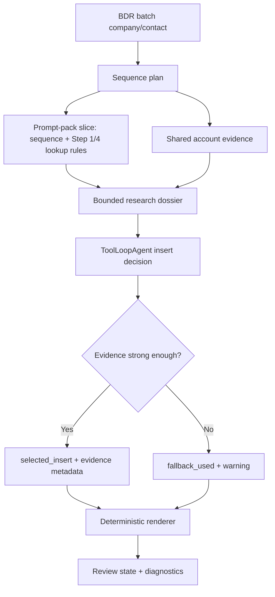
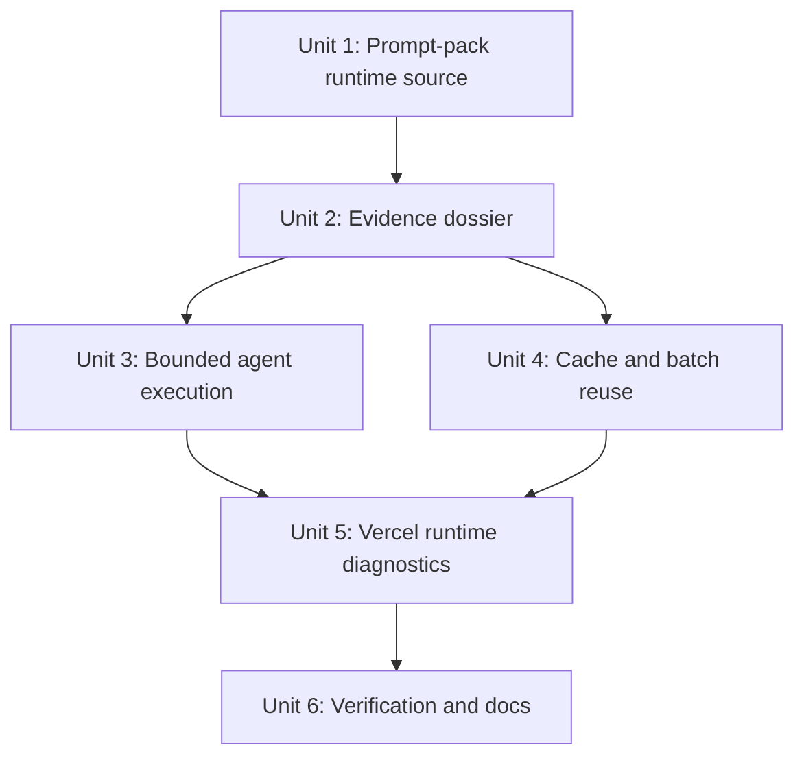

# feat: Optimize BDR Agent Runtime Research

## Overview

Optimize the BDR workflow so the Vercel AI SDK agent gathers research from the updated BDR prompt pack, compiles evidence-backed inserts into the existing email templates, and runs reliably within Vercel function budgets. The prior prompt-contract plan has completed the prompt and insert model work; this follow-up focuses on runtime shape: prompt slicing, bounded research, cache/reuse, agent step control, Vercel duration alignment, and production verification.

The optimized flow should keep the BDR play deterministic. The agent should not write whole emails from scratch or receive the full prompt document on every run. It should receive only the selected sequence's research instructions, gather a compact evidence dossier, return the structured insert contract, and let the existing renderer compile approved email drafts.

## Problem Frame

The origin requirements require the BDR path to select the right retail/ecommerce sequence, run targeted personalization lookups only for selected steps, preserve template voice, and surface evidence/warnings in review (see origin: `docs/brainstorms/2026-04-29-bdr-play-plugin-intake-requirements.md`). The updated BDR prompt source adds more granular research instructions across 12 sequences, including Exa-first retrieval, page extraction, Browserbase fallback for JS-heavy pages, review-pattern thresholds, persona-specific language constraints, and a strict internal output contract.

The current code already has BDR sequence planning, Exa/Firecrawl research seams, `ToolLoopAgent` placeholder research, and review rendering. The risk is that adding the full prompt pack naively would inflate tokens, increase tool loops, repeat web research per contact, and push batch processing beyond Vercel runtime limits. The plan therefore treats prompt rules as structured runtime data and treats agent calls as bounded synthesis over a compact evidence dossier.

## Requirements Trace

- R1. Use the updated BDR prompt pack as the canonical source for sequence-specific research instructions, evidence rules, language constraints, and fallback behavior.
- R2. Pass only the selected sequence and step prompt slices into the agent at runtime, not the full 12-sequence markdown.
- R3. Gather research into a compact evidence dossier with source priority, snippets, confidence, and lookup-family grouping before email rendering.
- R4. Keep the BDR agent bounded with explicit tool availability, step limits, output schema, timeouts, and telemetry.
- R5. Reuse and cache account-level research across contacts in the same company/batch so repeated lookups do not spend the Vercel function budget.
- R6. Support the prompt pack's retrieval order: Exa search first, page extraction for promising URLs, and Browserbase only as an optional fallback when static extraction is insufficient.
- R7. Compile email output from deterministic templates plus `selected_insert` only; never render raw snippets, prompt instructions, tool traces, or full scraped page text as email copy.
- R8. Preserve BDR route diagnostics, fallback-copy regression checks, non-pushable missing-email behavior, and review-first approval flow.
- R9. Add tests and smoke coverage that prove runtime optimization does not regress sequence selection, prompt fidelity, evidence fallback, or Vercel processing observability.

## Scope Boundaries

- Do not build a generic play marketplace, prompt editor, or multi-play orchestration graph.
- Do not hand full email writing to the LLM; BDR email bodies remain controlled templates.
- Do not require Browserbase for the first optimized path to work. It should be optional and fail closed to warnings/fallbacks when not configured.
- Do not expose raw provider traces, full scraped pages, API keys, or private diagnostics in the browser.
- Do not replace the production batch processing architecture with a new queue unless implementation evidence shows the optimized bounded flow still cannot fit the configured Vercel runtime.

### Deferred to Separate Tasks

- Generalizing prompt-pack ingestion to other outbound plays: future play-management work.
- Full Browserbase interaction workflows for support widgets or authenticated portals: future research-provider expansion after the static evidence path is stable.
- Pushing LinkedIn steps into an external sequencer: separate sequencing integration work.

## Context & Research

### Relevant Code and Patterns

- `lib/plays/bdr/sequences.ts` stores the 12 BDR sequence templates, lookup families, subjects, body templates, and LinkedIn notes.
- `lib/plays/bdr/types.ts` defines the sequence, lookup, insert, and placeholder research contracts.
- `lib/plays/bdr/research-agent.ts` already uses AI SDK `ToolLoopAgent`, `Output.object`, Exa search, Firecrawl scrape, `stopWhen`, and a structured placeholder output schema.
- `lib/plays/bdr/research.ts` and `lib/ai/tools.ts` are the lower-level research provider seams.
- No Browserbase client or dependency exists in the repo today, so Browserbase support must be introduced as an optional provider boundary rather than assumed as an available runtime tool.
- `lib/plays/bdr/workflow-runner.ts` currently resolves contacts, creates sequence plans, and researches placeholders per contact sequentially.
- `lib/jobs/processBatch.ts` routes BDR batches through `runBdrPlayWorkflow` and then persists evidence and review state.
- `app/api/internal/process-batch/[batchId]/route.ts` exports `maxDuration = 300`, while `vercel.json` still declares the same route at 60 seconds.
- `tests/bdr-play-workflow.test.ts`, `tests/bdr-play-placeholder-research.test.ts`, `tests/bdr-play-sequence-plan.test.ts`, `tests/bdr-play-agent.test.ts`, and `tests/research-tools.test.ts` already cover much of the BDR behavior.
- `docs/plans/2026-04-30-002-feat-bdr-prompt-contract-plan.md` is the completed predecessor plan for prompt contracts and insert/fallback semantics.

### Institutional Learnings

- `docs/solutions/integration-issues/vercel-agent-routing-fallback-copy-2026-05-01.md` is directly relevant. Key insight: open-ended tool loops and unobserved Vercel triggers previously caused stuck processing or generic fallback copy; BDR research should use Firecrawl only where bounded, provider schemas should be compatible, and review payloads must not preserve stale fallback fields.

### External References

- AI SDK `ToolLoopAgent` supports `stopWhen`, `activeTools`, structured `output`, `timeout`, and telemetry/event callbacks: `https://ai-sdk.dev/docs/reference/ai-sdk-core/tool-loop-agent`
- AI SDK structured data should use `generateText`/`streamText` with `Output.object`, and structured output counts as a step when combined with tools: `https://ai-sdk.dev/docs/ai-sdk-core/generating-structured-data`
- Vercel recommends Next.js `after()` for post-response work on Next.js 15.1+, while `waitUntil()` shares the same function timeout and can be cancelled on timeout: `https://vercel.com/docs/functions/functions-api-reference/vercel-functions-package`
- Next.js `after()` runs for the route's configured max duration: `https://nextjs.org/docs/app/api-reference/functions/after`

## Key Technical Decisions

- **Treat the prompt pack as structured runtime data:** Import the updated BDR prompt source into the repo and compile it into sequence/step prompt slices keyed by sequence code and lookup family. Runtime prompts should be small and deterministic.
- **Use a dossier-first flow:** Build a compact evidence dossier before synthesis, then ask the agent to decide `selected_insert` and fallback status from that dossier. This reduces open-ended tool use and makes failures reviewable.
- **Constrain agent autonomy by lookup family:** The selected sequence determines active tools, source priority, step limits, and timeout budget. Product, review, jobs, digital, and subscription lookups should not all expose the same unconstrained tool set.
- **Cache at company + lookup + source level:** Reuse account research across contacts and repeated lookup families in one batch. Persist only safe summaries/evidence metadata, not full raw scrape bodies.
- **Keep Browserbase optional and last:** The prompt pack mentions Browserbase, but the repo currently has Exa and Firecrawl seams. The implementation should add a provider boundary and diagnostics for Browserbase without making BDR processing depend on it unless configured.
- **Align Vercel runtime configuration:** The function route and `vercel.json` should agree on max duration, and status diagnostics should show when the optimized path used fallbacks because budget or provider configuration was insufficient.
- **Prefer characterization coverage before runtime refactors:** The area already has regression history around fallback copy and stale review state; runtime changes should start by locking current expected behavior.

## Open Questions

### Resolved During Planning

- Should the completed prompt-contract plan be reopened? No. Its implementation units are checked off, so this plan is a follow-up focused on runtime optimization.
- Should the whole BDR prompt markdown be sent to the agent? No. It should be imported as source material, then sliced by selected sequence and lookup.
- Should Browserbase be required immediately? No. Add a provider seam and fallback semantics, but keep Exa/Firecrawl as the initial configured path unless Browserbase credentials and dependency are added.
- Does this need external research? Yes. AI SDK v6 and Vercel runtime behavior are external contract surfaces; current docs confirm ToolLoopAgent controls and Vercel post-response timeout behavior.

### Deferred to Implementation

- Exact compiled prompt-pack format: TypeScript constants, JSON, or a small build-time conversion script can be chosen during implementation as long as runtime data is typed and testable.
- Exact cache persistence location: implementation may start with in-memory per-batch reuse and then persist compact evidence artifacts if needed for retries.
- Exact Browserbase package/API surface: choose only after confirming the provider package and deployment credentials. Until then, keep the interface optional.
- Exact per-lookup timeout values: set initial conservative budgets during implementation, then tune from observed smoke/runtime data.

## High-Level Technical Design

> *This illustrates the intended approach and is directional guidance for review, not implementation specification. The implementing agent should treat it as context, not code to reproduce.*

Runtime mode comparison:

| Mode | Purpose | Tool policy | Output |
|---|---|---|---|
| Account research | Classify company and seed reusable facts | Exa-first, small result cap | Evidence claims and URLs |
| Static extraction | Verify promising pages | Firecrawl/fetch with short timeout | Clean markdown snippet summary |
| Browser fallback | Handle JS-heavy pages only when configured | Browserbase boundary, explicit budget | Evidence or warning |
| Insert synthesis | Decide safe personalization line | AI SDK structured output over compact dossier | `selected_insert` or fallback |
| Rendering | Compile approval copy | No tools, no LLM | Template emails and metadata |

## Implementation Units

- [x] **Unit 1: Add a prompt-pack runtime source**

**Goal:** Bring the updated BDR prompt pack into the repo as portable source material and expose selected sequence/lookup instructions as typed runtime data.

**Requirements:** R1, R2, R6, R7

**Dependencies:** None

**Files:**
- Create: `docs/bdr-cold-outbound-prompt-pack.md`
- Create: `lib/plays/bdr/prompt-pack.ts`
- Modify: `lib/plays/bdr/sequences.ts`
- Modify: `lib/plays/bdr/types.ts`
- Test: `tests/bdr-prompt-pack.test.ts`
- Test: `tests/bdr-play-workflow.test.ts`

**Approach:**
- Copy the user-provided BDR prompt source into a repo-relative document so deployments and teammates are not dependent on a local Downloads path.
- Represent prompt-pack metadata as typed runtime slices keyed by sequence code, original step number, lookup family, source priority, evidence threshold, persona language constraints, and fallback rule.
- Keep email templates in `lib/plays/bdr/sequences.ts` clean of visible research instructions; store prompt instructions as metadata consumed by research only.
- Add a prompt-pack revision marker that can be included in diagnostics and fixture assertions.

**Patterns to follow:**
- Existing `BDR_SEQUENCES` and `sequenceFor` shape in `lib/plays/bdr/sequences.ts`.
- Prompt-contract model from `docs/plans/2026-04-30-002-feat-bdr-prompt-contract-plan.md`.

**Test scenarios:**
- Happy path: `A-1` exposes only Step 1 hero-product and Step 4 review-pattern prompt slices with their source priorities and thresholds.
- Happy path: `D-3` exposes subscription/eCommerce language constraints and excludes CX jargon from its runtime prompt metadata.
- Edge case: Missing prompt metadata for a known sequence fails a test instead of silently running a generic prompt.
- Error path: Runtime prompt slices contain no markdown table artifacts, `[SELECTED_INSERT]`, or full unrelated sequence bodies.
- Integration: rendered BDR output remains free of prompt instructions after prompt-pack metadata is added.

**Verification:**
- Every BDR sequence can be addressed through a compact, testable prompt-pack slice without sending the full source document to the agent.

- [x] **Unit 2: Build a compact evidence dossier layer**

**Goal:** Gather and normalize research before agent synthesis so each selected lookup receives a small, source-prioritized evidence packet rather than raw tool outputs.

**Requirements:** R3, R5, R6, R7

**Dependencies:** Unit 1

**Files:**
- Create: `lib/plays/bdr/research-dossier.ts`
- Create: `lib/ai/browserbase.ts`
- Modify: `lib/plays/bdr/research.ts`
- Modify: `lib/plays/bdr/placeholder-research.ts`
- Modify: `lib/ai/tools.ts`
- Test: `tests/bdr-research-dossier.test.ts`
- Test: `tests/bdr-play-placeholder-research.test.ts`
- Test: `tests/research-tools.test.ts`
- Test: `tests/browserbase-tools.test.ts`

**Approach:**
- Introduce a dossier abstraction that groups evidence by lookup family, source URL, short snippet, evidence type, confidence, verified fact, and inferred operating moment.
- Cap evidence aggressively: only the most relevant URLs/snippets per lookup should reach the agent.
- Enforce prompt-pack source priority before synthesis: official product/help/careers/press sources first; review/social sources only when the repeated-pattern threshold is met.
- Normalize Firecrawl and Exa outputs into the same evidence item shape and strip page chrome before agent input.
- Add Browserbase as a narrow optional provider boundary. When unavailable or when package support is not installed, the boundary should return an explicit warning/fallback signal rather than blocking BDR output.
- Record fallback reasons when evidence is missing, weak, or unavailable because a provider is not configured.

**Execution note:** Add characterization coverage around current placeholder research output before changing provider flow, especially for Quince noisy page text and Gruns subscription-page cleanup.

**Patterns to follow:**
- Existing `ResearchResult` shape in `lib/ai/tools.ts`.
- Existing fallback warning propagation in `lib/plays/bdr/placeholder-research.ts`.
- Noisy evidence fixtures in `tests/bdr-play-workflow.test.ts`.

**Test scenarios:**
- Happy path: official product evidence plus a clean Firecrawl snippet becomes a concise `hero_product` dossier with one preferred source URL.
- Happy path: support jobs evidence prefers exact role title/responsibility snippets over raw job counts.
- Edge case: one Reddit thread or one review complaint is rejected for `review_pattern` and produces fallback metadata.
- Edge case: duplicate URLs across Step 1 and Step 4 are de-duplicated in the dossier but remain associated with both lookup needs.
- Error path: Exa or Firecrawl failure becomes a warning/fallback dossier item without throwing the whole BDR batch.
- Error path: Browserbase is unavailable or disabled; JS-heavy-page evidence falls back with a clear warning instead of failing the batch.
- Integration: placeholder research consumes dossier items and still calls only the lookup families required by the selected sequence.

**Verification:**
- The agent receives compact, source-prioritized evidence packets rather than raw search/scrape text.

- [x] **Unit 3: Constrain the BDR ToolLoopAgent runtime**

**Goal:** Make BDR insert synthesis run within predictable Vercel budgets by controlling active tools, step counts, timeouts, telemetry, and structured output.

**Requirements:** R2, R4, R6, R7, R8

**Dependencies:** Units 1 and 2

**Files:**
- Modify: `lib/plays/bdr/research-agent.ts`
- Modify: `lib/plays/bdr/placeholder-research.ts`
- Test: `tests/bdr-play-agent.test.ts`
- Test: `tests/bdr-play-placeholder-research.test.ts`

**Approach:**
- Feed the agent only the selected prompt-pack slices and compact dossier for Step 1 and Step 4.
- Use AI SDK controls intentionally: `activeTools` per lookup, lower `stopWhen` where the dossier is already available, explicit total/step timeout, low temperature, bounded output tokens, and structured `Output.object`.
- Reserve tool calls for missing evidence. When the dossier is already sufficient, the agent should synthesize from evidence without further searching.
- Add event/telemetry hooks or structured logs for step count, tool count, timeout/fallback reason, prompt-pack revision, sequence code, and lookup family.
- Keep provider-facing schemas compatible, then normalize into strict app schemas after generation.

**Patterns to follow:**
- Existing `ToolLoopAgent` setup in `lib/plays/bdr/research-agent.ts`.
- Existing AI SDK intake router using `stepCountIs(1)` in `lib/plays/bdr/intake-agent.ts`.
- Provider-safe schema guidance from `docs/solutions/integration-issues/vercel-agent-routing-fallback-copy-2026-05-01.md`.

**Test scenarios:**
- Happy path: agent prompt for `A-1` includes only A-1 lookup instructions and selected evidence, not all 12 sequences.
- Happy path: sufficient dossier evidence produces structured `selected_insert` without invoking additional scrape/search tools in mocked execution.
- Edge case: low-confidence dossier causes `fallback_used: true` and a warning instead of forcing a personalization line.
- Error path: tool timeout returns fallback metadata and preserves batch processing.
- Integration: BDR workflow output includes no raw source snippets in `body_text` and no generic company-agent fallback subjects.

**Verification:**
- Agent execution is bounded, observable, and produces the same insert contract whether evidence was gathered by tools or supplied by a prebuilt dossier.

- [x] **Unit 4: Reuse research across contacts and batches**

**Goal:** Reduce duplicated research work by sharing account, page, and lookup evidence across contacts in the same company/batch and by preserving compact evidence artifacts for retries.

**Requirements:** R3, R5, R8, R9

**Dependencies:** Unit 2

**Files:**
- Modify: `lib/plays/bdr/workflow-runner.ts`
- Modify: `lib/jobs/processBatch.ts`
- Modify: `lib/plays/bdr/sequence-plan.ts`
- Test: `tests/bdr-play-workflow.test.ts`
- Test: `tests/batch-review-flow.test.ts`

**Approach:**
- Add an in-run research context keyed by company/domain, sequence code, lookup family, and normalized source URL.
- Reuse account research from sequence planning in placeholder research rather than re-searching the same company facts.
- Share the same lookup dossier for contacts with the same company and sequence lookup needs when persona-specific constraints do not require different evidence.
- Keep concurrency bounded if placeholder lookups are parallelized. The plan allows parallel work only where it does not risk provider rate limits or duplicate persistence.
- Persist compact evidence summaries in existing research artifacts so retries and review diagnostics can explain what happened without storing raw page dumps.

**Execution note:** Start with tests proving call counts and idempotent output for multi-contact companies before introducing parallelism.

**Patterns to follow:**
- Existing per-company duplicate guard in `processBatch`.
- Existing research artifact persistence in `saveResearchArtifact`.
- Existing sequence-planning evidence URL/claim propagation in `lib/plays/bdr/sequence-plan.ts`.

**Test scenarios:**
- Happy path: two contacts at the same company with the same sequence reuse account and lookup evidence instead of calling the provider twice.
- Happy path: two contacts with different persona sequences share account research but run only the distinct lookup families needed by each sequence.
- Edge case: retrying a partially processed batch does not create duplicate runs or duplicate evidence artifacts.
- Error path: one lookup provider failure produces a fallback warning for affected contacts without discarding successful evidence for other contacts.
- Integration: saved research artifact contains prompt-pack revision, sequence plans, compact dossier summaries, placeholder research, and warnings.

**Verification:**
- Multi-contact BDR batches perform fewer provider calls while preserving per-contact sequence output and review warnings.

- [x] **Unit 5: Align Vercel runtime, diagnostics, and fallback behavior**

**Goal:** Make the optimized path fit Vercel execution constraints and expose enough sanitized diagnostics to distinguish budget, provider, routing, and fallback outcomes.

**Requirements:** R4, R5, R8, R9

**Dependencies:** Units 3 and 4

**Files:**
- Modify: `vercel.json`
- Modify: `app/api/internal/process-batch/[batchId]/route.ts`
- Modify: `lib/jobs/processBatch.ts`
- Modify: `lib/mcp/diagnostics.ts`
- Modify: `lib/mcp/outbound-tools.ts`
- Test: `tests/readiness-config.test.ts`
- Test: `tests/mcp-outbound-sequence.test.ts`
- Test: `tests/batch-review-flow.test.ts`

**Approach:**
- Align `vercel.json` and the route-level `maxDuration` for batch processing so the deployed function budget matches the code's expectation.
- Add sanitized BDR runtime diagnostics: prompt-pack revision, sequence count, provider configuration presence, research fallback counts, agent step/tool counts when available, and whether Browserbase fallback was unavailable/skipped.
- Preserve the existing rule that missing research providers produce BDR warnings/fallbacks, not a silent route downgrade to `generic_company_agent`.
- Keep status responses additive and safe: no raw prompts, snippets, URLs beyond existing evidence URLs, secrets, or actor-private data beyond current contract.
- Avoid using post-response work for the heavy BDR research loop unless the current trigger architecture already guarantees observability and duration alignment.

**Patterns to follow:**
- Existing diagnostics in `lib/mcp/diagnostics.ts`.
- Production-readiness checks in `README.md` and `tests/readiness-config.test.ts`.
- Previous fallback-copy solution note in `docs/solutions/integration-issues/vercel-agent-routing-fallback-copy-2026-05-01.md`.

**Test scenarios:**
- Happy path: BDR create/status diagnostics include processing route, prompt-pack revision, configured provider presence, and no secrets.
- Happy path: `vercel.json` and route-level max duration agree for the internal batch processor.
- Edge case: Browserbase is not configured; diagnostics show static extraction path and BDR review output still renders with warnings/fallbacks.
- Error path: Anthropic/Exa/Firecrawl unavailable does not create generic company-agent copy for a BDR-selected batch.
- Integration: MCP status for a completed optimized BDR batch still reports `bdr_workflow` and ready-for-review state.

**Verification:**
- Operators can tell whether a BDR batch used optimized research, fell back because of weak evidence/provider gaps, or failed for a true processing issue.

- [x] **Unit 6: Add optimization verification and documentation**

**Goal:** Lock in the optimized runtime behavior with fixtures, production smoke checks, and operator documentation.

**Requirements:** R1-R9

**Dependencies:** Units 1 through 5

**Files:**
- Modify: `scripts/verify-bdr-processing-smoke.mjs`
- Modify: `README.md`
- Modify: `docs/bdr-play-intake.md`
- Modify: `docs/cowork-async-polling-instructions.md`
- Test: `tests/bdr-prompt-pack.test.ts`
- Test: `tests/bdr-research-dossier.test.ts`
- Test: `tests/bdr-play-workflow.test.ts`
- Test: `tests/readiness-config.test.ts`

**Approach:**
- Extend smoke verification to assert prompt-pack revision, BDR route, absence of generic fallback subjects, evidence/fallback diagnostics, and review-state cleanliness.
- Add fixture coverage for a high-return brand, high-consideration brand, subscription/eCommerce brand, support-ops persona, and digital/eCommerce persona.
- Add negative fixtures for one-off review evidence, weak official evidence, missing Browserbase configuration, and provider timeouts.
- Document the runtime contract: prompt-pack source, research retrieval order, provider requirements, fallback semantics, diagnostics, and what to do when a review URL shows fallback-heavy output.
- Keep docs aligned with the account-sequencer skill behavior: Cowork starts BDR work, Vercel selects sequence and research, review remains the approval source of truth.

**Patterns to follow:**
- Current production readiness and BDR smoke sections in `README.md`.
- Existing stale BDR batch triage guidance.
- Existing prompt-pack fixture style from predecessor BDR tests.

**Test scenarios:**
- Happy path: smoke against a configured deployment creates a BDR batch, reaches review, reports prompt-pack revision, and contains no generic fallback copy.
- Happy path: optimized workflow for Gruns/Jillian-style subscription/eCommerce input maps to `D-3` and uses subscription lifecycle language.
- Edge case: weak review/social evidence uses Version B/fallback and records why.
- Error path: missing optional Browserbase config does not fail the batch or hide fallback warnings.
- Integration: docs/readiness tests require prompt-pack revision and optimized runtime diagnostics in operator checklists.

**Verification:**
- A reviewer or operator can validate optimized BDR behavior locally and against production before using the flow for customer work.

## System-Wide Impact

- **Interaction graph:** Cowork/MCP still creates a BDR batch with `play_id`; `processBatch` still calls `runBdrPlayWorkflow`; the BDR workflow gains prompt-pack slices, dossier construction, bounded agent synthesis, reuse/caching, and richer diagnostics before saving review state.
- **Error propagation:** Provider misses, weak evidence, timeouts, and optional Browserbase absence should become warnings/fallbacks on BDR output. Route mismatch, persistence failure, or renderer failure should remain processing errors.
- **State lifecycle risks:** Caching/reuse must not leak evidence across companies, domains, batches, or unrelated lookup families. Retried batches must not duplicate runs or show stale fallback copy.
- **API surface parity:** MCP create/status responses should be additive. Review output should remain compatible with existing edit/approve/submit flows. Push remains email-only.
- **Integration coverage:** Unit tests should prove prompt slicing and dossier behavior; workflow tests should prove rendered copy; MCP/batch tests should prove routing and review persistence; smoke should prove deployed runtime behavior.
- **Unchanged invariants:** `play_id: "bdr_cold_outbound"` remains the durable BDR selector; BDR contacts without verified emails remain non-pushable; deterministic templates remain the source of final email structure.

## Risks & Dependencies

| Risk | Mitigation |
|------|------------|
| Prompt-pack import duplicates or drifts from sequence templates | Add prompt-pack revision and tests that compare required sequence coverage and lookup metadata |
| Agent still exceeds Vercel budget for large batches | Reuse research across contacts, cap evidence, bound agent steps/timeouts, align max duration, and surface fallback diagnostics |
| Browserbase requirement blocks deployment | Keep Browserbase optional and last in the retrieval order; static Exa/Firecrawl path remains functional |
| Cached evidence crosses company boundaries | Key cache by batch/company/domain/lookup/source and test multi-company isolation |
| Structured output schema fails provider compatibility | Keep provider-facing schema simple and normalize into stricter app schemas after generation |
| Reviewers see raw research or prompt instructions | Renderer uses only `selected_insert`; tests assert no prompt artifacts or raw snippets in email body |
| Runtime diagnostics leak sensitive data | Use sanitized booleans/counts/revisions; do not expose raw prompts, raw scrape bodies, provider keys, or internal traces |

## Documentation / Operational Notes

- Update the BDR docs to state that the prompt pack is a runtime source and that weak evidence intentionally falls back to generic openers.
- Update readiness documentation so production verification checks prompt-pack revision, optimized runtime diagnostics, BDR route, and absence of generic fallback copy.
- Record provider expectations: `ANTHROPIC_API_KEY`, `EXA_API_KEY`, and `FIRECRAWL_API_KEY` support the optimized static path; Browserbase is optional until explicitly configured.
- Note that Vercel environment changes require redeploy before affecting production runtime behavior.

## Sources & References

- **Origin document:** [docs/brainstorms/2026-04-29-bdr-play-plugin-intake-requirements.md](../brainstorms/2026-04-29-bdr-play-plugin-intake-requirements.md)
- **Predecessor plan:** [docs/plans/2026-04-30-002-feat-bdr-prompt-contract-plan.md](2026-04-30-002-feat-bdr-prompt-contract-plan.md)
- **Institutional learning:** [docs/solutions/integration-issues/vercel-agent-routing-fallback-copy-2026-05-01.md](../solutions/integration-issues/vercel-agent-routing-fallback-copy-2026-05-01.md)
- Related code: `lib/plays/bdr/research-agent.ts`
- Related code: `lib/plays/bdr/workflow-runner.ts`
- Related code: `lib/jobs/processBatch.ts`
- Related code: `lib/ai/tools.ts`
- Related tests: `tests/bdr-play-workflow.test.ts`
- Related tests: `tests/bdr-play-placeholder-research.test.ts`
- External docs: `https://ai-sdk.dev/docs/reference/ai-sdk-core/tool-loop-agent`
- External docs: `https://ai-sdk.dev/docs/ai-sdk-core/generating-structured-data`
- External docs: `https://vercel.com/docs/functions/functions-api-reference/vercel-functions-package`
- External docs: `https://nextjs.org/docs/app/api-reference/functions/after`
