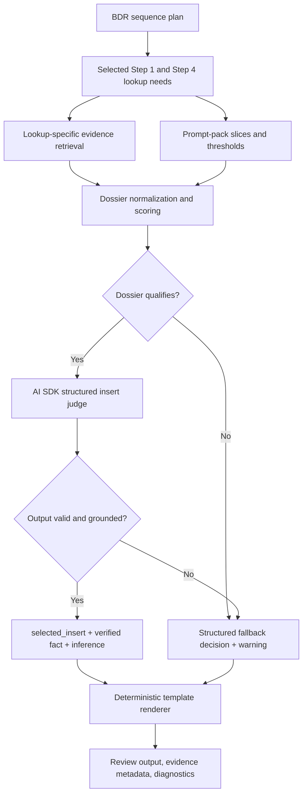
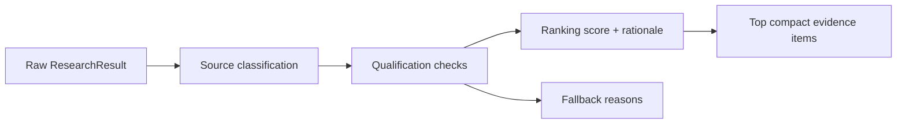
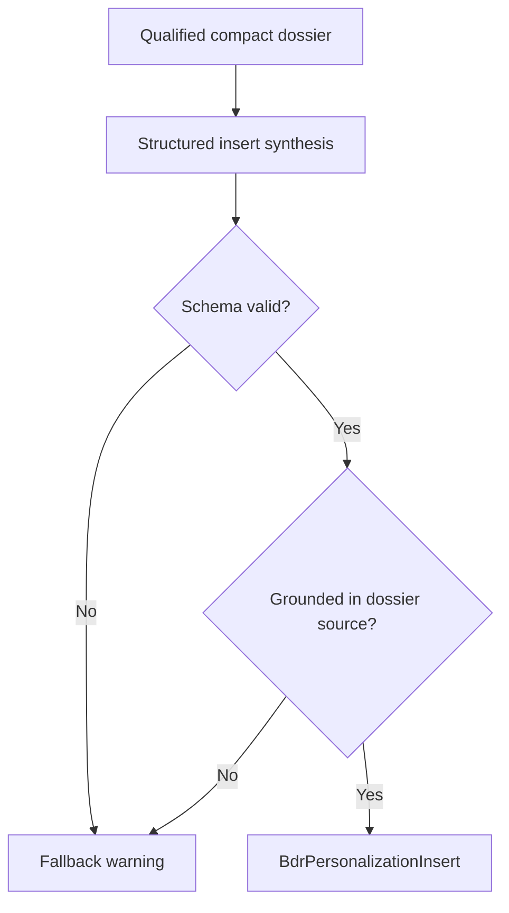

# feat: Improve BDR Dossier Snippet Quality

## Overview

Improve BDR personalization quality by making the evidence dossier the primary research artifact and using AI SDK structured synthesis as a bounded judge over that dossier. The BDR agent should produce exactly one best `selected_insert` per selected placeholder, or an explicit fallback decision, while deterministic sequence templates continue to render the final emails.

This plan builds on the completed BDR runtime optimization work. It does not reopen BDR intake, routing, or template rendering. It strengthens the middle of the workflow: evidence qualification, dossier ranking, insert synthesis, diagnostics, and regression coverage.

## Problem Frame

The BDR workflow can now route to the right play, slice prompt-pack instructions by selected sequence, and render Step 1 / Step 4 templates. The remaining quality gap is the personalized snippet. If the evidence layer is too thin or too noisy, the insert becomes generic, unsafe, or falls back too often. If the model is allowed to research freely, the Vercel runtime and review safety risks return.

The origin requirements define the intended shape: optimize primarily for the best personalized snippet, generate one best insert per placeholder, build compact evidence dossiers first, and use the AI SDK agent only where it improves judgment over verified evidence (see origin: `docs/brainstorms/2026-05-02-bdr-dossier-snippet-quality-requirements.md`).

## Requirements Trace

- R1. Produce exactly one best `selected_insert` per selected BDR placeholder, or a structured fallback decision.
- R2. Ensure inserts fit the destination template voice and do not expose research-process language, raw snippets, or prompt instructions.
- R3. Ground each insert in a verified public fact with source URL, source snippet, evidence type, confidence, and soft inference.
- R4. Prefer account-specific evidence over generic category language when reliable evidence exists.
- R5. Use template fallbacks and review warnings when evidence is weak, stale, ambiguous, unsupported, or below threshold.
- R6. Build dossiers before final synthesis, grouped by lookup family, source priority, verified fact, inferred operating moment, confidence, and fallback reason.
- R7. Keep dossiers compact so bounded synthesis receives only the strongest selected Step 1 / Step 4 evidence.
- R8. Preserve reviewer trust context: source URL, snippet, evidence kind, confidence, and qualification rationale.
- R9. Enforce repeated-pattern thresholds before personalization, especially for review/social evidence.
- R10. Reuse dossiers across same-company contacts with the same selected lookup need.
- R11. Use the AI SDK path as a bounded judge/compressor over the dossier, not as an unconstrained web researcher or full email writer.
- R12. Prompt synthesis with only selected prompt-pack slices, relevant dossier evidence, output contract, and language constraints.
- R13. Follow current AI SDK v6 agent guidance: use `ToolLoopAgent` only where tool looping is needed, bound loops with `stopWhen`, scope tool availability, use `Output.object`, timeouts, and telemetry/step visibility.
- R14. Accept only structured output that distinguishes verified fact, inference, selected insert, fallback status, warning, and evidence URL.
- R15. Provider/tool failures must degrade into warning-backed fallback decisions, not generic outbound copy or hidden success.
- R16. Keep BDR email bodies deterministic: sequence templates plus selected insert only.
- R17. Keep reviewer-visible language plain and avoid internal implementation labels.
- R18. Diagnostics and smoke checks must show whether the optimized dossier path ran, the prompt-pack revision, and fallback causes.

## Scope Boundaries

- Do not build multi-candidate reviewer selection.
- Do not let the AI SDK path write whole email bodies.
- Do not build a generalized play marketplace, prompt editor, or arbitrary agent graph.
- Do not require Browserbase or another optional provider for the core path.
- Do not expose raw provider payloads, full scraped pages, API keys, private diagnostics, or tool traces in browser-visible review state.

### Deferred to Separate Tasks

- Full Browserbase interactive workflows for JS-heavy sites: future provider expansion after dossier scoring is stable.
- Multi-candidate insert review UI: future UX iteration if one-best-insert quality is still insufficient.
- Generalizing dossier/snippet quality to non-BDR plays: future play-management work.

## Context & Research

### Relevant Code and Patterns

- `lib/plays/bdr/sequences.ts` stores deterministic BDR templates, fallback bodies, Step 1/4 lookup families, and LinkedIn notes.
- `lib/plays/bdr/prompt-pack.ts` stores selected-sequence prompt-pack slices, source priorities, evidence thresholds, output contract, and language constraints.
- `lib/plays/bdr/research-dossier.ts` already normalizes raw `ResearchResult` items into compact dossier items, but currently has a simple source-kind heuristic and first-item selection.
- `lib/plays/bdr/research.ts` owns lookup-specific provider calls and currently turns the dossier directly into `BdrResearchFinding`.
- `lib/plays/bdr/research-agent.ts` currently uses `ToolLoopAgent`, Exa, Firecrawl, `Output.object`, `stepCountIs`, and timeout wrappers for placeholder research.
- `lib/plays/bdr/placeholder-research.ts` chooses agent research for the default provider and falls back to deterministic provider lookups.
- `lib/plays/bdr/workflow-runner.ts` already reuses placeholder research by sequence across same-company contacts.
- `lib/plays/bdr/workflow-output.ts` renders deterministic templates from selected inserts or fallback decisions and must remain the only email-body compiler.
- `lib/mcp/diagnostics.ts`, `scripts/verify-bdr-processing-smoke.mjs`, and `tests/readiness-config.test.ts` already carry deployment and prompt-pack diagnostics.
- Existing tests to extend include `tests/bdr-research-dossier.test.ts`, `tests/bdr-play-placeholder-research.test.ts`, `tests/bdr-play-agent.test.ts`, `tests/bdr-play-workflow.test.ts`, `tests/mcp-outbound-sequence.test.ts`, and `tests/readiness-config.test.ts`.
- No repo-local `AGENTS.md` file was present in this checkout; the thread-provided AGENTS guidance is the applicable planning constraint.

### Institutional Learnings

- `docs/solutions/integration-issues/vercel-agent-routing-fallback-copy-2026-05-01.md` is directly relevant. Key lessons: never let BDR work silently fall back to generic outbound copy, keep route selection durable before persistence, avoid open-ended generic tool loops in Vercel, normalize provider-safe structured output into stricter app schemas, and replace all stale review fields when generated drafts are overwritten.
- `docs/plans/2026-05-02-001-feat-bdr-agent-runtime-optimization-plan.md` established the prior runtime direction: prompt-pack slicing, compact dossiers, bounded execution, per-batch reuse, optional Browserbase boundary, Vercel duration alignment, and smoke diagnostics.

### External References

- AI SDK v6 `ToolLoopAgent` docs: `ToolLoopAgent` is for reusable multi-step tool loops, uses `instructions`, supports `tools`, `toolChoice`, `stopWhen`, `activeTools`, `Output`, timeouts, callbacks, and telemetry. Default stop condition is `stepCountIs(20)`, so BDR must override it when loops remain. Source: `https://ai-sdk.dev/docs/reference/ai-sdk-core/tool-loop-agent`
- AI SDK loop-control docs: agent loops continue until non-tool finish, missing execute, approval, or stop condition; `stopWhen` and `prepareStep` control loop execution. Source: `https://ai-sdk.dev/docs/agents/loop-control`
- AI SDK structured data docs: structured output in v6 uses `Output.object` with `generateText`, `streamText`, or agent output configuration, not legacy `generateObject` assumptions. Source: `https://ai-sdk.dev/docs/ai-sdk-core/generating-structured-data`

## Key Technical Decisions

- **Choose dossier-first synthesis for the core path:** Build, score, and qualify evidence before asking the model for the insert. This directly supports snippet quality while keeping tool drift and runtime cost controlled.
- **Use non-tool structured synthesis for normal insert judging:** Once the dossier is built, the final insert decision does not need web tools. Prefer an AI SDK structured generation path with `Output.object` for normal synthesis; keep `ToolLoopAgent` only for bounded retrieval/enrichment cases where tools are actually required.
- **Keep one insert per placeholder:** The system, not the reviewer, chooses the best insert or fallback. Reviewers edit the resulting draft but do not choose among multiple generated candidates in this version.
- **Make evidence qualification explicit:** Dossier items should carry enough rationale to explain why an item qualified, lost to a stronger item, or triggered fallback.
- **Treat fallback as a successful safe outcome:** Weak evidence should render the correct BDR fallback template and warning rather than forcing a low-confidence personalized line.
- **Keep diagnostics operator-focused:** Reviewer-visible state should explain evidence quality plainly; provider/runtime diagnostics should stay sanitized and operator-facing.

## Open Questions

### Resolved During Planning

- Should the implementation generate one insert or multiple ranked candidates? One insert per placeholder, per the origin decision.
- Should the agent gather evidence freely or judge a dossier? Use a dossier-first flow and bound the agent to judging/compressing verified evidence.
- Should `ToolLoopAgent` remain in the final insert path? Only where tool looping is needed. Normal insert judging should not expose tools after the dossier is already built.
- Should Browserbase be required for better snippets? No. Keep it optional and warning-backed.

### Deferred to Implementation

- Exact scoring weights for source priority, confidence, evidence recency, domain match, and snippet specificity: tune through characterization tests and fixture examples.
- Exact AI SDK call shape for non-tool structured synthesis: implementation should follow the installed AI SDK version and provider compatibility, then normalize into app types.
- Exact telemetry field names and persistence location: choose based on current diagnostics/store patterns while keeping browser-visible state sanitized.
- Whether any existing `ToolLoopAgent` code should be retained as an optional enrichment path or replaced by deterministic provider calls for this iteration: decide after characterization coverage shows the smallest safe refactor.

## High-Level Technical Design

> *This illustrates the intended approach and is directional guidance for review, not implementation specification. The implementing agent should treat it as context, not code to reproduce.*

## Implementation Units

- [x] **Unit 1: Characterize Current Snippet Quality**

**Goal:** Lock down current BDR snippet, fallback, and leak-prevention behavior before changing dossier scoring or AI SDK synthesis.

**Requirements:** R1, R2, R5, R16, R17

**Dependencies:** None

**Files:**
- Modify: `tests/bdr-research-dossier.test.ts`
- Modify: `tests/bdr-play-placeholder-research.test.ts`
- Modify: `tests/bdr-play-workflow.test.ts`
- Modify: `tests/bdr-play-agent.test.ts`

**Approach:**
- Add characterization tests for known good and bad snippet examples across product, review, subscription, support-jobs, and digital-signal lookup families.
- Assert that fallback decisions render BDR fallback templates rather than generic outbound copy or internal guardrail text.
- Assert exactly-one-insert behavior: each selected placeholder produces one `selected_insert` or a fallback object, never multiple candidates or freeform prose.

**Execution note:** Add failing characterization tests before refactoring the dossier or agent path.

**Patterns to follow:**
- Existing noisy Quince and Gruns examples in `tests/bdr-play-workflow.test.ts`.
- Existing selected lookup coverage in `tests/bdr-play-placeholder-research.test.ts`.
- Existing prompt-slice leak checks in `tests/bdr-play-agent.test.ts`.

**Test scenarios:**
- Happy path: Kizik A-1 product evidence produces a specific product insert and review evidence produces a specific review-pattern insert.
- Happy path: Gruns D-3 subscription evidence produces a subscription-flow insert that fits the template and does not paste raw page text.
- Edge case: one review or one Reddit/social item triggers Step 4 fallback with a review warning.
- Edge case: unsupported persona produces blocked draft metadata and no sendable email copy.
- Error path: missing provider evidence produces fallback warning, not generic company-agent copy.
- Integration: rendered review JSON contains no prompt-pack instructions, tool traces, `confirm the right BDR sequence`, or known generic fallback subjects.

**Verification:**
- The current observable behavior is covered before dossier and synthesis internals change.

- [x] **Unit 2: Enrich Dossier Qualification and Ranking**

**Goal:** Make `BdrEvidenceDossier` expressive enough to select high-quality evidence and explain qualification/fallback decisions.

**Requirements:** R3, R4, R6, R7, R8, R9, R10

**Dependencies:** Unit 1

**Files:**
- Modify: `lib/plays/bdr/research-dossier.ts`
- Modify: `lib/plays/bdr/types.ts`
- Modify: `lib/plays/bdr/research.ts`
- Test: `tests/bdr-research-dossier.test.ts`

**Approach:**
- Extend dossier items with qualification signals such as domain match, source-priority bucket, specificity, repeated-pattern group, verified fact, inferred operating moment, disqualification reason, and ranking rationale.
- Keep the dossier compact by capping the evidence that reaches synthesis, but preserve review-safe metadata for why the best item won or why fallback was selected.
- Move repeated-review threshold logic into dossier qualification so downstream synthesis cannot accidentally personalize from weak social/review evidence.
- Preserve compatibility with the current `BdrPersonalizationInsert` shape or extend it carefully so existing renderer and review tests keep passing.

**Technical design:** *(directional guidance, not implementation specification)*

**Patterns to follow:**
- Existing `buildBdrEvidenceDossier()` and `researchFindingFromDossier()` separation.
- Existing prompt-pack source priorities from `bdrPromptConfigForLookup()`.
- Existing `BdrPersonalizationInsert` evidence and fallback fields.

**Test scenarios:**
- Happy path: official product page outranks social/review evidence for `hero_product`.
- Happy path: exact support job title/responsibility outranks a generic careers page for `support_jobs`.
- Happy path: subscription help-center or account portal language qualifies for `subscription_signal` with source and inference.
- Edge case: three credible review-pattern examples qualify; one or two examples do not.
- Edge case: duplicate URL/snippet evidence is de-duplicated while preserving lookup association.
- Edge case: official-domain evidence is required for product/subscription personalization when company domain is known.
- Error path: empty, low-confidence, or non-matching evidence returns fallback reasons and no selected insert.

**Verification:**
- Dossier qualification is deterministic, compact, explainable, and independently testable.

- [x] **Unit 3: Improve Lookup-Specific Evidence Retrieval**

**Goal:** Feed the dossier with better targeted evidence for each selected lookup while keeping provider calls bounded and optional-provider failures safe.

**Requirements:** R4, R5, R6, R7, R9, R10, R15

**Dependencies:** Unit 2

**Files:**
- Modify: `lib/plays/bdr/research.ts`
- Modify: `lib/ai/tools.ts`
- Modify: `lib/ai/browserbase.ts`
- Modify: `lib/plays/bdr/placeholder-research.ts`
- Test: `tests/bdr-play-placeholder-research.test.ts`
- Test: `tests/browserbase-tools.test.ts`
- Test: `tests/research-tools.test.ts`

**Approach:**
- Tune lookup-specific searches around the prompt-pack source priorities: official product/catalog for product lookups, help/subscription pages for subscription lookups, careers/job pages for support jobs, press/careers for digital signals, and review/social sources for repeated patterns.
- Use static extraction only on promising URLs and keep timeout/result caps explicit.
- Keep Browserbase as optional last-mile fallback. When unavailable, return a warning/fallback signal rather than failing the batch.
- Reuse same-company/same-lookup evidence through the existing workflow cache, but make reuse keying lookup-aware so two sequences sharing `review_pattern` or `hero_product` do not repeat research unnecessarily.

**Patterns to follow:**
- Existing `searchPublicWeb()`, `searchWithExa()`, and `scrapeWithFirecrawl()` provider seams.
- Existing optional Browserbase fail-closed boundary in `lib/ai/browserbase.ts`.
- Existing per-sequence placeholder reuse in `lib/plays/bdr/workflow-runner.ts`.

**Test scenarios:**
- Happy path: selected A-1 sequence calls only `hero_product` and `review_pattern` retrieval paths.
- Happy path: selected C-1/D-3 sequence calls subscription-specific retrieval and avoids unrelated product/digital searches.
- Happy path: Firecrawl extraction result is normalized into dossier evidence when a promising URL is available.
- Edge case: same company with two contacts and same lookup needs reuses evidence and does not repeat provider calls.
- Error path: Exa returns no results; dossier fallback warning is produced and email rendering uses template fallback.
- Error path: Firecrawl or Browserbase fails/disabled; fallback warning is preserved without throwing the whole BDR batch.

**Verification:**
- Better targeted provider evidence reaches the dossier without expanding the runtime into an open-ended research loop.

- [x] **Unit 4: Replace Final Insert Selection With Bounded Structured Synthesis**

**Goal:** Use AI SDK structured synthesis as the one-best-insert judge over a qualified dossier, while keeping tool-loop agents out of the normal final insert path.

**Requirements:** R1, R2, R3, R11, R12, R13, R14, R15, R16

**Dependencies:** Units 1, 2, and 3

**Files:**
- Modify: `lib/plays/bdr/research-agent.ts`
- Modify: `lib/plays/bdr/placeholder-research.ts`
- Modify: `lib/plays/bdr/research-dossier.ts`
- Modify: `lib/plays/bdr/types.ts`
- Test: `tests/bdr-play-agent.test.ts`
- Test: `tests/bdr-play-placeholder-research.test.ts`
- Test: `tests/bdr-play-workflow.test.ts`

**Approach:**
- Change the final insert decision from tool-led research to structured synthesis over the compact dossier for the normal path.
- Prompt with only company context, selected sequence/step prompt slices, language constraints, compact dossier items, and the strict output contract.
- Accept only structured output that maps to `BdrPersonalizationInsert`; if output is missing, ungrounded, off-template, or references a source not in the dossier, fall back with a warning.
- Keep any remaining `ToolLoopAgent` usage narrowly scoped to evidence enrichment where a tool loop is truly needed. If retained, set explicit `stopWhen`, timeouts, tool availability, and callbacks/telemetry per current AI SDK v6 docs.
- Record synthesis failure reasons in safe warning metadata, not email body text.

**Technical design:** *(directional guidance, not implementation specification)*

**Patterns to follow:**
- Existing `Output.object` schema pattern in `lib/plays/bdr/research-agent.ts`.
- Existing normalization in `normalizeFinding()` and fallback behavior in `placeholder-research.ts`.
- Provider-safe schema lessons from `docs/solutions/integration-issues/vercel-agent-routing-fallback-copy-2026-05-01.md`.

**Test scenarios:**
- Happy path: structured synthesis returns one selected insert using a dossier source URL and snippet; renderer inserts it into the correct template.
- Happy path: prompt serialization includes selected sequence slices and dossier items, but excludes unrelated sequence bodies and prompt-pack markdown artifacts.
- Edge case: model returns prose without structured insert; workflow falls back with warning.
- Edge case: model returns a source URL not present in the dossier; workflow rejects it and falls back.
- Edge case: model returns a selected insert that contains research-process language; workflow rejects or sanitizes it and records warning.
- Error path: provider timeout or API failure returns fallback metadata without generic outbound copy.
- Integration: full BDR workflow output has Step 1/4 bodies from templates only, with selected insert metadata in `play_metadata.personalization`.

**Verification:**
- The final snippet decision is high-quality, structured, grounded, and bounded independently from provider/tool volatility.

- [x] **Unit 5: Add Diagnostics, Review Safety, and Smoke Coverage**

**Goal:** Make optimized dossier behavior observable to operators and safe for reviewers without exposing private provider internals.

**Requirements:** R8, R15, R16, R17, R18

**Dependencies:** Units 2, 3, and 4

**Files:**
- Modify: `lib/mcp/diagnostics.ts`
- Modify: `scripts/verify-bdr-processing-smoke.mjs`
- Modify: `docs/bdr-play-intake.md`
- Modify: `docs/cowork-async-polling-instructions.md`
- Modify: `README.md`
- Test: `tests/mcp-outbound-sequence.test.ts`
- Test: `tests/readiness-config.test.ts`
- Test: `tests/batch-review-flow.test.ts`

**Approach:**
- Add sanitized diagnostics that show the optimized dossier path and prompt-pack revision ran, and categorize fallback cause as weak evidence, provider configuration, provider failure, agent failure, or blocked sequence mapping.
- Keep reviewer-visible copy focused on evidence quality and next action; keep provider/runtime details operator-facing.
- Extend BDR smoke checks to assert that optimized dossier diagnostics are present and that review payloads contain no generic fallback copy, prompt instructions, tool traces, raw scraped pages, or internal guardrail body text.
- Update docs so operators know how to distinguish high-quality personalized inserts, safe template fallbacks, blocked unmapped contacts, and runtime/provider fallback conditions.

**Patterns to follow:**
- Existing diagnostics structure in `lib/mcp/diagnostics.ts`.
- Existing BDR smoke checks in `scripts/verify-bdr-processing-smoke.mjs`.
- Existing readiness assertions in `tests/readiness-config.test.ts`.
- Existing fallback-copy prevention tests in `tests/batch-review-flow.test.ts`.

**Test scenarios:**
- Happy path: BDR create/status diagnostics include prompt-pack revision and optimized dossier path marker.
- Happy path: review output includes selected insert metadata, evidence URLs, and warnings without raw provider payloads.
- Edge case: weak evidence fallback records a safe fallback cause and still renders the correct BDR fallback template.
- Edge case: blocked sequence mapping remains non-approvable and non-pushable.
- Error path: provider missing/failure appears as sanitized diagnostics and warning-backed fallback, not as hidden success.
- Integration: BDR smoke rejects generic fallback subjects, prompt-pack artifacts, tool traces, and stale original draft fields.

**Verification:**
- Operators can tell why personalization did or did not happen, and reviewers never see internal implementation text as outbound email copy.

## System-Wide Impact

- **Interaction graph:** BDR intake and sequence planning remain unchanged. The affected flow is selected sequence plan -> evidence retrieval -> dossier qualification -> structured insert synthesis -> deterministic renderer -> review persistence -> diagnostics/status.
- **Error propagation:** Provider failures, weak evidence, invalid model output, and timeout conditions should become explicit fallback warnings and sanitized diagnostics. They should not throw the whole batch unless persistence or route integrity is compromised.
- **State lifecycle risks:** Review state must not preserve stale generic draft fields. Existing fail-closed behavior in `processBatch.ts` should remain intact while selected insert metadata becomes richer.
- **API surface parity:** MCP create/status responses and Cowork polling docs should reflect the same BDR diagnostics without exposing private research payloads.
- **Integration coverage:** Unit tests alone are insufficient for this feature; smoke coverage must exercise the batch creation/status/review path and verify no generic/static fallback copy survives.
- **Unchanged invariants:** BDR play selection remains `play_id: "bdr_cold_outbound"`, email bodies remain deterministic templates, missing real emails remain non-pushable, and unsupported personas remain blocked rather than invented.

## Risks & Dependencies

| Risk | Mitigation |
|------|------------|
| Better evidence scoring becomes too complex to reason about | Keep scoring deterministic, fixture-backed, and explainable through dossier item rationale. |
| AI SDK synthesis hallucinates or chooses unsupported sources | Validate output against dossier source URLs/snippets and fall back on mismatch. |
| Runtime grows beyond Vercel budget | Use compact dossiers, cap provider results, avoid final-stage tool loops, and preserve timeout/fallback behavior. |
| Review UI receives too much evidence detail | Separate reviewer-safe evidence explanations from operator diagnostics and raw provider artifacts. |
| Optional provider gaps reduce quality | Keep Browserbase optional and make missing-provider status visible in diagnostics, while relying on Exa/static extraction for the core path. |
| Existing regression around generic fallback copy returns | Keep fail-closed BDR persistence checks and smoke assertions for known generic fallback strings. |

## Documentation / Operational Notes

- Update BDR intake and polling docs to explain the optimized dossier path and fallback causes.
- Update README readiness guidance so operators know that a safe fallback is acceptable when evidence is weak, while generic company-agent copy remains a BDR routing failure.
- Keep smoke scripts aligned with any new diagnostics field names.
- No data migration is expected unless implementation chooses to persist richer dossier artifacts beyond current research artifact storage; that decision is deferred to implementation.

## Sources & References

- **Origin document:** `docs/brainstorms/2026-05-02-bdr-dossier-snippet-quality-requirements.md`
- **Related plan:** `docs/plans/2026-05-02-001-feat-bdr-agent-runtime-optimization-plan.md`
- **Institutional learning:** `docs/solutions/integration-issues/vercel-agent-routing-fallback-copy-2026-05-01.md`
- **AI SDK ToolLoopAgent docs:** `https://ai-sdk.dev/docs/reference/ai-sdk-core/tool-loop-agent`
- **AI SDK loop-control docs:** `https://ai-sdk.dev/docs/agents/loop-control`
- **AI SDK structured data docs:** `https://ai-sdk.dev/docs/ai-sdk-core/generating-structured-data`
