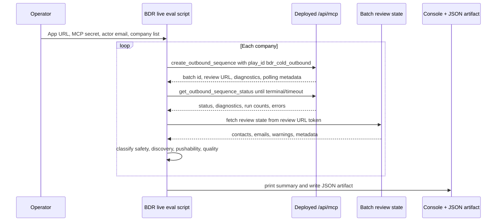

# feat: Add BDR Live E2E Eval

## Overview

Add a deployed-runtime BDR canary eval that submits a company-only list through MCP, targets CX leaders, waits for async processing, inspects review state, and reports pass/warn/fail results per company. This complements the existing one-company smoke check by validating the real Vercel route, real providers, database persistence, contact discovery, deterministic BDR rendering, and safety checks across the initial canary list.

## Problem Frame

The existing BDR smoke proves one controlled route can complete, but rollout confidence needs a broader live eval that catches company-specific contact discovery failures, weak dossier quality, stale generic fallback copy, provider warnings, and unsafe pushability. The origin requirements define a live E2E eval for Gruns, The Black Tux, Quince, Manscapped, and Alo Yoga, with company-only inputs and CX leaders as the target persona (see origin: `docs/brainstorms/2026-05-02-bdr-live-e2e-eval-requirements.md`).

## Requirements Trace

- R1. Run only against a deployed MCP endpoint with operator-provided app URL, MCP secret, and actor email.
- R2. Submit company-only BDR requests targeting CX leaders.
- R3. Use one traceable review-first batch per company with a unique correlation id.
- R4. Poll status to a terminal state or bounded timeout.
- R5. Do not silently rewrite ambiguous company names such as "Manscapped"; flag ambiguity instead.
- R6. Hard fail if any company routes through `generic_company_agent`.
- R7. Require sanitized diagnostics for contract revision, prompt-pack revision, optimized dossier path, runtime, persistence, and fallback causes.
- R8. Hard fail on secrets, tool traces, prompt instructions, unresolved BDR placeholders, or generic fallback copy in responses or review state.
- R9. Treat provider failures, weak evidence, and missing contact data as warning-backed BDR fallback behavior rather than hidden success.
- R10-R13. Evaluate CX leader discovery, non-pushable placeholders, missing email safety, and unsupported persona warnings.
- R14-R17. Inspect BDR Step 1 and Step 4 rendered emails, template safety, source-backed personalization, and weak-evidence fallback behavior.
- R18-R22. Produce one row per company, console plus JSON reporting, overall hard-fail vs warning verdicts, and rerun support for failed/warning companies.

## Scope Boundaries

- Do not push contacts to Instantly.
- Do not require real emails for company-only canaries.
- Do not grade deliverability, reply likelihood, or campaign performance.
- Do not require human review approval during the automated eval.
- Do not let the eval change BDR generation behavior; it observes the deployed workflow and reports.
- Do not make safe BDR fallback copy a hard failure when the reason is weak evidence or missing contact data.

## Context & Research

### Relevant Code and Patterns

- `scripts/verify-bdr-processing-smoke.mjs` already normalizes an MCP endpoint, applies `MCP_API_SECRET`, calls JSON-RPC tools, polls status, fetches batch review state, checks diagnostics, and rejects known fallback/leakage patterns.
- `scripts/verify-mcp-schema.mjs` provides the deployed MCP schema verification pattern and error messaging style.
- `lib/mcp/outbound-tools.ts` defines the create/status response shape, polling metadata, diagnostics, and status transitions that the eval should consume.
- `app/api/review/batch/[token]/state/route.ts` exposes the review-state endpoint used by the smoke script and needed for email/contact inspection.
- `lib/plays/bdr/workflow-output.ts` defines the BDR review payload shape: `sequence_code`, `play_metadata.personalization`, non-pushable placeholder emails, QA warnings, Step 1/Step 4 labels, and blocked sequence metadata.
- `tests/readiness-config.test.ts` shows how to test live-script behavior with a fetch shim instead of opening sockets or calling the network.
- `tests/mcp-route.test.ts`, `tests/mcp-outbound-sequence.test.ts`, and `tests/batch-review-flow.test.ts` cover the MCP route contract, status polling, BDR diagnostics, and no-generic-copy safety invariants.

### Institutional Learnings

- `docs/solutions/integration-issues/vercel-agent-routing-fallback-copy-2026-05-01.md` says production smoke is the real integration test for this failure class because bugs can depend on Vercel duration, environment variables, provider behavior, database persistence, and Cowork-style polling.
- The same learning says schema verification alone is insufficient; the eval must inspect generated review state and stale original fields, not just MCP tools/list.

### External References

- No external research is needed for the first plan. The repo already has strong local patterns for MCP scripts, JSON-RPC status polling, review-state inspection, and script tests.

## Key Technical Decisions

- Build a new multi-company eval script rather than expanding the one-company smoke script: the smoke remains a small readiness check, while the eval needs richer reporting, reruns, and quality warnings.
- Use one batch per company: this isolates failures, avoids one bad company masking the rest, and supports rerunning only failed/warning rows.
- Keep company names literal by default: the canary should surface typo/ambiguity risk, while still allowing optional domains or normalized names through a structured input file later.
- Use deterministic safety gates for hard failures: route, diagnostics, leakage, generic fallback strings, prompt/tool text, unresolved placeholders, secret-like strings, and unsafe pushability are objective enough to automate.
- Use warning-level quality heuristics for snippet quality: specificity, source evidence, warning count, fallback cause, and CX persona fit are useful rollout signals, but should not block when output is safe.
- Save JSON as the durable artifact first, with optional markdown reporting deferred until after the console/JSON contract is stable.

## Open Questions

### Resolved During Planning

- Report format: console summary plus machine-readable JSON are required first; markdown can be optional.
- Batch shape: use one batch per company.
- "Manscapped" handling: submit exactly as provided and flag ambiguity unless the operator supplies a domain or explicit normalized name.
- Text-quality scoring: use lightweight heuristics that produce warnings, not a model-graded quality score.

### Deferred to Implementation

- Exact JSON field names: keep them stable and documented, but allow small naming adjustments while implementing tests.

## High-Level Technical Design

> *This illustrates the intended approach and is directional guidance for review, not implementation specification. The implementing agent should treat it as context, not code to reproduce.*

## Implementation Units

- [x] **Unit 1: Define Eval Input And Script Shell**

**Goal:** Create the live eval entry point and operator input contract without implementing all classification logic yet.

**Requirements:** R1, R2, R3, R5

**Dependencies:** None

**Files:**
- Create: `scripts/verify-bdr-live-e2e-eval.mjs`
- Modify: `package.json`
- Test: `tests/bdr-live-e2e-eval-script.test.ts`

**Approach:**
- Follow the endpoint normalization, auth header, JSON parse, and error-message patterns in `scripts/verify-bdr-processing-smoke.mjs`.
- Require `MCP_URL` or `APP_BASE_URL`, `BDR_EVAL_ACTOR_EMAIL`, and optional `MCP_API_SECRET`.
- Default the company list to Gruns, The Black Tux, Quince, Manscapped, and Alo Yoga.
- Support a simple operator override for companies, while keeping the first implementation company-only. Optional domains may be accepted, but contacts should not be required.
- Include `play_id: "bdr_cold_outbound"`, `target_persona: "CX leaders"`, and BDR intake metadata with a correlation id in every create request.
- Add `mcp:bdr-eval` as the package script name so it sits beside `mcp:bdr-smoke`.

**Patterns to follow:**
- `scripts/verify-bdr-processing-smoke.mjs`
- `scripts/verify-mcp-schema.mjs`
- `tests/readiness-config.test.ts`

**Test scenarios:**
- Happy path: with `APP_BASE_URL` and `BDR_EVAL_ACTOR_EMAIL`, the script builds company-only create requests for all five default companies and includes BDR play metadata plus target persona.
- Edge case: when the operator provides a comma-separated company override, the script uses that list and still sends no contacts.
- Edge case: "Manscapped" appears exactly as provided in the request payload and receives an ambiguity note in the result model.
- Error path: missing app URL exits non-zero with a clear MCP URL message.
- Error path: missing actor email exits non-zero with a clear actor email message.

**Verification:**
- The script can be invoked in tests with a mocked fetch and produces create requests with the expected company-only BDR shape.

- [x] **Unit 2: Add Live MCP Orchestration**

**Goal:** Implement deployed JSON-RPC create/status calls, per-company batches, bounded polling, review-state fetching, and rerun targeting.

**Requirements:** R1, R3, R4, R18, R22

**Dependencies:** Unit 1

**Files:**
- Modify: `scripts/verify-bdr-live-e2e-eval.mjs`
- Test: `tests/bdr-live-e2e-eval-script.test.ts`

**Approach:**
- Reuse the smoke script's JSON-RPC call pattern for `create_outbound_sequence` and `get_outbound_sequence_status`.
- Run one company at a time by default to keep logs readable and avoid overloading providers; defer parallelism unless implementation finds a safe reason to add it.
- Poll each batch until `is_terminal` or a max-attempt limit. Respect response polling metadata where present, while allowing env overrides for canary speed.
- Derive the review-state URL from the batch `review_url` using the existing `/api/review/batch/:token/state` pattern.
- Support rerun filtering from prior JSON by accepting only failed/warning companies as input in a later invocation, without requiring a second script.
- Keep network failures and JSON-RPC tool errors as row-level failures unless the script cannot authenticate or parse the endpoint at all.

**Patterns to follow:**
- `scripts/verify-bdr-processing-smoke.mjs`
- `lib/mcp/outbound-tools.ts`
- `tests/mcp-route.test.ts`

**Test scenarios:**
- Happy path: each default company creates a separate batch id, polls status to `ready_for_review`, fetches review state, and records one row per company.
- Edge case: one company times out while later companies still run and receive their own rows.
- Edge case: status response is terminal with `partially_failed`; the row captures errors and classifies according to safety checks rather than crashing the whole script.
- Error path: JSON-RPC tool error from create becomes a failed row with the tool error message.
- Error path: review-state fetch returns non-JSON or non-OK; the row fails with a readable review-state error.
- Integration: mocked fetch observes create/status/review calls in the expected order for each company.

**Verification:**
- The orchestration can complete a multi-company mocked run and produce independent row outcomes for success, timeout, and failed review-state cases.

- [x] **Unit 3: Implement Safety And Quality Classification**

**Goal:** Convert raw create/status/review data into pass/warn/fail row results that separate hard safety failures from rollout-quality warnings.

**Requirements:** R6, R7, R8, R9, R10, R11, R12, R13, R14, R15, R16, R17, R18, R21

**Dependencies:** Unit 2

**Files:**
- Modify: `scripts/verify-bdr-live-e2e-eval.mjs`
- Test: `tests/bdr-live-e2e-eval-script.test.ts`

**Approach:**
- Hard failures:
  - `diagnostics.processing_route` is not `bdr_workflow`.
  - required diagnostics are missing.
  - serialized response/review state contains known generic fallback strings, prompt-pack artifacts, tool traces, unresolved bracket placeholders, or secret-like strings.
  - a contact appears pushable despite missing or placeholder email conditions.
  - rendered BDR sequence has unresolved template placeholders or missing expected Step 1/Step 4 shape when sequence mapped.
- Warnings:
  - no credible CX leader discovered and workflow produced a safe non-pushable placeholder.
  - discovered contact has no verified email.
  - title/persona is outside sequence map and draft is blocked.
  - fallback causes include weak evidence, provider configuration, provider failure, agent failure, or blocked sequence mapping.
  - personalized insert is absent or generic but output remains safe.
  - company name appears ambiguous, including the initial "Manscapped" spelling.
- Quality heuristics should inspect `play_metadata.personalization`, evidence URLs, warning count, sequence code, email labels, and body text. They should not attempt to judge reply likelihood.
- The first implementation should keep classification deterministic and transparent in the JSON row, with arrays like `hard_failures`, `warnings`, and `quality_notes`.

**Patterns to follow:**
- Existing banned fallback checks in `scripts/verify-bdr-processing-smoke.mjs`
- BDR review payload shape in `lib/plays/bdr/workflow-output.ts`
- Pushability invariant in `lib/review-push-eligibility.ts`
- Tests in `tests/batch-review-flow.test.ts`

**Test scenarios:**
- Happy path: BDR route, complete diagnostics, mapped sequence, two BDR emails, evidence URLs, and no banned text yields `pass`.
- Warning path: safe placeholder contact with `example.invalid` email, missing contact warning, and no generic copy yields `warn`.
- Warning path: weak evidence fallback with BDR template copy and fallback causes yields `warn`, not `fail`.
- Warning path: ambiguous company name produces an ambiguity note.
- Error path: `generic_company_agent` route yields `fail`.
- Error path: review payload containing `handoffs without the reset`, `full conversation history`, `before it becomes urgent`, or KUHL proof copy yields `fail`.
- Error path: review payload containing prompt/tool language, secret-looking strings, or unresolved BDR placeholders yields `fail`.
- Error path: mapped sequence has missing Step 1 or Step 4 email shape yields `fail`.
- Edge case: unsupported title blocks draft with `draft_generation_blocked` and a non-pushable contact; classify as `warn` unless unsafe fields are present.

**Verification:**
- Classification tests cover pass, warning, and hard-failure rows without making network calls.

- [x] **Unit 4: Add Reporting Artifacts And Rerun Workflow**

**Goal:** Provide operator-friendly console output and durable JSON artifacts that can be compared or reused for reruns.

**Requirements:** R18, R19, R20, R21, R22

**Dependencies:** Units 2 and 3

**Files:**
- Modify: `scripts/verify-bdr-live-e2e-eval.mjs`
- Test: `tests/bdr-live-e2e-eval-script.test.ts`
- Modify: `.gitignore`

**Approach:**
- Print a compact console summary with one row per company: result, company, status, batch id, route, contact name/title, pushability, sequence code, warning count, and first failure/warning.
- Save a JSON artifact containing run metadata, input companies, environment-safe endpoint metadata, per-company rows, and overall verdict.
- Default JSON artifacts should be written under `tmp/bdr-live-e2e-eval/`, with an override for operators who want a different output directory.
- Redact secrets and avoid storing raw full provider payloads. Store review URLs and batch ids because they are operator-facing debugging handles.
- Exit non-zero when any hard failure exists. Exit zero when only warnings exist, while clearly printing that rollout still needs human review.
- Support reruns by allowing input from a previous artifact filtered to failed or warning companies.
- Optional markdown output can be added behind a flag if it is cheap, but JSON and console are the required contract.

**Patterns to follow:**
- `scripts/verify-bdr-processing-smoke.mjs` for concise terminal output and non-zero failure semantics.
- `tests/readiness-config.test.ts` for script execution tests with spawned Node and mocked fetch.

**Test scenarios:**
- Happy path: all pass rows produce overall `pass`, zero exit status, and JSON artifact with five company rows.
- Warning path: one warning row and no failures produce zero exit status with overall `warn`.
- Error path: one hard failure produces non-zero exit status with overall `fail`.
- Edge case: artifact write path is overridden by env/flag and the script writes there without leaking secrets.
- Edge case: default artifact path writes below `tmp/bdr-live-e2e-eval/`, and `tmp/` is ignored by git.
- Edge case: rerun-from-artifact mode selects only rows with `warn` or `fail`.
- Error path: artifact write failure returns a clear error after printing enough row context for debugging.

**Verification:**
- Script tests prove console summary, JSON artifact structure, exit status, and rerun filtering behavior.

- [x] **Unit 5: Document Operator Usage And Keep Readiness Tests Aligned**

**Goal:** Make the live eval discoverable and keep docs/tests aligned with the new command and safety contract.

**Requirements:** R1, R18, R19, R21, R22

**Dependencies:** Units 1-4

**Files:**
- Modify: `README.md`
- Modify: `docs/cowork-async-polling-instructions.md` if operator triage wording needs the eval reference
- Modify: `tests/readiness-config.test.ts`
- Test: `tests/bdr-live-e2e-eval-script.test.ts`

**Approach:**
- Add a README section after the existing one-company BDR smoke describing when to use the multi-company live eval.
- Document required env vars, default canary list, company-only CX leader behavior, JSON artifact location, and pass/warn/fail semantics.
- Clarify that warnings are expected for missing emails or weak evidence and do not automatically block rollout, while generic route/fallback/leakage failures do.
- Keep readiness tests checking that package scripts, README guidance, and eval script safety patterns remain aligned.

**Patterns to follow:**
- Existing README production readiness and BDR smoke sections.
- `tests/readiness-config.test.ts`

**Test scenarios:**
- Happy path: package script, README, and eval script all mention the same command and default canary companies.
- Happy path: docs include the required env vars and explain pass/warn/fail.
- Error path: readiness test fails if docs stop mentioning `generic_company_agent` as a hard BDR eval failure.
- Integration: the eval script test remains the behavioral proof; readiness tests only assert docs/config alignment.

**Verification:**
- Operators can find and run the eval from README without needing implementation knowledge.

## System-Wide Impact

- **Interaction graph:** New script calls deployed `/api/mcp`, `/api/review/batch/:token/state`, and reads generated review payloads. It does not change runtime routes or generation behavior.
- **Error propagation:** Endpoint/auth failures should stop the run early when global; per-company create/status/review failures should become row-level failures so the rest of the canary still runs.
- **State lifecycle risks:** The eval creates real review-first batches in the deployed database. Rows must include correlation ids and batch ids so test data can be found and cleaned or ignored.
- **API surface parity:** The eval should use the same JSON-RPC `create_outbound_sequence` and `get_outbound_sequence_status` paths as Cowork, not direct internal routes.
- **Integration coverage:** Unit tests with fetch shims prove script logic; live execution remains the actual rollout gate because provider and Vercel behavior cannot be proven locally.
- **Unchanged invariants:** The eval must not push to Instantly, approve reviews, mutate generated drafts, or depend on local in-memory persistence.

## Risks & Dependencies

| Risk | Mitigation |
|------|------------|
| Eval creates noisy production test data | Use traceable actor email, per-run correlation ids, and review-first batches only. |
| Provider variance causes warning noise | Separate hard failures from quality warnings and preserve fallback causes in the report. |
| Ambiguous company names hide input problems | Submit names exactly as provided and surface ambiguity notes unless a domain override is supplied. |
| JSON artifact leaks sensitive data | Store sanitized response/review summaries, batch ids, review URLs, warning text, and diagnostics; never store secrets or raw provider payloads. |
| Local mocks diverge from live behavior | Keep the script tests focused on orchestration/classification contracts and keep live eval as the deployment gate. |
| The eval becomes too slow | Run sequentially for clarity first, but keep poll interval/max attempts configurable for canary runs. |

## Documentation / Operational Notes

- Add `npm run mcp:bdr-eval` or equivalent package script after implementation.
- Recommended live command should mirror existing readiness style: `MCP_URL`, `MCP_API_SECRET`, and `BDR_EVAL_ACTOR_EMAIL`.
- Document that the initial default list is Gruns, The Black Tux, Quince, Manscapped, and Alo Yoga, company-only, looking for CX leaders.
- Document that warning-only evals still require human judgment before broad rollout, but hard failures should stop rollout.
- Note that `Manscapped` is intentionally tested as provided unless the operator supplies a domain/normalized company input.

## Sources & References

- **Origin document:** [docs/brainstorms/2026-05-02-bdr-live-e2e-eval-requirements.md](docs/brainstorms/2026-05-02-bdr-live-e2e-eval-requirements.md)
- Related script: `scripts/verify-bdr-processing-smoke.mjs`
- Related script: `scripts/verify-mcp-schema.mjs`
- Related route: `app/api/review/batch/[token]/state/route.ts`
- Related MCP code: `lib/mcp/outbound-tools.ts`
- Related BDR rendering: `lib/plays/bdr/workflow-output.ts`
- Related tests: `tests/readiness-config.test.ts`, `tests/mcp-route.test.ts`, `tests/mcp-outbound-sequence.test.ts`, `tests/batch-review-flow.test.ts`
- Institutional learning: `docs/solutions/integration-issues/vercel-agent-routing-fallback-copy-2026-05-01.md`
